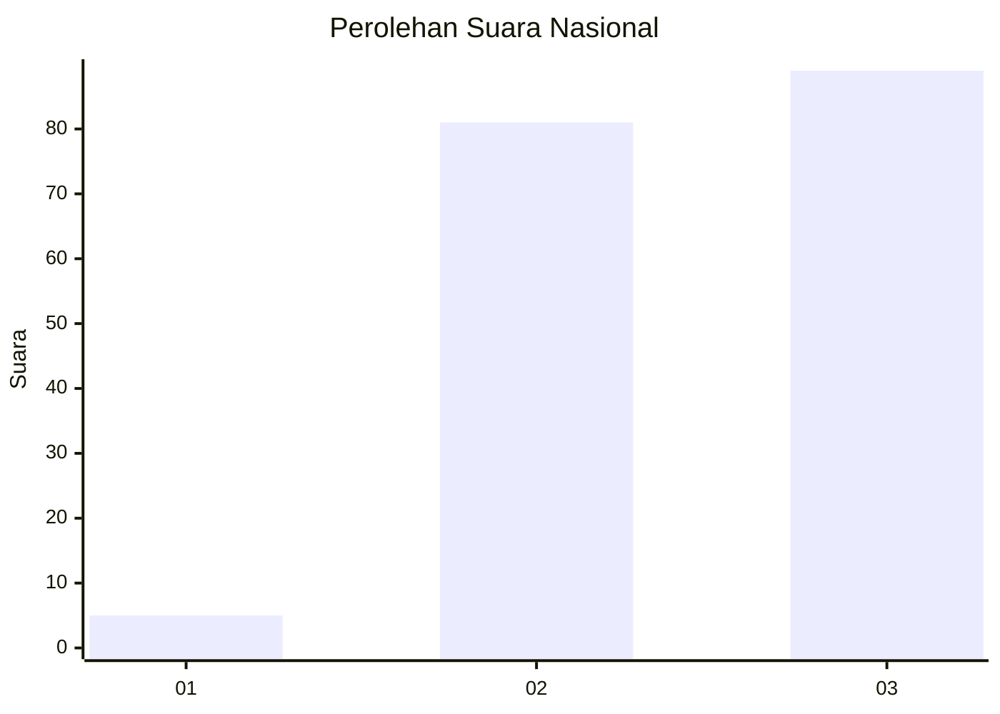
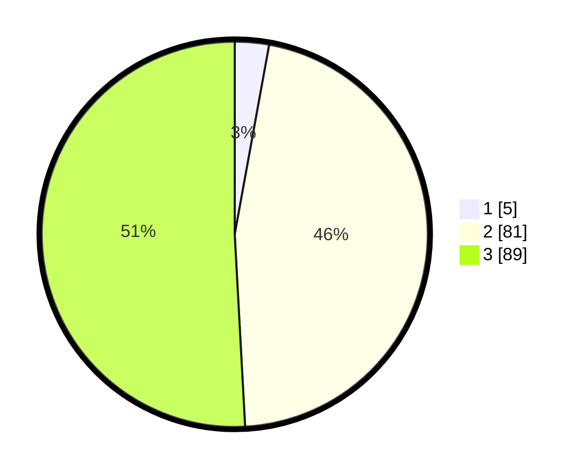

# Hasil

## Grafik

## Tabel

| No. | Nama Paslon    | Suara | Suara (raw) | Persentase |
|:--- |:-------------- | -----:| -----------:| ----------:|
| 1   | ANIES MUHAIMIN | 5     | [5][p-1]    | 2,86       |
| 2   | PRABOWO GIBRAN | 81    | [81][p-2]   | 46,29      |
| 3   | GANJAR MAHFUD  | 89    | [89][p-3]   | 50,86      |

[p-1]: https://github.com/gigit-pemilu/pemilu-2024/blob/main/pilpres/hitung-suara/sub/51-bali/sub/08-buleleng/sub/02-seririt/sub/2013-bubunan/sub/013-tps/sub/paslon-1.txt
[p-2]: https://github.com/gigit-pemilu/pemilu-2024/blob/main/pilpres/hitung-suara/sub/51-bali/sub/08-buleleng/sub/02-seririt/sub/2013-bubunan/sub/013-tps/sub/paslon-2.txt
[p-3]: https://github.com/gigit-pemilu/pemilu-2024/blob/main/pilpres/hitung-suara/sub/51-bali/sub/08-buleleng/sub/02-seririt/sub/2013-bubunan/sub/013-tps/sub/paslon-3.txt

## Foto C Plano

https://sirekap-obj-formc.kpu.go.id/08df/pemilu/ppwp/51/08/02/20/13/5108022013013-20240214-132510--fed51616-51d9-42b9-807b-ff6a9e99bc23.jpg

https://sirekap-obj-formc.kpu.go.id/08df/pemilu/ppwp/51/08/02/20/13/5108022013013-20240214-132825--105ea053-1862-466c-9801-f94069654655.jpg

https://sirekap-obj-formc.kpu.go.id/08df/pemilu/ppwp/51/08/02/20/13/5108022013013-20240214-133111--a165c339-0293-4655-9252-b57c306b759e.jpg

## Metadata

| Key        | Value               |
| ---------- | ------------------- |
| Time Stamp | 2024-02-24 22:31:28 |

