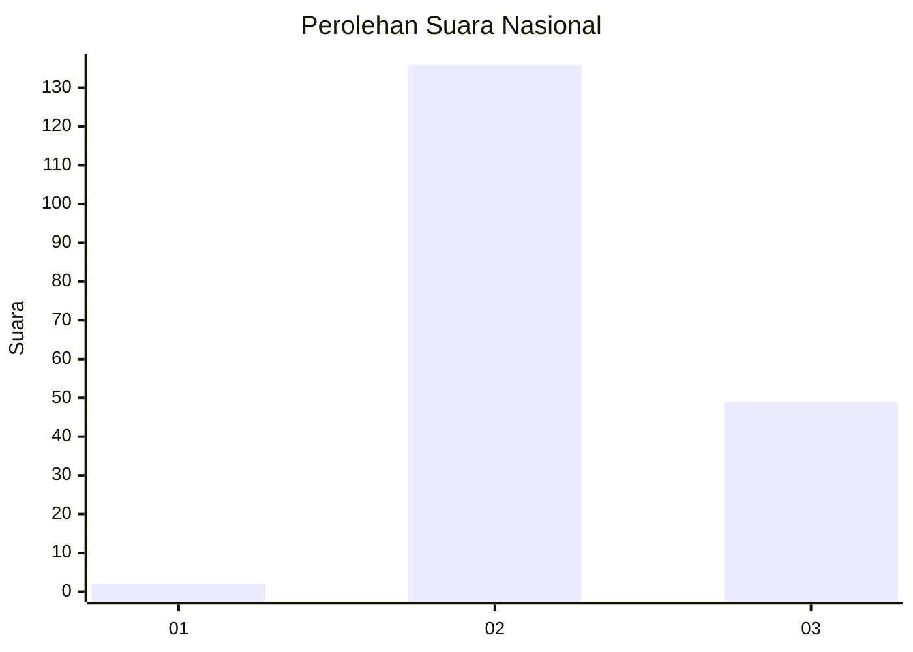
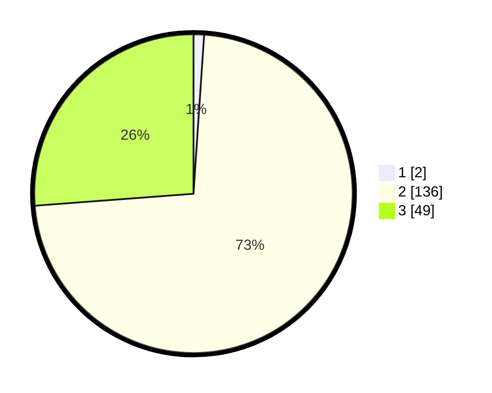

# Hasil

## Grafik

## Tabel

| No. | Nama Paslon    | Suara | Suara (raw) | Persentase |
|:--- |:-------------- | -----:| -----------:| ----------:|
| 1   | ANIES MUHAIMIN | 2     | [2][p-1]    | 1,07       |
| 2   | PRABOWO GIBRAN | 136   | [136][p-2]  | 72,73      |
| 3   | GANJAR MAHFUD  | 49    | [49][p-3]   | 26,20      |

[p-1]: https://github.com/gigit-pemilu/pemilu-2024/blob/main/pilpres/hitung-suara/sub/51-bali/sub/08-buleleng/sub/02-seririt/sub/2014-patemon/sub/002-tps/sub/paslon-1.txt
[p-2]: https://github.com/gigit-pemilu/pemilu-2024/blob/main/pilpres/hitung-suara/sub/51-bali/sub/08-buleleng/sub/02-seririt/sub/2014-patemon/sub/002-tps/sub/paslon-2.txt
[p-3]: https://github.com/gigit-pemilu/pemilu-2024/blob/main/pilpres/hitung-suara/sub/51-bali/sub/08-buleleng/sub/02-seririt/sub/2014-patemon/sub/002-tps/sub/paslon-3.txt

## Foto C Plano

https://sirekap-obj-formc.kpu.go.id/f39d/pemilu/ppwp/51/08/02/20/14/5108022014002-20240214-222126--7571d2f5-5a1f-4345-b70e-decbea0c1b2f.jpg

https://sirekap-obj-formc.kpu.go.id/f39d/pemilu/ppwp/51/08/02/20/14/5108022014002-20240214-222303--fc6c9192-efff-4125-b934-c2bdd9274bd2.jpg

https://sirekap-obj-formc.kpu.go.id/f39d/pemilu/ppwp/51/08/02/20/14/5108022014002-20240214-222428--63cbfb94-68f9-46f2-9df6-f724120a0e17.jpg

## Metadata

| Key        | Value               |
| ---------- | ------------------- |
| Time Stamp | 2024-02-25 11:00:00 |

