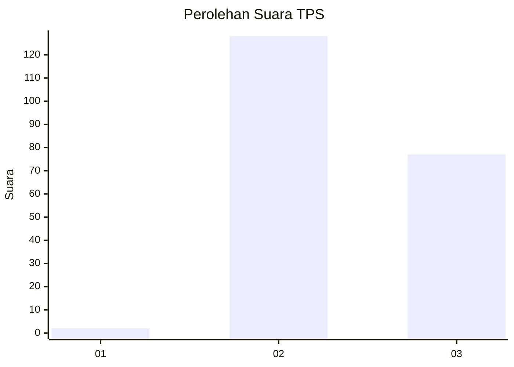
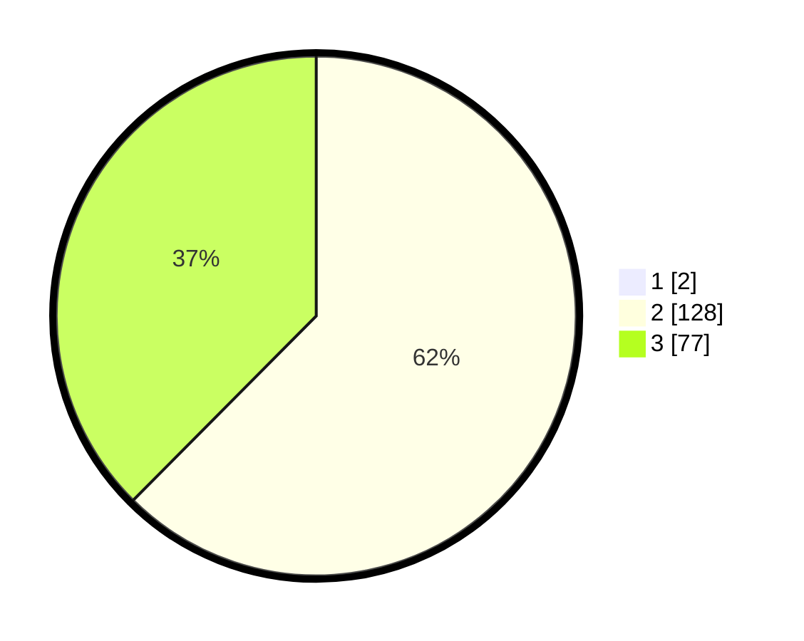

# Hasil

## Grafik

## Tabel

| No. | Nama Paslon    | Suara | Suara (raw) | Persentase |
|:--- |:-------------- | -----:| -----------:| ----------:|
| 1   | ANIES MUHAIMIN | 2     | [2][p-1]    | 0,97       |
| 2   | PRABOWO GIBRAN | 128   | [128][p-2]  | 61,84      |
| 3   | GANJAR MAHFUD  | 77    | [77][p-3]   | 37,20      |

[p-1]: https://github.com/gigit-pemilu/pemilu-2024-51-bali/blob/main/pilpres/hitung-suara/sub/51-bali/sub/08-buleleng/sub/02-seririt/sub/2014-patemon/sub/005-tps/sub/paslon-1.txt
[p-2]: https://github.com/gigit-pemilu/pemilu-2024-51-bali/blob/main/pilpres/hitung-suara/sub/51-bali/sub/08-buleleng/sub/02-seririt/sub/2014-patemon/sub/005-tps/sub/paslon-2.txt
[p-3]: https://github.com/gigit-pemilu/pemilu-2024-51-bali/blob/main/pilpres/hitung-suara/sub/51-bali/sub/08-buleleng/sub/02-seririt/sub/2014-patemon/sub/005-tps/sub/paslon-3.txt

## Foto C Plano

https://sirekap-obj-formc.kpu.go.id/1e1a/pemilu/ppwp/51/08/02/20/14/5108022014005-20240215-084458--120c6018-5f61-4623-8a56-ee6be8e1ffc5.jpg

https://sirekap-obj-formc.kpu.go.id/1e1a/pemilu/ppwp/51/08/02/20/14/5108022014005-20240215-105148--730ebbb4-65d7-4f50-ad32-9e7ebb8904cd.jpg

https://sirekap-obj-formc.kpu.go.id/1e1a/pemilu/ppwp/51/08/02/20/14/5108022014005-20240215-084637--6720d9a8-e5c2-4eb8-bc1c-f743c51a1207.jpg

## Metadata

| Key        | Value               |
| ---------- | ------------------- |
| Time Stamp | 2024-02-24 22:31:28 |

