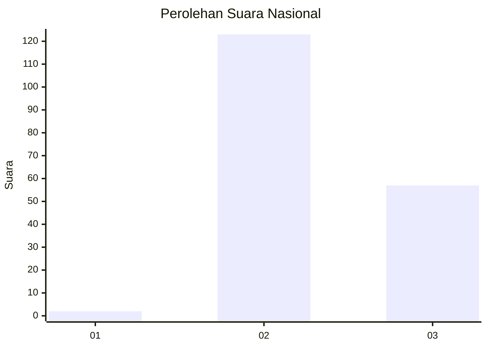
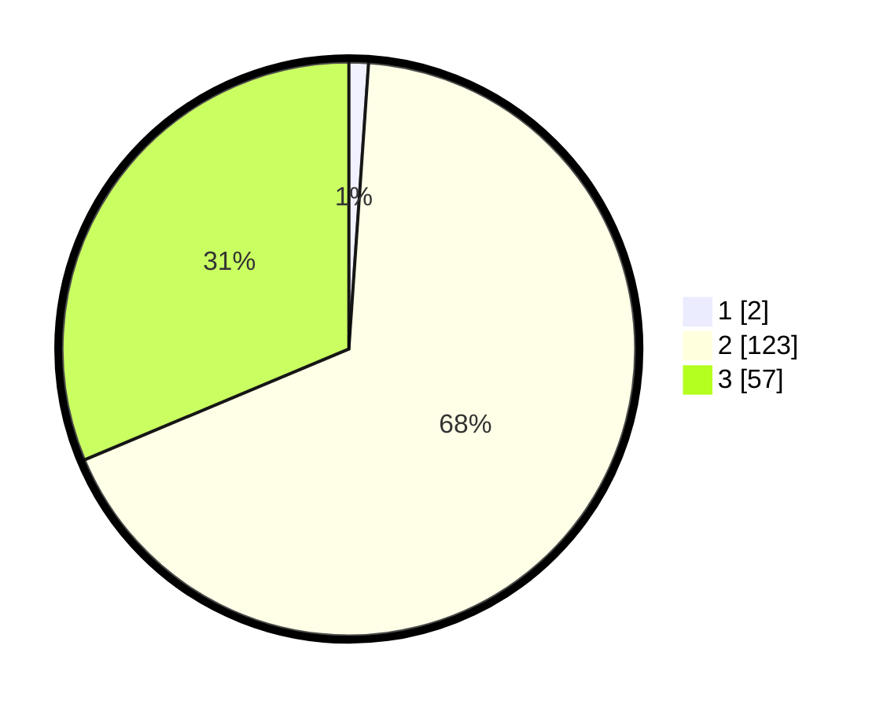

# Hasil

## Grafik

## Tabel

| No. | Nama Paslon    | Suara | Suara (raw) | Persentase |
|:--- |:-------------- | -----:| -----------:| ----------:|
| 1   | ANIES MUHAIMIN | 2     | [2][p-1]    | 1,10       |
| 2   | PRABOWO GIBRAN | 123   | [123][p-2]  | 67,58      |
| 3   | GANJAR MAHFUD  | 57    | [57][p-3]   | 31,32      |

[p-1]: https://github.com/gigit-pemilu/pemilu-2024/blob/main/pilpres/hitung-suara/sub/51-bali/sub/08-buleleng/sub/02-seririt/sub/2014-patemon/sub/006-tps/sub/paslon-1.txt
[p-2]: https://github.com/gigit-pemilu/pemilu-2024/blob/main/pilpres/hitung-suara/sub/51-bali/sub/08-buleleng/sub/02-seririt/sub/2014-patemon/sub/006-tps/sub/paslon-2.txt
[p-3]: https://github.com/gigit-pemilu/pemilu-2024/blob/main/pilpres/hitung-suara/sub/51-bali/sub/08-buleleng/sub/02-seririt/sub/2014-patemon/sub/006-tps/sub/paslon-3.txt

## Foto C Plano

https://sirekap-obj-formc.kpu.go.id/9bd1/pemilu/ppwp/51/08/02/20/14/5108022014006-20240215-104404--8d23d9b5-033e-4788-9a97-e771f74eff99.jpg

https://sirekap-obj-formc.kpu.go.id/9bd1/pemilu/ppwp/51/08/02/20/14/5108022014006-20240215-104955--8770694a-b0f0-4794-a81d-cd043deb5602.jpg

https://sirekap-obj-formc.kpu.go.id/9bd1/pemilu/ppwp/51/08/02/20/14/5108022014006-20240215-105347--b88e683a-3134-423a-8289-4325660ecd89.jpg

## Metadata

| Key        | Value               |
| ---------- | ------------------- |
| Time Stamp | 2024-02-24 22:31:28 |

