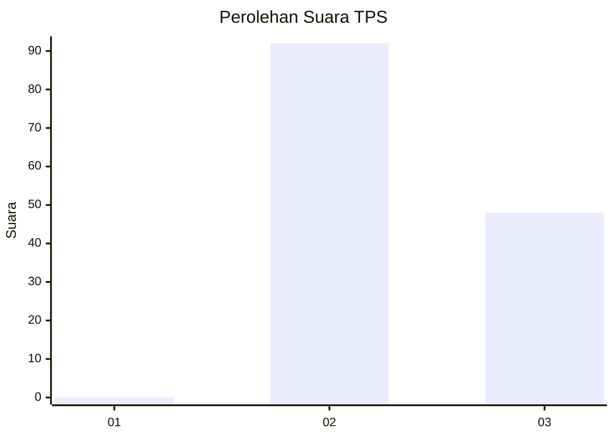
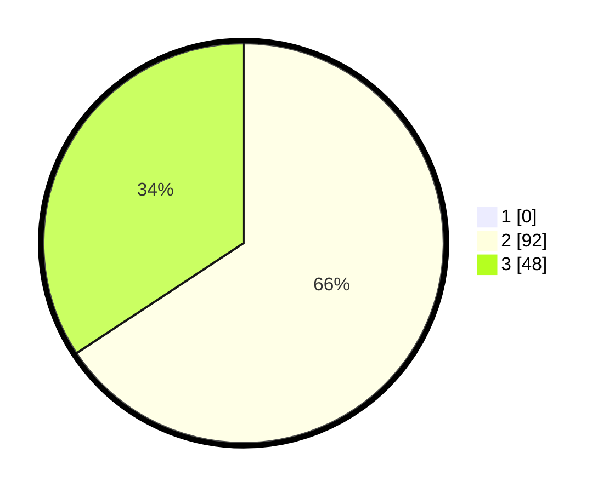

# Hasil

## Grafik

## Tabel

| No. | Nama Paslon    | Suara | Suara (raw) | Persentase |
|:--- |:-------------- | -----:| -----------:| ----------:|
| 1   | ANIES MUHAIMIN | 0     | [0][p-1]    | 0,00       |
| 2   | PRABOWO GIBRAN | 92    | [92][p-2]   | 65,71      |
| 3   | GANJAR MAHFUD  | 48    | [48][p-3]   | 34,29      |

[p-1]: https://github.com/gigit-pemilu/pemilu-2024-51-bali/blob/main/pilpres/hitung-suara/sub/51-bali/sub/08-buleleng/sub/02-seririt/sub/2014-patemon/sub/007-tps/sub/paslon-1.txt
[p-2]: https://github.com/gigit-pemilu/pemilu-2024-51-bali/blob/main/pilpres/hitung-suara/sub/51-bali/sub/08-buleleng/sub/02-seririt/sub/2014-patemon/sub/007-tps/sub/paslon-2.txt
[p-3]: https://github.com/gigit-pemilu/pemilu-2024-51-bali/blob/main/pilpres/hitung-suara/sub/51-bali/sub/08-buleleng/sub/02-seririt/sub/2014-patemon/sub/007-tps/sub/paslon-3.txt

## Foto C Plano

https://sirekap-obj-formc.kpu.go.id/e391/pemilu/ppwp/51/08/02/20/14/5108022014007-20240215-124258--4e02af06-6f15-420f-ba56-7e9e5d13a6e9.jpg

https://sirekap-obj-formc.kpu.go.id/e391/pemilu/ppwp/51/08/02/20/14/5108022014007-20240215-124453--3e66b604-ae43-4324-bb27-7691d72d4c67.jpg

https://sirekap-obj-formc.kpu.go.id/e391/pemilu/ppwp/51/08/02/20/14/5108022014007-20240215-124542--2b844a20-af0b-4a0b-8177-de831fa1562b.jpg

## Metadata

| Key        | Value               |
| ---------- | ------------------- |
| Time Stamp | 2024-02-24 22:31:28 |

