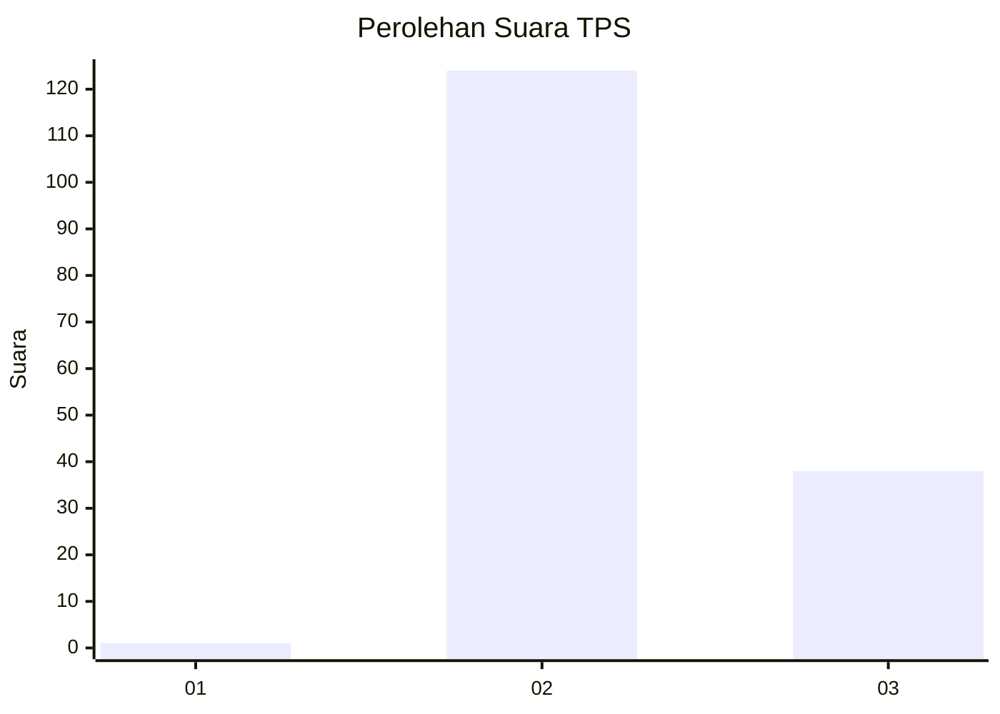
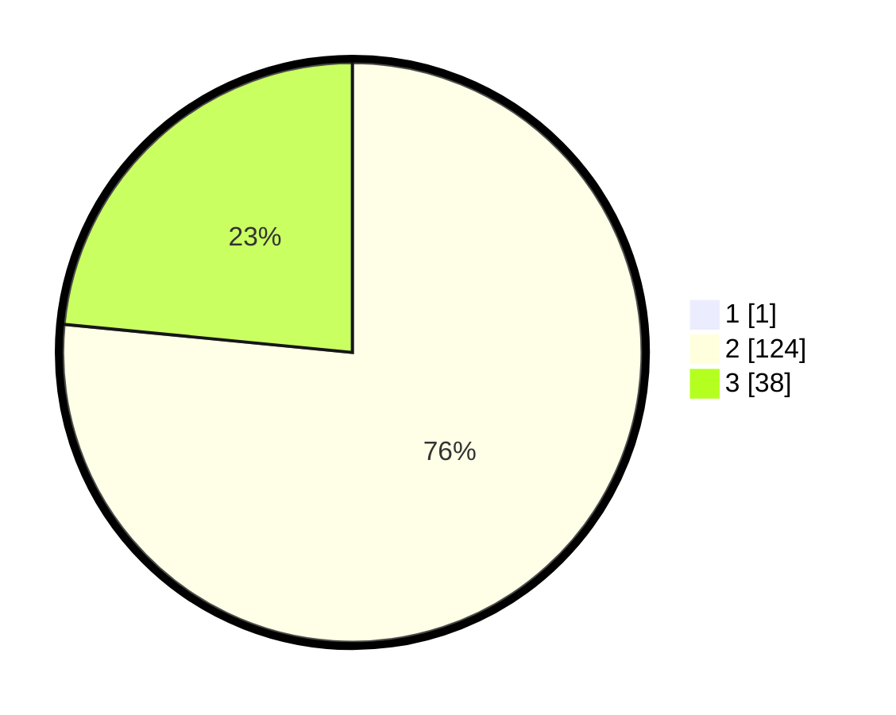

# Hasil

## Grafik

## Tabel

| No. | Nama Paslon    | Suara | Suara (raw) | Persentase |
|:--- |:-------------- | -----:| -----------:| ----------:|
| 1   | ANIES MUHAIMIN | 1     | [1][p-1]    | 0,61       |
| 2   | PRABOWO GIBRAN | 124   | [124][p-2]  | 76,07      |
| 3   | GANJAR MAHFUD  | 38    | [38][p-3]   | 23,31      |

[p-1]: https://github.com/gigit-pemilu/pemilu-2024-51-bali/blob/main/pilpres/hitung-suara/sub/51-bali/sub/08-buleleng/sub/02-seririt/sub/2014-patemon/sub/008-tps/sub/paslon-1.txt
[p-2]: https://github.com/gigit-pemilu/pemilu-2024-51-bali/blob/main/pilpres/hitung-suara/sub/51-bali/sub/08-buleleng/sub/02-seririt/sub/2014-patemon/sub/008-tps/sub/paslon-2.txt
[p-3]: https://github.com/gigit-pemilu/pemilu-2024-51-bali/blob/main/pilpres/hitung-suara/sub/51-bali/sub/08-buleleng/sub/02-seririt/sub/2014-patemon/sub/008-tps/sub/paslon-3.txt

## Foto C Plano

https://sirekap-obj-formc.kpu.go.id/032a/pemilu/ppwp/51/08/02/20/14/5108022014008-20240214-234606--50b9b210-ca37-4f88-8dc4-ab2c0db33583.jpg

https://sirekap-obj-formc.kpu.go.id/032a/pemilu/ppwp/51/08/02/20/14/5108022014008-20240214-234259--6a27d40b-340a-4afc-bc74-00195a336ad0.jpg

https://sirekap-obj-formc.kpu.go.id/032a/pemilu/ppwp/51/08/02/20/14/5108022014008-20240215-114106--ff423f8b-aa3c-40f5-b9c3-40efcb9e1301.jpg

## Metadata

| Key        | Value               |
| ---------- | ------------------- |
| Time Stamp | 2024-02-15 12:00:28 |

