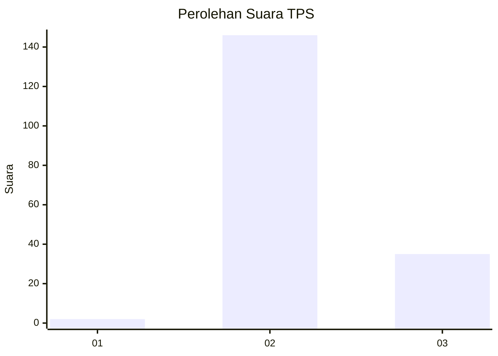
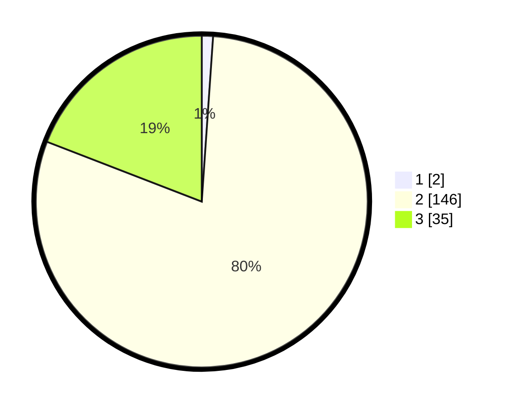

# Hasil

## Grafik

## Tabel

| No. | Nama Paslon    | Suara | Suara (raw) | Persentase |
|:--- |:-------------- | -----:| -----------:| ----------:|
| 1   | ANIES MUHAIMIN | 2     | [2][p-1]    | 1,09       |
| 2   | PRABOWO GIBRAN | 146   | [146][p-2]  | 79,78      |
| 3   | GANJAR MAHFUD  | 35    | [35][p-3]   | 19,13      |

[p-1]: https://github.com/gigit-pemilu/pemilu-2024-51-bali/blob/main/pilpres/hitung-suara/sub/51-bali/sub/08-buleleng/sub/02-seririt/sub/2014-patemon/sub/010-tps/sub/paslon-1.txt
[p-2]: https://github.com/gigit-pemilu/pemilu-2024-51-bali/blob/main/pilpres/hitung-suara/sub/51-bali/sub/08-buleleng/sub/02-seririt/sub/2014-patemon/sub/010-tps/sub/paslon-2.txt
[p-3]: https://github.com/gigit-pemilu/pemilu-2024-51-bali/blob/main/pilpres/hitung-suara/sub/51-bali/sub/08-buleleng/sub/02-seririt/sub/2014-patemon/sub/010-tps/sub/paslon-3.txt

## Foto C Plano

https://sirekap-obj-formc.kpu.go.id/32c6/pemilu/ppwp/51/08/02/20/14/5108022014010-20240214-230750--39a415d6-cac1-4e51-877d-cd744bd34453.jpg

https://sirekap-obj-formc.kpu.go.id/32c6/pemilu/ppwp/51/08/02/20/14/5108022014010-20240214-231016--826d2c03-2122-46f0-8663-d97f6829e883.jpg

https://sirekap-obj-formc.kpu.go.id/32c6/pemilu/ppwp/51/08/02/20/14/5108022014010-20240214-231110--81e99509-bf8b-4831-8710-e8e4ac25f652.jpg

## Metadata

| Key        | Value               |
| ---------- | ------------------- |
| Time Stamp | 2024-02-15 12:00:28 |

