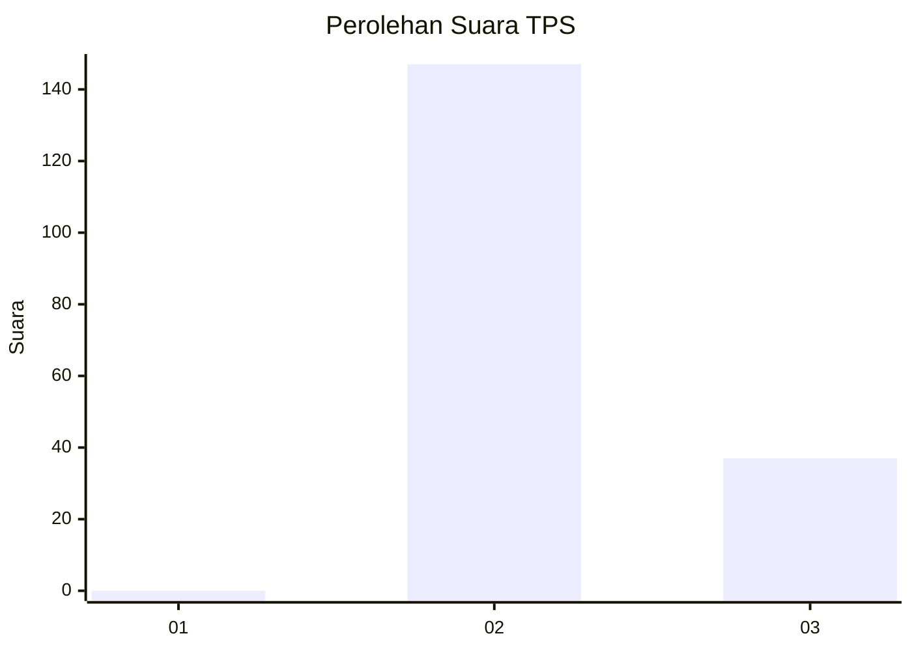
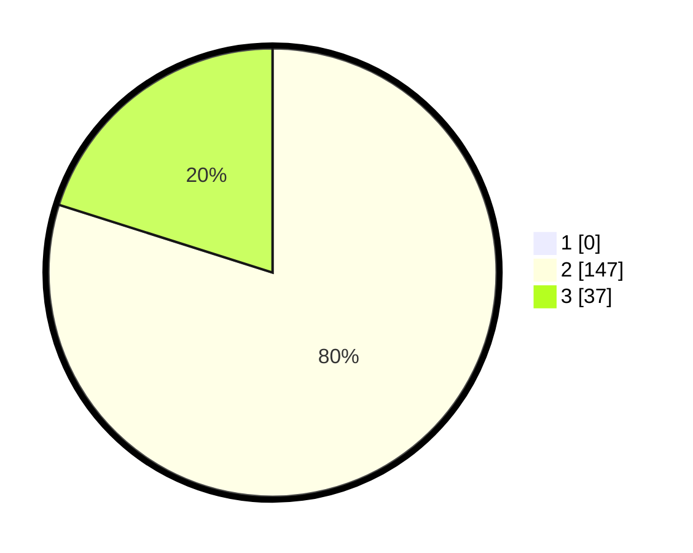

# Hasil

## Grafik

## Tabel

| No. | Nama Paslon    | Suara | Suara (raw) | Persentase |
|:--- |:-------------- | -----:| -----------:| ----------:|
| 1   | ANIES MUHAIMIN | 0     | [0][p-1]    | 0,00       |
| 2   | PRABOWO GIBRAN | 147   | [147][p-2]  | 79,89      |
| 3   | GANJAR MAHFUD  | 37    | [37][p-3]   | 20,11      |

[p-1]: https://github.com/gigit-pemilu/pemilu-2024-51-bali/blob/main/pilpres/hitung-suara/sub/51-bali/sub/08-buleleng/sub/02-seririt/sub/2014-patemon/sub/012-tps/sub/paslon-1.txt
[p-2]: https://github.com/gigit-pemilu/pemilu-2024-51-bali/blob/main/pilpres/hitung-suara/sub/51-bali/sub/08-buleleng/sub/02-seririt/sub/2014-patemon/sub/012-tps/sub/paslon-2.txt
[p-3]: https://github.com/gigit-pemilu/pemilu-2024-51-bali/blob/main/pilpres/hitung-suara/sub/51-bali/sub/08-buleleng/sub/02-seririt/sub/2014-patemon/sub/012-tps/sub/paslon-3.txt

## Foto C Plano

https://sirekap-obj-formc.kpu.go.id/d445/pemilu/ppwp/51/08/02/20/14/5108022014012-20240214-204812--de3e84bf-f6df-4846-bce3-a81a3868f32d.jpg

https://sirekap-obj-formc.kpu.go.id/d445/pemilu/ppwp/51/08/02/20/14/5108022014012-20240214-205054--d991de58-94ce-4762-a2fc-e2404f8b31bd.jpg

https://sirekap-obj-formc.kpu.go.id/d445/pemilu/ppwp/51/08/02/20/14/5108022014012-20240214-220922--8e6b7fe6-d42c-434e-8615-95e141e26958.jpg

## Metadata

| Key        | Value               |
| ---------- | ------------------- |
| Time Stamp | 2024-02-15 00:41:44 |

