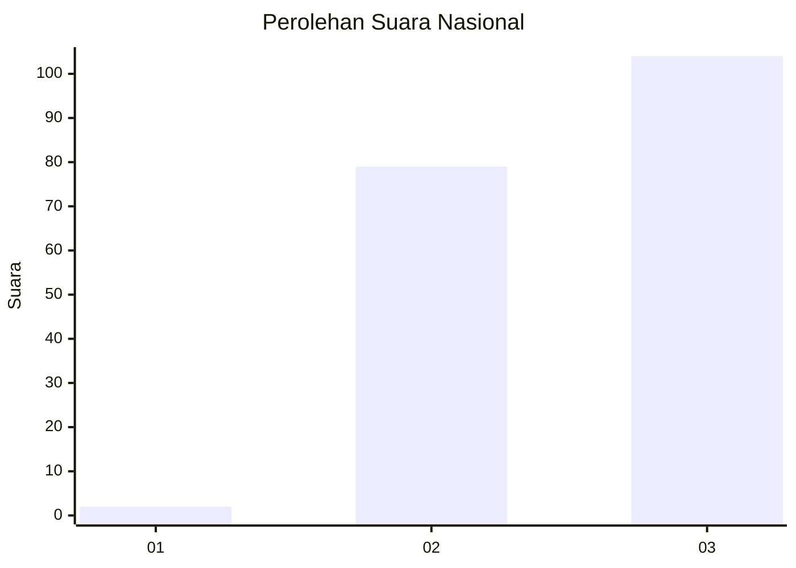
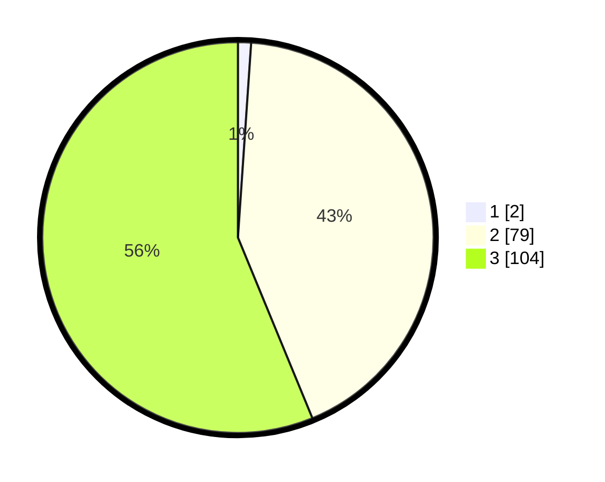

# Hasil

## Grafik

## Tabel

| No. | Nama Paslon    | Suara | Suara (raw) | Persentase |
|:--- |:-------------- | -----:| -----------:| ----------:|
| 1   | ANIES MUHAIMIN | 2     | [2][p-1]    | 1,08       |
| 2   | PRABOWO GIBRAN | 79    | [79][p-2]   | 42,70      |
| 3   | GANJAR MAHFUD  | 104   | [104][p-3]  | 56,22      |

[p-1]: https://github.com/gigit-pemilu/pemilu-2024/blob/main/pilpres/hitung-suara/sub/51-bali/sub/08-buleleng/sub/02-seririt/sub/2014-patemon/sub/020-tps/sub/paslon-1.txt
[p-2]: https://github.com/gigit-pemilu/pemilu-2024/blob/main/pilpres/hitung-suara/sub/51-bali/sub/08-buleleng/sub/02-seririt/sub/2014-patemon/sub/020-tps/sub/paslon-2.txt
[p-3]: https://github.com/gigit-pemilu/pemilu-2024/blob/main/pilpres/hitung-suara/sub/51-bali/sub/08-buleleng/sub/02-seririt/sub/2014-patemon/sub/020-tps/sub/paslon-3.txt

## Foto C Plano

https://sirekap-obj-formc.kpu.go.id/a6f7/pemilu/ppwp/51/08/02/20/14/5108022014020-20240215-104612--06b04d48-47a3-40f5-8121-d160fab3233d.jpg

https://sirekap-obj-formc.kpu.go.id/a6f7/pemilu/ppwp/51/08/02/20/14/5108022014020-20240215-104816--c3919619-3fdf-4995-8731-77a62f4b2c41.jpg

https://sirekap-obj-formc.kpu.go.id/a6f7/pemilu/ppwp/51/08/02/20/14/5108022014020-20240215-104949--b3c9a38c-8c46-4571-94fc-f3f35f023a99.jpg

## Metadata

| Key        | Value               |
| ---------- | ------------------- |
| Time Stamp | 2024-02-15 19:30:26 |

