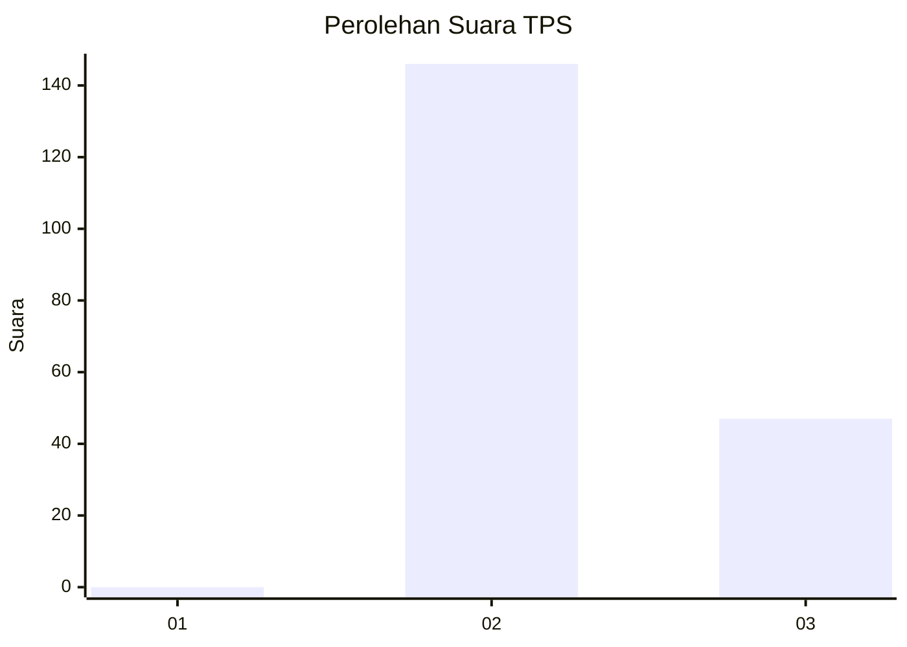
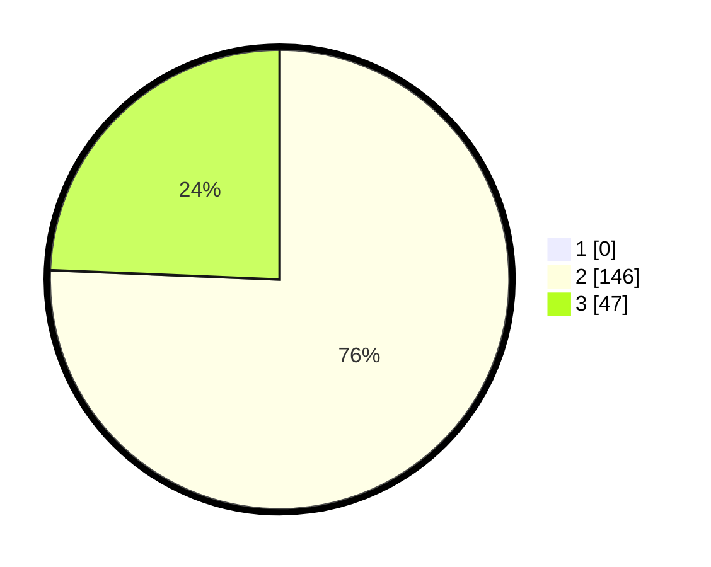

# Hasil

## Grafik

## Tabel

| No. | Nama Paslon    | Suara | Suara (raw) | Persentase |
|:--- |:-------------- | -----:| -----------:| ----------:|
| 1   | ANIES MUHAIMIN | 0     | [0][p-1]    | 0,00       |
| 2   | PRABOWO GIBRAN | 146   | [146][p-2]  | 75,65      |
| 3   | GANJAR MAHFUD  | 47    | [47][p-3]   | 24,35      |

[p-1]: https://github.com/gigit-pemilu/pemilu-2024-51-bali/blob/main/pilpres/hitung-suara/sub/51-bali/sub/08-buleleng/sub/02-seririt/sub/2014-patemon/sub/022-tps/sub/paslon-1.txt
[p-2]: https://github.com/gigit-pemilu/pemilu-2024-51-bali/blob/main/pilpres/hitung-suara/sub/51-bali/sub/08-buleleng/sub/02-seririt/sub/2014-patemon/sub/022-tps/sub/paslon-2.txt
[p-3]: https://github.com/gigit-pemilu/pemilu-2024-51-bali/blob/main/pilpres/hitung-suara/sub/51-bali/sub/08-buleleng/sub/02-seririt/sub/2014-patemon/sub/022-tps/sub/paslon-3.txt

## Foto C Plano

https://sirekap-obj-formc.kpu.go.id/ad17/pemilu/ppwp/51/08/02/20/14/5108022014022-20240215-103414--594d982b-c61b-467e-9207-7f9b3de4dc41.jpg

https://sirekap-obj-formc.kpu.go.id/ad17/pemilu/ppwp/51/08/02/20/14/5108022014022-20240215-103747--b44a13d6-47ae-4bbe-9da5-71911f99d814.jpg

https://sirekap-obj-formc.kpu.go.id/ad17/pemilu/ppwp/51/08/02/20/14/5108022014022-20240215-103942--99600d6b-e32e-4410-b470-4754724fb5d9.jpg

## Metadata

| Key        | Value               |
| ---------- | ------------------- |
| Time Stamp | 2024-02-24 22:31:28 |

