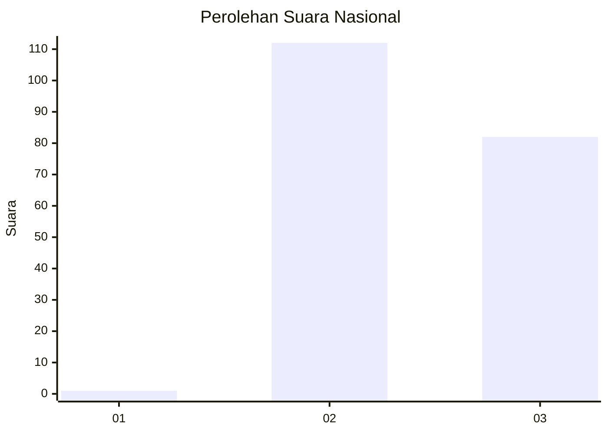
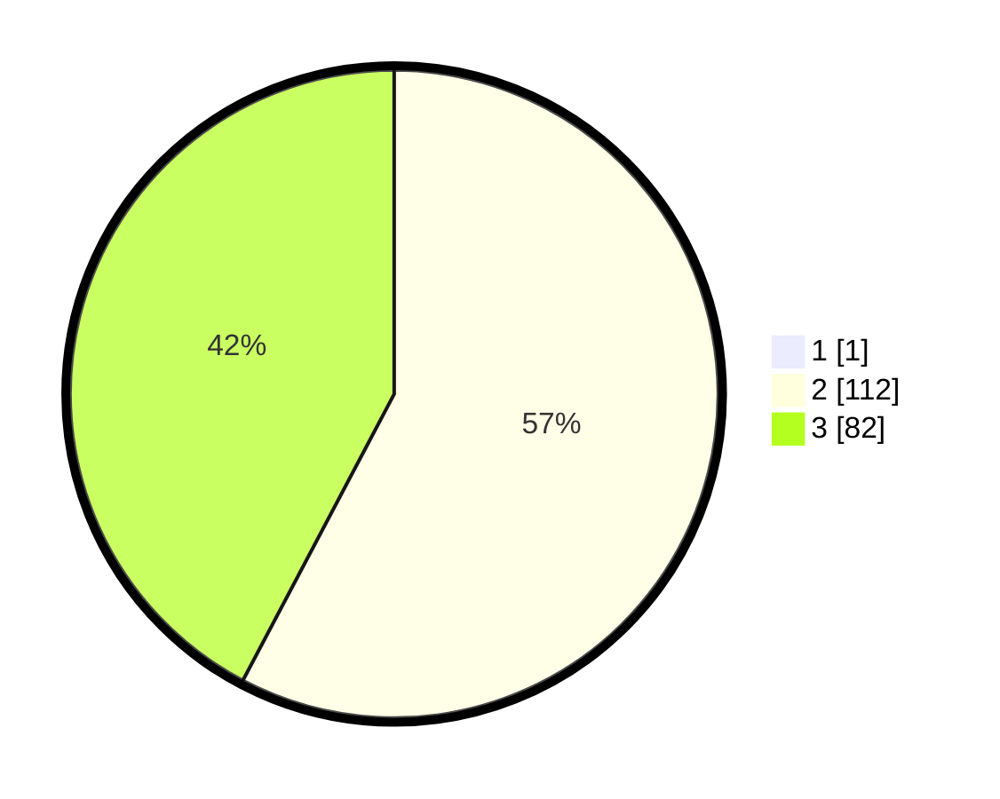

# Hasil

## Grafik

## Tabel

| No. | Nama Paslon    | Suara | Suara (raw) | Persentase |
|:--- |:-------------- | -----:| -----------:| ----------:|
| 1   | ANIES MUHAIMIN | 1     | [1][p-1]    | 0,51       |
| 2   | PRABOWO GIBRAN | 112   | [112][p-2]  | 57,44      |
| 3   | GANJAR MAHFUD  | 82    | [82][p-3]   | 42,05      |

[p-1]: https://github.com/gigit-pemilu/pemilu-2024/blob/main/pilpres/hitung-suara/sub/51-bali/sub/08-buleleng/sub/02-seririt/sub/2014-patemon/sub/025-tps/sub/paslon-1.txt
[p-2]: https://github.com/gigit-pemilu/pemilu-2024/blob/main/pilpres/hitung-suara/sub/51-bali/sub/08-buleleng/sub/02-seririt/sub/2014-patemon/sub/025-tps/sub/paslon-2.txt
[p-3]: https://github.com/gigit-pemilu/pemilu-2024/blob/main/pilpres/hitung-suara/sub/51-bali/sub/08-buleleng/sub/02-seririt/sub/2014-patemon/sub/025-tps/sub/paslon-3.txt

## Foto C Plano

https://sirekap-obj-formc.kpu.go.id/597e/pemilu/ppwp/51/08/02/20/14/5108022014025-20240214-201542--0ccfc5f6-2e93-40a0-930a-64d64bbd8370.jpg

https://sirekap-obj-formc.kpu.go.id/597e/pemilu/ppwp/51/08/02/20/14/5108022014025-20240215-104659--51c0254a-aee5-4da5-8940-f6b9f12aadad.jpg

https://sirekap-obj-formc.kpu.go.id/597e/pemilu/ppwp/51/08/02/20/14/5108022014025-20240215-104818--a9bacc01-8536-4e75-8f70-946c149ed135.jpg

## Metadata

| Key        | Value               |
| ---------- | ------------------- |
| Time Stamp | 2024-02-25 12:00:00 |

