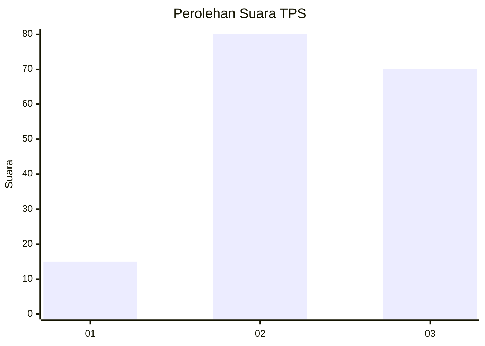
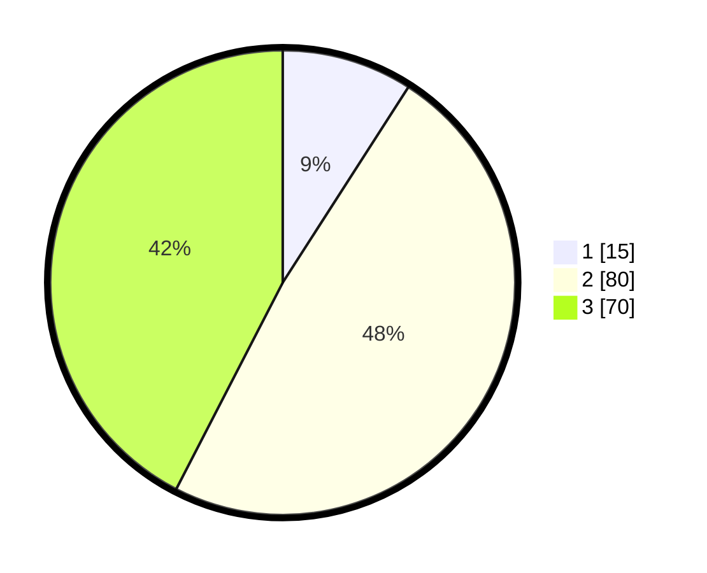

# Hasil

## Grafik

## Tabel

| No. | Nama Paslon    | Suara | Suara (raw) | Persentase |
|:--- |:-------------- | -----:| -----------:| ----------:|
| 1   | ANIES MUHAIMIN | 15    | [15][p-1]   | 9,09       |
| 2   | PRABOWO GIBRAN | 80    | [80][p-2]   | 48,48      |
| 3   | GANJAR MAHFUD  | 70    | [70][p-3]   | 42,42      |

[p-1]: https://github.com/gigit-pemilu/pemilu-2024-51-bali/blob/main/pilpres/hitung-suara/sub/51-bali/sub/08-buleleng/sub/02-seririt/sub/2016-pengastulan/sub/003-tps/sub/paslon-1.txt
[p-2]: https://github.com/gigit-pemilu/pemilu-2024-51-bali/blob/main/pilpres/hitung-suara/sub/51-bali/sub/08-buleleng/sub/02-seririt/sub/2016-pengastulan/sub/003-tps/sub/paslon-2.txt
[p-3]: https://github.com/gigit-pemilu/pemilu-2024-51-bali/blob/main/pilpres/hitung-suara/sub/51-bali/sub/08-buleleng/sub/02-seririt/sub/2016-pengastulan/sub/003-tps/sub/paslon-3.txt

## Foto C Plano

https://sirekap-obj-formc.kpu.go.id/762b/pemilu/ppwp/51/08/02/20/16/5108022016003-20240215-123242--a4dc7d9e-4406-4a22-a951-3f63f98f8288.jpg

https://sirekap-obj-formc.kpu.go.id/762b/pemilu/ppwp/51/08/02/20/16/5108022016003-20240215-123350--72be1c52-dc69-4537-8e23-2101ce1d4109.jpg

https://sirekap-obj-formc.kpu.go.id/762b/pemilu/ppwp/51/08/02/20/16/5108022016003-20240215-122958--55f6c46c-de0d-40d6-b01d-2076b553d1ad.jpg

## Metadata

| Key        | Value               |
| ---------- | ------------------- |
| Time Stamp | 2024-02-25 12:00:00 |

