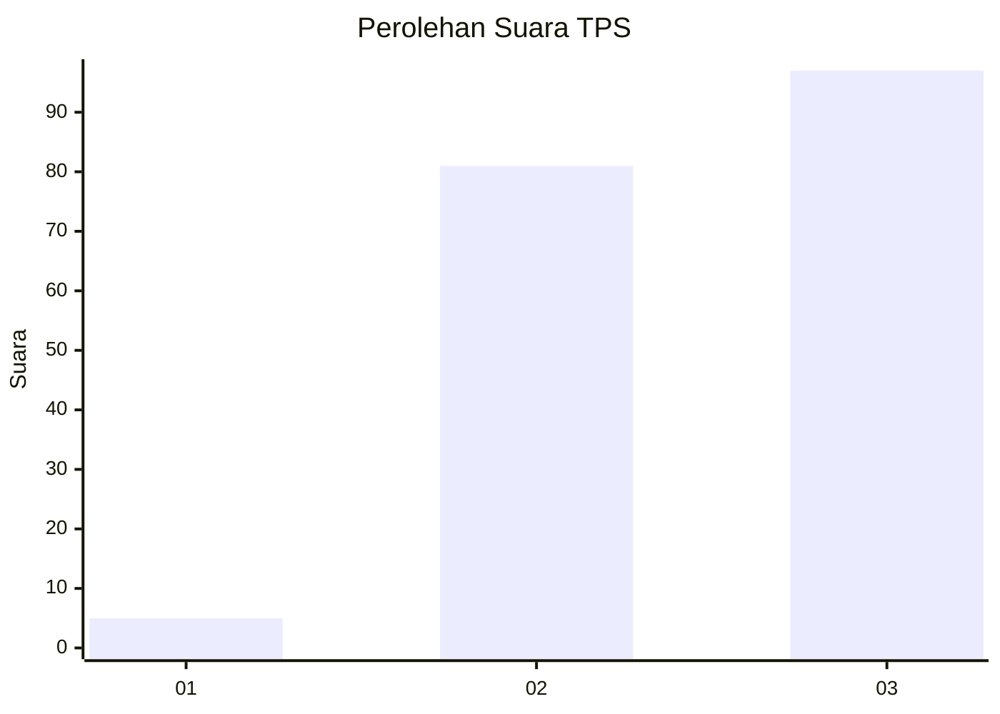
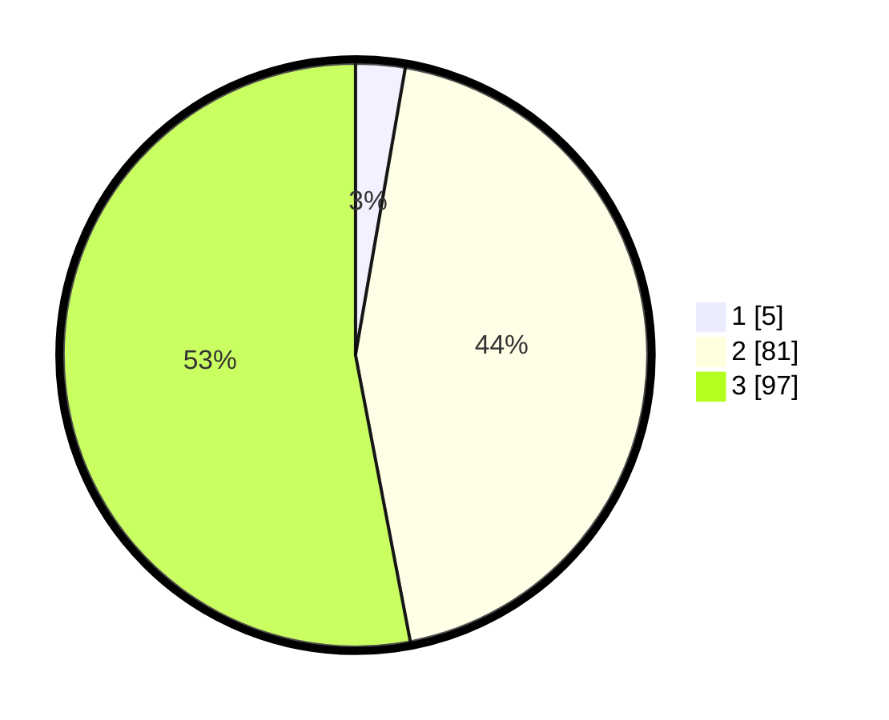

# Hasil

## Grafik

## Tabel

| No. | Nama Paslon    | Suara | Suara (raw) | Persentase |
|:--- |:-------------- | -----:| -----------:| ----------:|
| 1   | ANIES MUHAIMIN | 5     | [5][p-1]    | 2,73       |
| 2   | PRABOWO GIBRAN | 81    | [81][p-2]   | 44,26      |
| 3   | GANJAR MAHFUD  | 97    | [97][p-3]   | 53,01      |

[p-1]: https://github.com/gigit-pemilu/pemilu-2024-51-bali/blob/main/pilpres/hitung-suara/sub/51-bali/sub/08-buleleng/sub/02-seririt/sub/2016-pengastulan/sub/006-tps/sub/paslon-1.txt
[p-2]: https://github.com/gigit-pemilu/pemilu-2024-51-bali/blob/main/pilpres/hitung-suara/sub/51-bali/sub/08-buleleng/sub/02-seririt/sub/2016-pengastulan/sub/006-tps/sub/paslon-2.txt
[p-3]: https://github.com/gigit-pemilu/pemilu-2024-51-bali/blob/main/pilpres/hitung-suara/sub/51-bali/sub/08-buleleng/sub/02-seririt/sub/2016-pengastulan/sub/006-tps/sub/paslon-3.txt

## Foto C Plano

https://sirekap-obj-formc.kpu.go.id/472b/pemilu/ppwp/51/08/02/20/16/5108022016006-20240215-111148--aeb318cf-03a0-40d5-9c8d-c42282ce59a4.jpg

https://sirekap-obj-formc.kpu.go.id/472b/pemilu/ppwp/51/08/02/20/16/5108022016006-20240215-111253--5a9406c5-dabc-4cb3-8985-55a66e5eba75.jpg

https://sirekap-obj-formc.kpu.go.id/472b/pemilu/ppwp/51/08/02/20/16/5108022016006-20240215-111413--ff64a287-a59a-4fa5-a94a-ffcfabf5696c.jpg

## Metadata

| Key        | Value               |
| ---------- | ------------------- |
| Time Stamp | 2024-02-24 22:31:28 |

