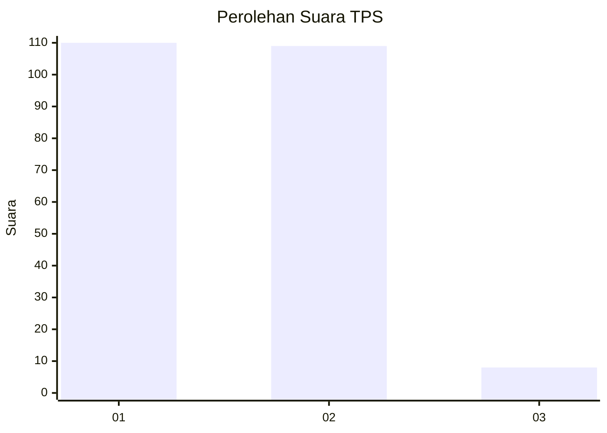
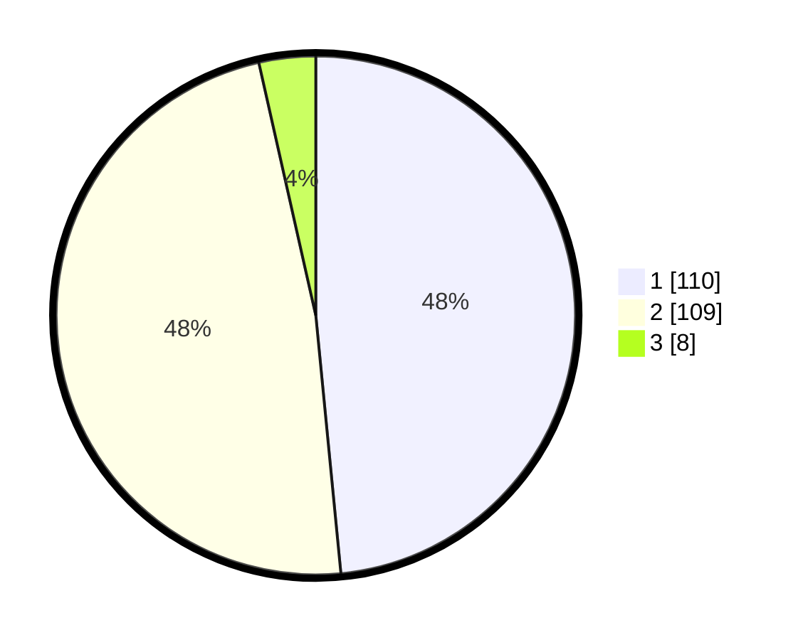

# Hasil

## Grafik

## Tabel

| No. | Nama Paslon    | Suara | Suara (raw) | Persentase |
|:--- |:-------------- | -----:| -----------:| ----------:|
| 1   | ANIES MUHAIMIN | 110   | [110][p-1]  | 48,46      |
| 2   | PRABOWO GIBRAN | 109   | [109][p-2]  | 48,02      |
| 3   | GANJAR MAHFUD  | 8     | [8][p-3]    | 3,52       |

[p-1]: https://github.com/gigit-pemilu/pemilu-2024-51-bali/blob/main/pilpres/hitung-suara/sub/51-bali/sub/08-buleleng/sub/02-seririt/sub/2016-pengastulan/sub/009-tps/sub/paslon-1.txt
[p-2]: https://github.com/gigit-pemilu/pemilu-2024-51-bali/blob/main/pilpres/hitung-suara/sub/51-bali/sub/08-buleleng/sub/02-seririt/sub/2016-pengastulan/sub/009-tps/sub/paslon-2.txt
[p-3]: https://github.com/gigit-pemilu/pemilu-2024-51-bali/blob/main/pilpres/hitung-suara/sub/51-bali/sub/08-buleleng/sub/02-seririt/sub/2016-pengastulan/sub/009-tps/sub/paslon-3.txt

## Foto C Plano

https://sirekap-obj-formc.kpu.go.id/6e7e/pemilu/ppwp/51/08/02/20/16/5108022016009-20240215-114254--224edc59-985d-42e3-9d02-cf5a005a2813.jpg

https://sirekap-obj-formc.kpu.go.id/6e7e/pemilu/ppwp/51/08/02/20/16/5108022016009-20240215-114333--2b3438f4-4fb3-41b8-ac0c-6da8ae7cfe48.jpg

https://sirekap-obj-formc.kpu.go.id/6e7e/pemilu/ppwp/51/08/02/20/16/5108022016009-20240215-114629--25f4e33f-280c-4a1f-bec4-dc7dc0455956.jpg

## Metadata

| Key        | Value               |
| ---------- | ------------------- |
| Time Stamp | 2024-02-24 22:31:28 |

