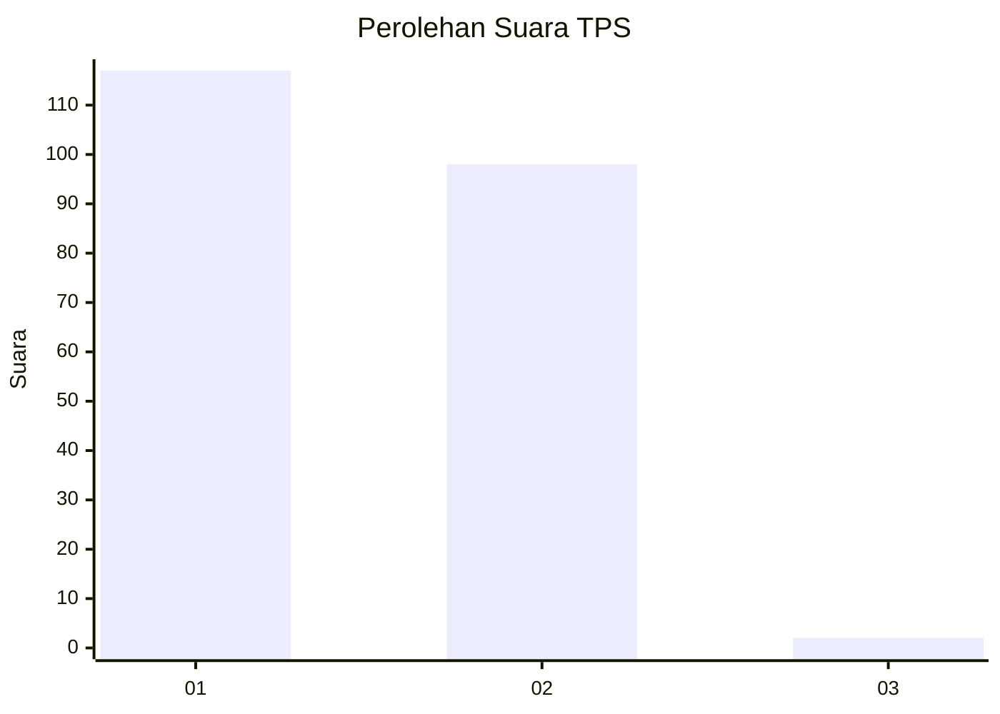
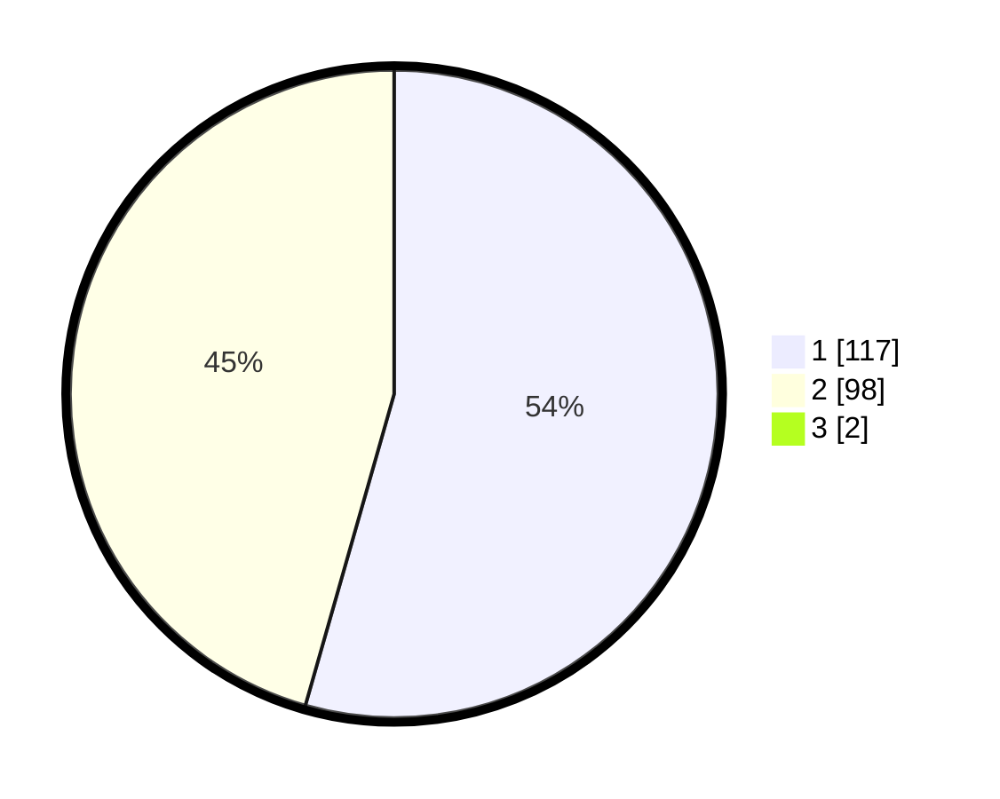

# Hasil

## Grafik

## Tabel

| No. | Nama Paslon    | Suara | Suara (raw) | Persentase |
|:--- |:-------------- | -----:| -----------:| ----------:|
| 1   | ANIES MUHAIMIN | 117   | [117][p-1]  | 53,92      |
| 2   | PRABOWO GIBRAN | 98    | [98][p-2]   | 45,16      |
| 3   | GANJAR MAHFUD  | 2     | [2][p-3]    | 0,92       |

[p-1]: https://github.com/gigit-pemilu/pemilu-2024-51-bali/blob/main/pilpres/hitung-suara/sub/51-bali/sub/08-buleleng/sub/02-seririt/sub/2016-pengastulan/sub/011-tps/sub/paslon-1.txt
[p-2]: https://github.com/gigit-pemilu/pemilu-2024-51-bali/blob/main/pilpres/hitung-suara/sub/51-bali/sub/08-buleleng/sub/02-seririt/sub/2016-pengastulan/sub/011-tps/sub/paslon-2.txt
[p-3]: https://github.com/gigit-pemilu/pemilu-2024-51-bali/blob/main/pilpres/hitung-suara/sub/51-bali/sub/08-buleleng/sub/02-seririt/sub/2016-pengastulan/sub/011-tps/sub/paslon-3.txt

## Foto C Plano

https://sirekap-obj-formc.kpu.go.id/da0e/pemilu/ppwp/51/08/02/20/16/5108022016011-20240215-023519--7c4d8756-0b45-4c86-9d17-107a94747f0b.jpg

https://sirekap-obj-formc.kpu.go.id/da0e/pemilu/ppwp/51/08/02/20/16/5108022016011-20240215-023607--e5673b0c-212f-402e-92b5-1f0856ec50f2.jpg

## Metadata

| Key        | Value               |
| ---------- | ------------------- |
| Time Stamp | 2024-02-15 19:30:26 |

