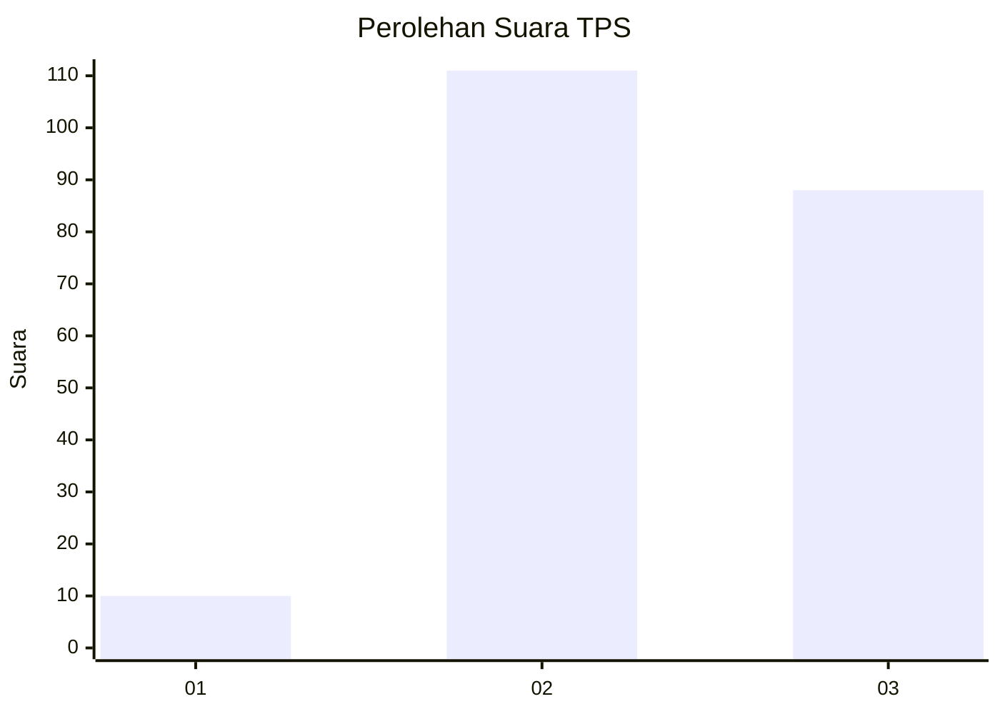
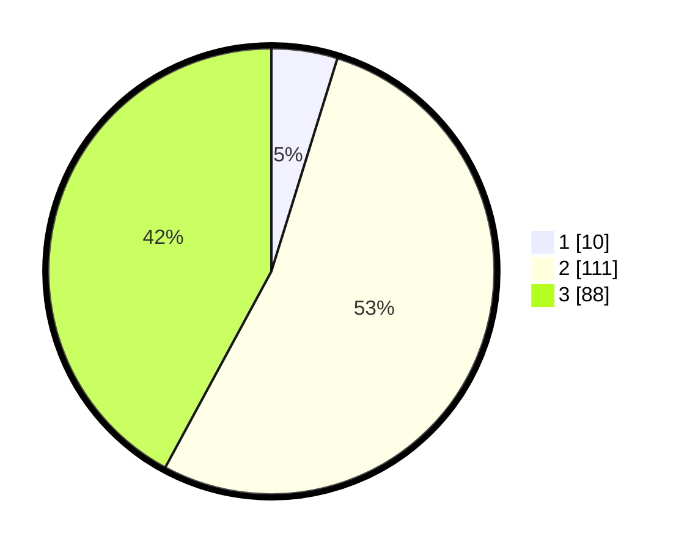

# Hasil

## Grafik

## Tabel

| No. | Nama Paslon    | Suara | Suara (raw) | Persentase |
|:--- |:-------------- | -----:| -----------:| ----------:|
| 1   | ANIES MUHAIMIN | 10    | [10][p-1]   | 4,78       |
| 2   | PRABOWO GIBRAN | 111   | [111][p-2]  | 53,11      |
| 3   | GANJAR MAHFUD  | 88    | [88][p-3]   | 42,11      |

[p-1]: https://github.com/gigit-pemilu/pemilu-2024-51-bali/blob/main/pilpres/hitung-suara/sub/51-bali/sub/08-buleleng/sub/02-seririt/sub/2016-pengastulan/sub/013-tps/sub/paslon-1.txt
[p-2]: https://github.com/gigit-pemilu/pemilu-2024-51-bali/blob/main/pilpres/hitung-suara/sub/51-bali/sub/08-buleleng/sub/02-seririt/sub/2016-pengastulan/sub/013-tps/sub/paslon-2.txt
[p-3]: https://github.com/gigit-pemilu/pemilu-2024-51-bali/blob/main/pilpres/hitung-suara/sub/51-bali/sub/08-buleleng/sub/02-seririt/sub/2016-pengastulan/sub/013-tps/sub/paslon-3.txt

## Foto C Plano

https://sirekap-obj-formc.kpu.go.id/7853/pemilu/ppwp/51/08/02/20/16/5108022016013-20240215-045339--943ebdd2-9106-4059-925f-db864d312d4e.jpg

https://sirekap-obj-formc.kpu.go.id/7853/pemilu/ppwp/51/08/02/20/16/5108022016013-20240215-045438--7c47f32c-5424-425e-bd70-022f90ddab1e.jpg

https://sirekap-obj-formc.kpu.go.id/7853/pemilu/ppwp/51/08/02/20/16/5108022016013-20240215-045527--f5131d19-10a1-4177-a035-856e6365e85f.jpg

## Metadata

| Key        | Value               |
| ---------- | ------------------- |
| Time Stamp | 2024-02-24 22:31:28 |

