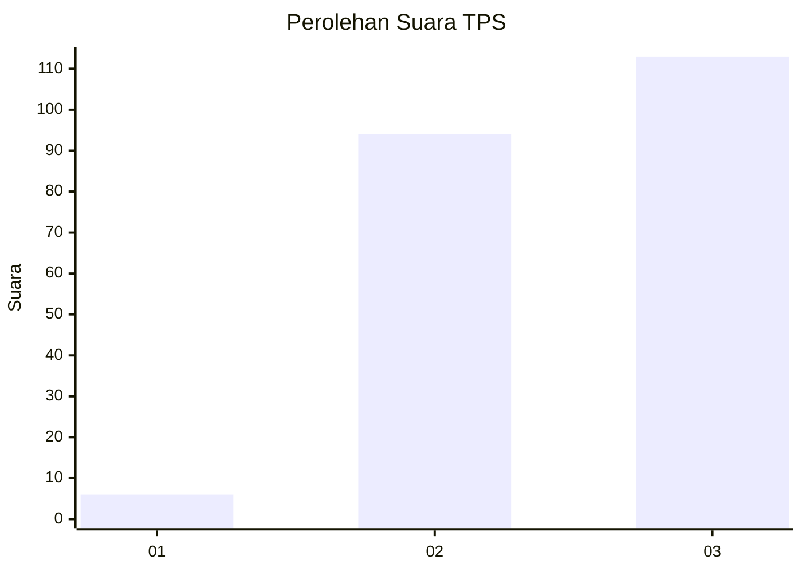
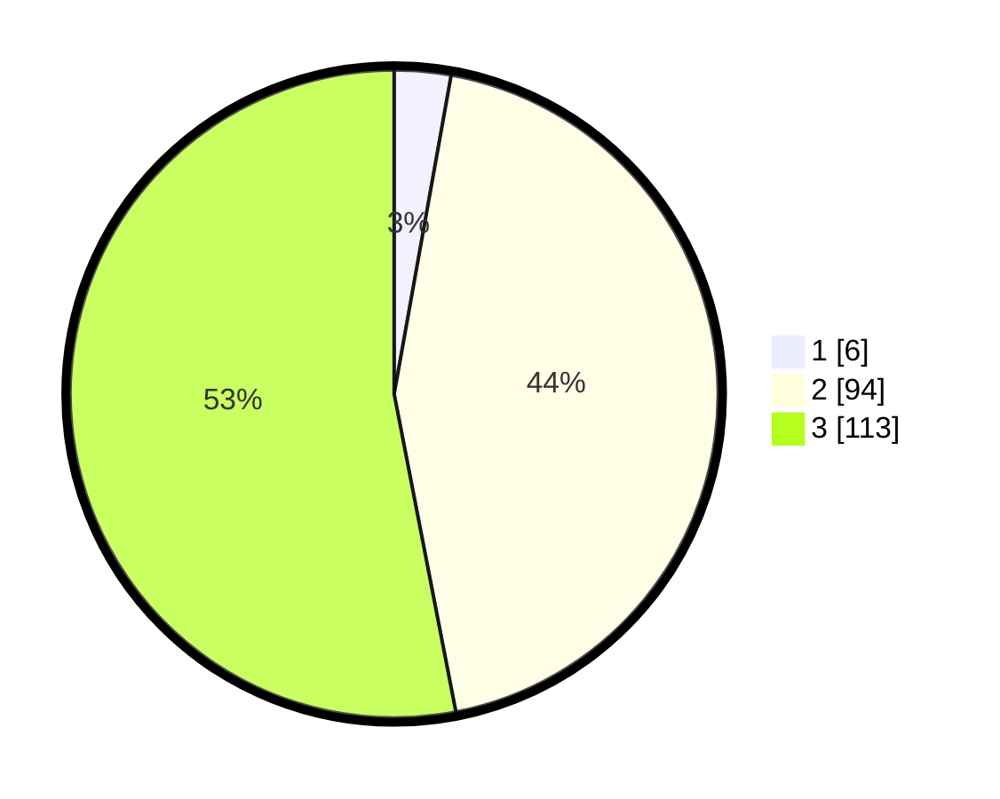

# Hasil

## Grafik

## Tabel

| No. | Nama Paslon    | Suara | Suara (raw) | Persentase |
|:--- |:-------------- | -----:| -----------:| ----------:|
| 1   | ANIES MUHAIMIN | 6     | [6][p-1]    | 2,82       |
| 2   | PRABOWO GIBRAN | 94    | [94][p-2]   | 44,13      |
| 3   | GANJAR MAHFUD  | 113   | [113][p-3]  | 53,05      |

[p-1]: https://github.com/gigit-pemilu/pemilu-2024-51-bali/blob/main/pilpres/hitung-suara/sub/51-bali/sub/08-buleleng/sub/02-seririt/sub/2016-pengastulan/sub/014-tps/sub/paslon-1.txt
[p-2]: https://github.com/gigit-pemilu/pemilu-2024-51-bali/blob/main/pilpres/hitung-suara/sub/51-bali/sub/08-buleleng/sub/02-seririt/sub/2016-pengastulan/sub/014-tps/sub/paslon-2.txt
[p-3]: https://github.com/gigit-pemilu/pemilu-2024-51-bali/blob/main/pilpres/hitung-suara/sub/51-bali/sub/08-buleleng/sub/02-seririt/sub/2016-pengastulan/sub/014-tps/sub/paslon-3.txt

## Foto C Plano

https://sirekap-obj-formc.kpu.go.id/40e5/pemilu/ppwp/51/08/02/20/16/5108022016014-20240215-102714--ec351b86-a313-46f7-9725-8feddbe8318c.jpg

https://sirekap-obj-formc.kpu.go.id/40e5/pemilu/ppwp/51/08/02/20/16/5108022016014-20240215-103024--b330c16a-7c16-4895-ade3-2277b634b7d0.jpg

https://sirekap-obj-formc.kpu.go.id/40e5/pemilu/ppwp/51/08/02/20/16/5108022016014-20240215-103220--867209f7-a923-4347-9204-e46523d97917.jpg

## Metadata

| Key        | Value               |
| ---------- | ------------------- |
| Time Stamp | 2024-02-24 22:31:28 |

