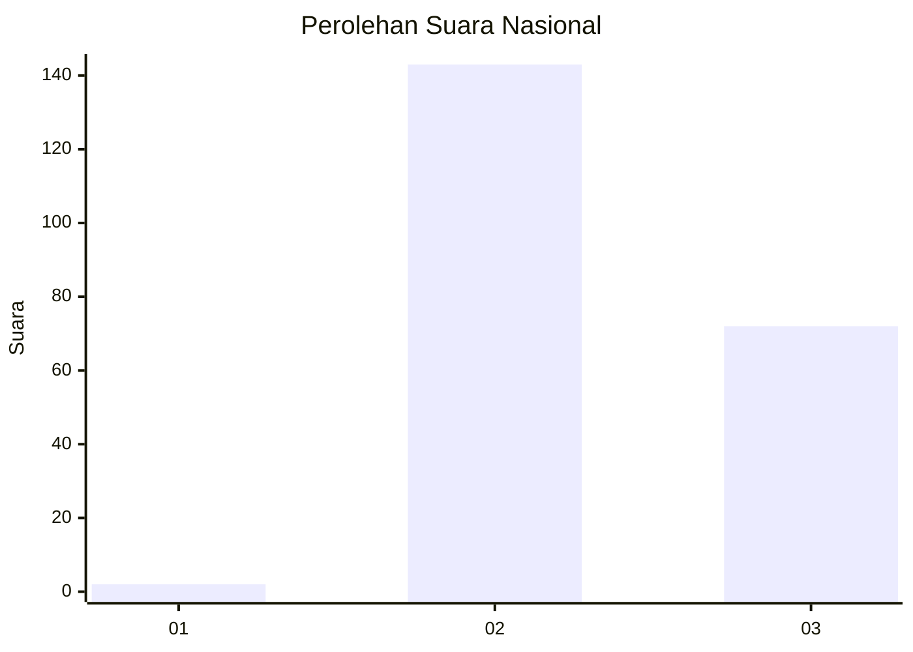
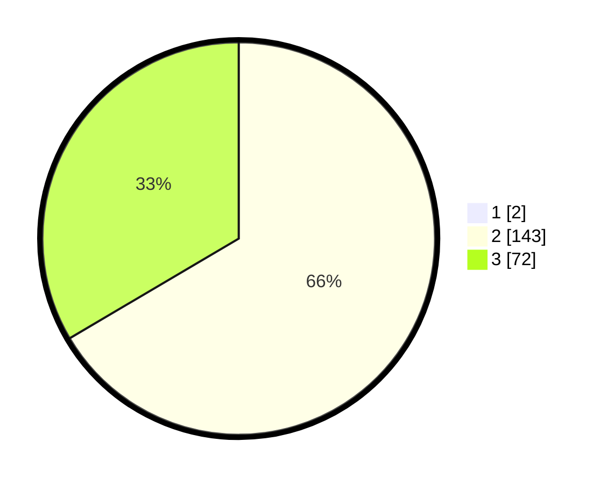

# Hasil

## Grafik

## Tabel

| No. | Nama Paslon    | Suara | Suara (raw) | Persentase |
|:--- |:-------------- | -----:| -----------:| ----------:|
| 1   | ANIES MUHAIMIN | 2     | [2][p-1]    | 0,92       |
| 2   | PRABOWO GIBRAN | 143   | [143][p-2]  | 65,90      |
| 3   | GANJAR MAHFUD  | 72    | [72][p-3]   | 33,18      |

[p-1]: https://github.com/gigit-pemilu/pemilu-2024/blob/main/pilpres/hitung-suara/sub/51-bali/sub/08-buleleng/sub/02-seririt/sub/2017-lokapaksa/sub/001-tps/sub/paslon-1.txt
[p-2]: https://github.com/gigit-pemilu/pemilu-2024/blob/main/pilpres/hitung-suara/sub/51-bali/sub/08-buleleng/sub/02-seririt/sub/2017-lokapaksa/sub/001-tps/sub/paslon-2.txt
[p-3]: https://github.com/gigit-pemilu/pemilu-2024/blob/main/pilpres/hitung-suara/sub/51-bali/sub/08-buleleng/sub/02-seririt/sub/2017-lokapaksa/sub/001-tps/sub/paslon-3.txt

## Foto C Plano

https://sirekap-obj-formc.kpu.go.id/1ade/pemilu/ppwp/51/08/02/20/17/5108022017001-20240214-233543--f2ebb546-7b1a-4c06-b8fe-7c9dec4fa635.jpg

https://sirekap-obj-formc.kpu.go.id/1ade/pemilu/ppwp/51/08/02/20/17/5108022017001-20240214-233841--664d05db-a045-45e2-9a7c-5acb33462fa4.jpg

https://sirekap-obj-formc.kpu.go.id/1ade/pemilu/ppwp/51/08/02/20/17/5108022017001-20240214-233959--188b8035-b424-4e43-964e-b958ee10f09b.jpg

## Metadata

| Key        | Value               |
| ---------- | ------------------- |
| Time Stamp | 2024-02-15 15:00:29 |

