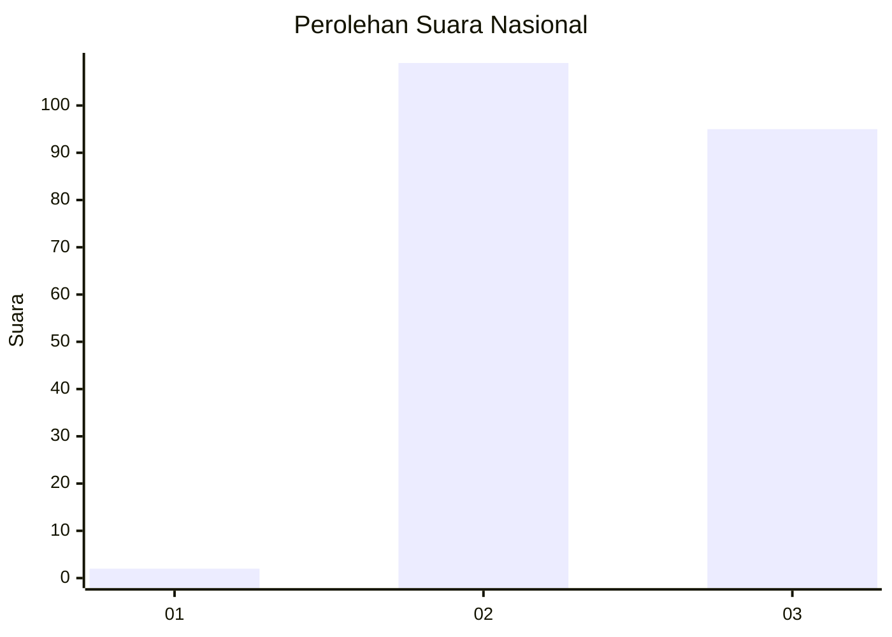
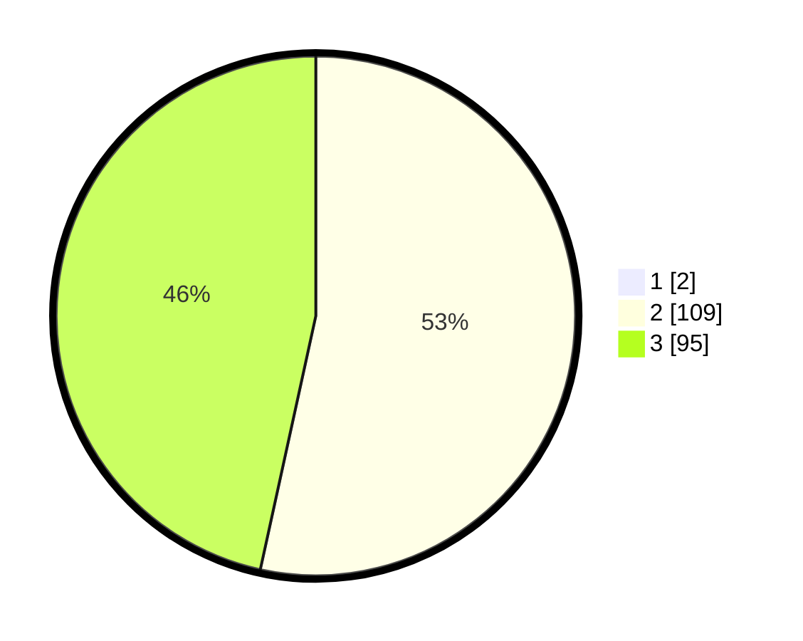

# Hasil

## Grafik

## Tabel

| No. | Nama Paslon    | Suara | Suara (raw) | Persentase |
|:--- |:-------------- | -----:| -----------:| ----------:|
| 1   | ANIES MUHAIMIN | 2     | [2][p-1]    | 0,97       |
| 2   | PRABOWO GIBRAN | 109   | [109][p-2]  | 52,91      |
| 3   | GANJAR MAHFUD  | 95    | [95][p-3]   | 46,12      |

[p-1]: https://github.com/gigit-pemilu/pemilu-2024/blob/main/pilpres/hitung-suara/sub/51-bali/sub/08-buleleng/sub/02-seririt/sub/2017-lokapaksa/sub/004-tps/sub/paslon-1.txt
[p-2]: https://github.com/gigit-pemilu/pemilu-2024/blob/main/pilpres/hitung-suara/sub/51-bali/sub/08-buleleng/sub/02-seririt/sub/2017-lokapaksa/sub/004-tps/sub/paslon-2.txt
[p-3]: https://github.com/gigit-pemilu/pemilu-2024/blob/main/pilpres/hitung-suara/sub/51-bali/sub/08-buleleng/sub/02-seririt/sub/2017-lokapaksa/sub/004-tps/sub/paslon-3.txt

## Foto C Plano

https://sirekap-obj-formc.kpu.go.id/eda9/pemilu/ppwp/51/08/02/20/17/5108022017004-20240215-104727--5f41d87c-53b7-431c-9152-585bed493ca9.jpg

https://sirekap-obj-formc.kpu.go.id/eda9/pemilu/ppwp/51/08/02/20/17/5108022017004-20240215-105040--4baa5210-e3c2-4d77-918b-83ce8f64d0b2.jpg

https://sirekap-obj-formc.kpu.go.id/eda9/pemilu/ppwp/51/08/02/20/17/5108022017004-20240215-105523--53b5ac0e-f016-4c2c-8ed3-933f13f0f83a.jpg

## Metadata

| Key        | Value               |
| ---------- | ------------------- |
| Time Stamp | 2024-02-24 22:31:28 |

