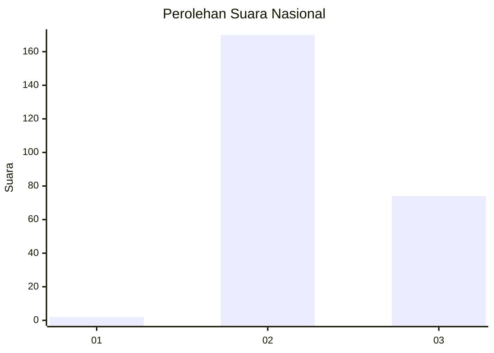
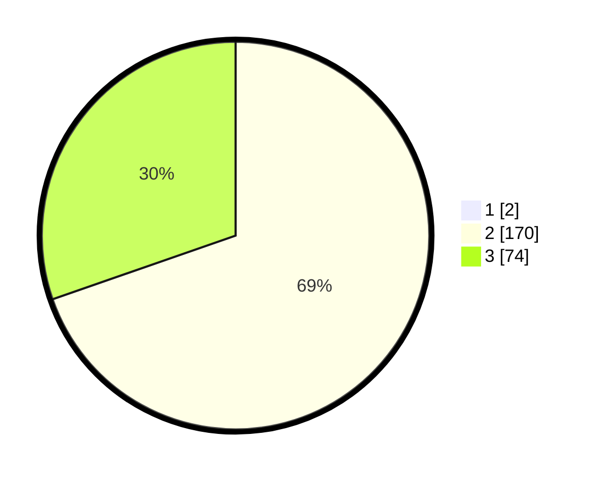

# Hasil

## Grafik

## Tabel

| No. | Nama Paslon    | Suara | Suara (raw) | Persentase |
|:--- |:-------------- | -----:| -----------:| ----------:|
| 1   | ANIES MUHAIMIN | 2     | [2][p-1]    | 0,81       |
| 2   | PRABOWO GIBRAN | 170   | [170][p-2]  | 69,11      |
| 3   | GANJAR MAHFUD  | 74    | [74][p-3]   | 30,08      |

[p-1]: https://github.com/gigit-pemilu/pemilu-2024/blob/main/pilpres/hitung-suara/sub/51-bali/sub/08-buleleng/sub/02-seririt/sub/2017-lokapaksa/sub/010-tps/sub/paslon-1.txt
[p-2]: https://github.com/gigit-pemilu/pemilu-2024/blob/main/pilpres/hitung-suara/sub/51-bali/sub/08-buleleng/sub/02-seririt/sub/2017-lokapaksa/sub/010-tps/sub/paslon-2.txt
[p-3]: https://github.com/gigit-pemilu/pemilu-2024/blob/main/pilpres/hitung-suara/sub/51-bali/sub/08-buleleng/sub/02-seririt/sub/2017-lokapaksa/sub/010-tps/sub/paslon-3.txt

## Foto C Plano

https://sirekap-obj-formc.kpu.go.id/b1ee/pemilu/ppwp/51/08/02/20/17/5108022017010-20240215-002658--a2ff7730-0e13-4592-9100-fe673f3a3248.jpg

https://sirekap-obj-formc.kpu.go.id/b1ee/pemilu/ppwp/51/08/02/20/17/5108022017010-20240215-002730--a2ac9196-a018-4851-8af6-4acc730fca36.jpg

https://sirekap-obj-formc.kpu.go.id/b1ee/pemilu/ppwp/51/08/02/20/17/5108022017010-20240215-002817--d5ef0ca7-0676-4a86-95e4-b40af6c97539.jpg

## Metadata

| Key        | Value               |
| ---------- | ------------------- |
| Time Stamp | 2024-02-24 22:31:28 |

