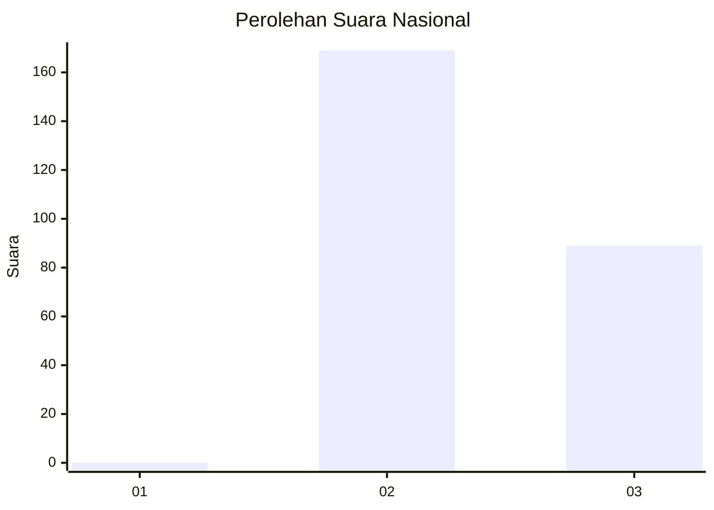
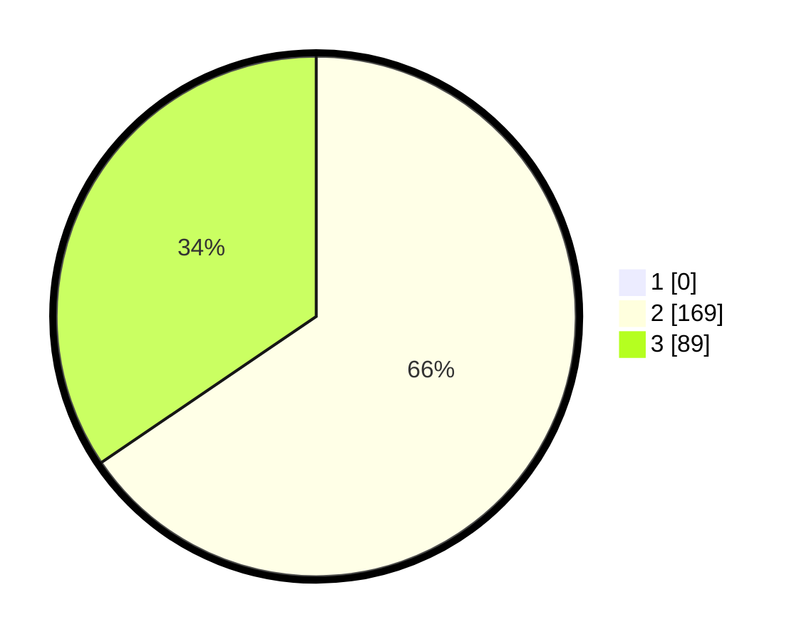

# Hasil

## Grafik

## Tabel

| No. | Nama Paslon    | Suara | Suara (raw) | Persentase |
|:--- |:-------------- | -----:| -----------:| ----------:|
| 1   | ANIES MUHAIMIN | 0     | [0][p-1]    | 0,00       |
| 2   | PRABOWO GIBRAN | 169   | [169][p-2]  | 65,50      |
| 3   | GANJAR MAHFUD  | 89    | [89][p-3]   | 34,50      |

[p-1]: https://github.com/gigit-pemilu/pemilu-2024/blob/main/pilpres/hitung-suara/sub/51-bali/sub/08-buleleng/sub/02-seririt/sub/2017-lokapaksa/sub/011-tps/sub/paslon-1.txt
[p-2]: https://github.com/gigit-pemilu/pemilu-2024/blob/main/pilpres/hitung-suara/sub/51-bali/sub/08-buleleng/sub/02-seririt/sub/2017-lokapaksa/sub/011-tps/sub/paslon-2.txt
[p-3]: https://github.com/gigit-pemilu/pemilu-2024/blob/main/pilpres/hitung-suara/sub/51-bali/sub/08-buleleng/sub/02-seririt/sub/2017-lokapaksa/sub/011-tps/sub/paslon-3.txt

## Foto C Plano

https://sirekap-obj-formc.kpu.go.id/0c4f/pemilu/ppwp/51/08/02/20/17/5108022017011-20240215-012935--e367fe58-5648-484a-bf46-33bf5be1a9a9.jpg

https://sirekap-obj-formc.kpu.go.id/0c4f/pemilu/ppwp/51/08/02/20/17/5108022017011-20240214-205717--15999a46-96df-4d72-83ca-3e2f392761bb.jpg

https://sirekap-obj-formc.kpu.go.id/0c4f/pemilu/ppwp/51/08/02/20/17/5108022017011-20240214-214550--5de03680-4e8f-4b69-acd5-b42f91a16bac.jpg

## Metadata

| Key        | Value               |
| ---------- | ------------------- |
| Time Stamp | 2024-02-24 23:00:00 |

