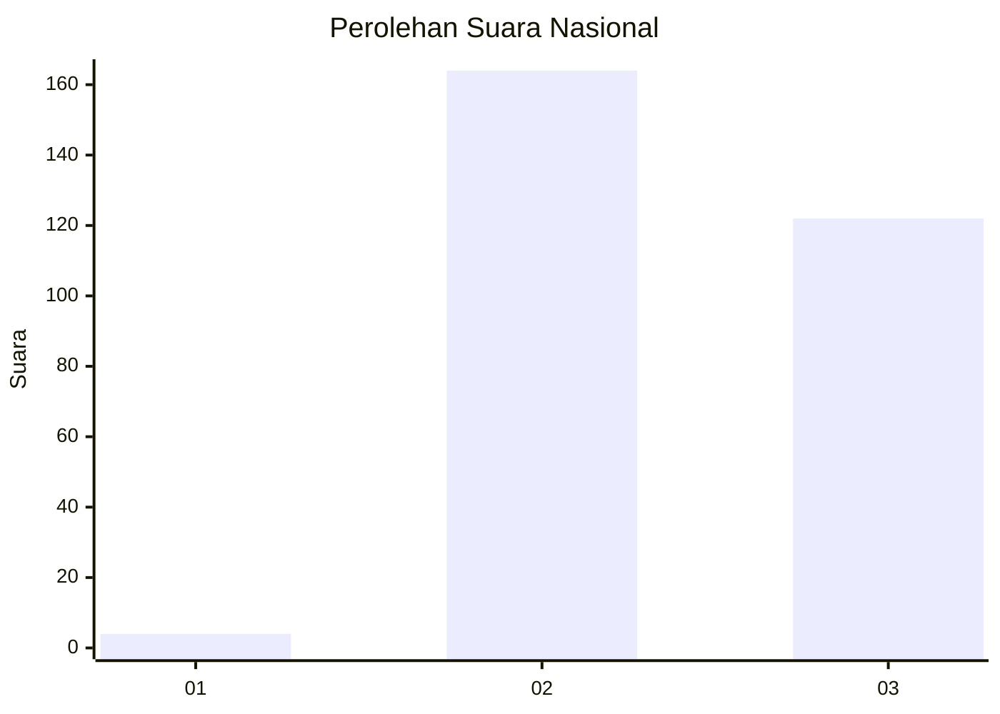
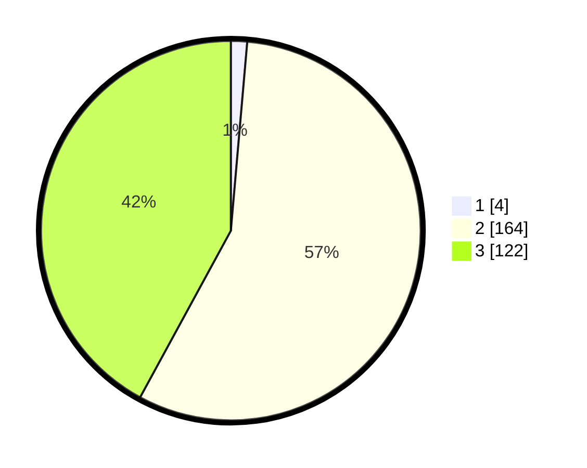

# Hasil

## Grafik

## Tabel

| No. | Nama Paslon    | Suara | Suara (raw) | Persentase |
|:--- |:-------------- | -----:| -----------:| ----------:|
| 1   | ANIES MUHAIMIN | 4     | [4][p-1]    | 1,38       |
| 2   | PRABOWO GIBRAN | 164   | [164][p-2]  | 56,55      |
| 3   | GANJAR MAHFUD  | 122   | [122][p-3]  | 42,07      |

[p-1]: https://github.com/gigit-pemilu/pemilu-2024/blob/main/pilpres/hitung-suara/sub/51-bali/sub/08-buleleng/sub/02-seririt/sub/2017-lokapaksa/sub/014-tps/sub/paslon-1.txt
[p-2]: https://github.com/gigit-pemilu/pemilu-2024/blob/main/pilpres/hitung-suara/sub/51-bali/sub/08-buleleng/sub/02-seririt/sub/2017-lokapaksa/sub/014-tps/sub/paslon-2.txt
[p-3]: https://github.com/gigit-pemilu/pemilu-2024/blob/main/pilpres/hitung-suara/sub/51-bali/sub/08-buleleng/sub/02-seririt/sub/2017-lokapaksa/sub/014-tps/sub/paslon-3.txt

## Foto C Plano

https://sirekap-obj-formc.kpu.go.id/705c/pemilu/ppwp/51/08/02/20/17/5108022017014-20240214-132855--963be9f2-d24c-4e65-bc37-0b10bf565d64.jpg

https://sirekap-obj-formc.kpu.go.id/705c/pemilu/ppwp/51/08/02/20/17/5108022017014-20240214-133039--8f1aa4d8-96ef-4166-9c5f-7ca850cfd3f7.jpg

## Metadata

| Key        | Value               |
| ---------- | ------------------- |
| Time Stamp | 2024-02-24 22:31:28 |

