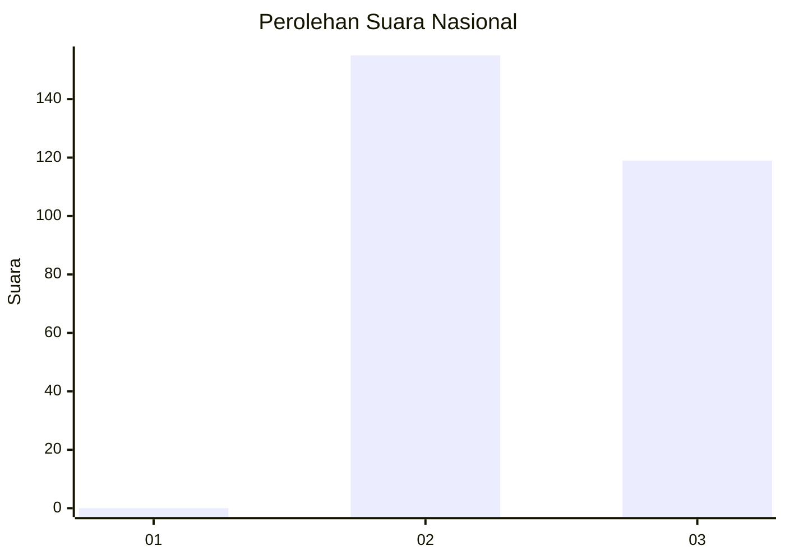
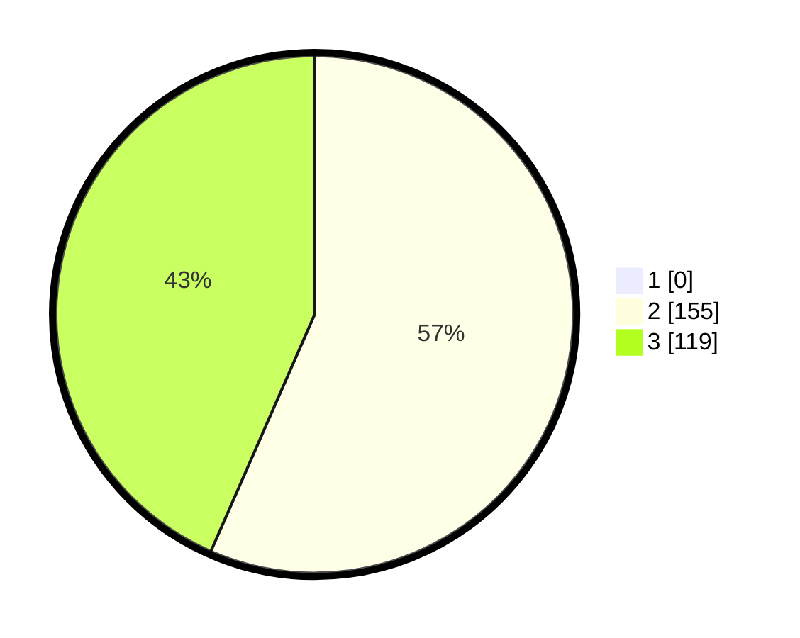

# Hasil

## Grafik

## Tabel

| No. | Nama Paslon    | Suara | Suara (raw) | Persentase |
|:--- |:-------------- | -----:| -----------:| ----------:|
| 1   | ANIES MUHAIMIN | 0     | [0][p-1]    | 0,00       |
| 2   | PRABOWO GIBRAN | 155   | [155][p-2]  | 56,57      |
| 3   | GANJAR MAHFUD  | 119   | [119][p-3]  | 43,43      |

[p-1]: https://github.com/gigit-pemilu/pemilu-2024/blob/main/pilpres/hitung-suara/sub/51-bali/sub/08-buleleng/sub/02-seririt/sub/2017-lokapaksa/sub/018-tps/sub/paslon-1.txt
[p-2]: https://github.com/gigit-pemilu/pemilu-2024/blob/main/pilpres/hitung-suara/sub/51-bali/sub/08-buleleng/sub/02-seririt/sub/2017-lokapaksa/sub/018-tps/sub/paslon-2.txt
[p-3]: https://github.com/gigit-pemilu/pemilu-2024/blob/main/pilpres/hitung-suara/sub/51-bali/sub/08-buleleng/sub/02-seririt/sub/2017-lokapaksa/sub/018-tps/sub/paslon-3.txt

## Foto C Plano

https://sirekap-obj-formc.kpu.go.id/0ec6/pemilu/ppwp/51/08/02/20/17/5108022017018-20240215-041057--2d80801b-6e5b-4847-bf63-30b4b6d44218.jpg

https://sirekap-obj-formc.kpu.go.id/0ec6/pemilu/ppwp/51/08/02/20/17/5108022017018-20240215-041146--f58df977-670d-4848-80f5-46f15dd07545.jpg

https://sirekap-obj-formc.kpu.go.id/0ec6/pemilu/ppwp/51/08/02/20/17/5108022017018-20240215-041226--47d1c916-efa2-4225-a69b-eb4a1aae295d.jpg

## Metadata

| Key        | Value               |
| ---------- | ------------------- |
| Time Stamp | 2024-02-26 01:00:00 |

