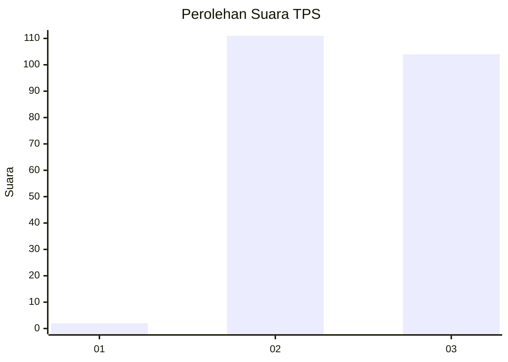
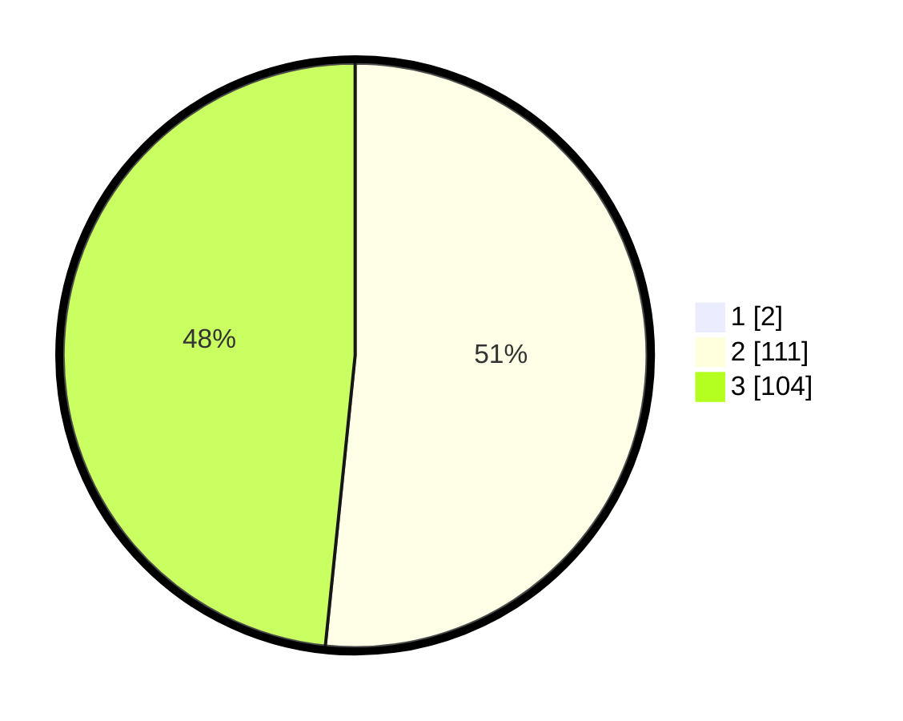

# Hasil

## Grafik

## Tabel

| No. | Nama Paslon    | Suara | Suara (raw) | Persentase |
|:--- |:-------------- | -----:| -----------:| ----------:|
| 1   | ANIES MUHAIMIN | 2     | [2][p-1]    | 0,92       |
| 2   | PRABOWO GIBRAN | 111   | [111][p-2]  | 51,15      |
| 3   | GANJAR MAHFUD  | 104   | [104][p-3]  | 47,93      |

[p-1]: https://github.com/gigit-pemilu/pemilu-2024-51-bali/blob/main/pilpres/hitung-suara/sub/51-bali/sub/08-buleleng/sub/02-seririt/sub/2017-lokapaksa/sub/020-tps/sub/paslon-1.txt
[p-2]: https://github.com/gigit-pemilu/pemilu-2024-51-bali/blob/main/pilpres/hitung-suara/sub/51-bali/sub/08-buleleng/sub/02-seririt/sub/2017-lokapaksa/sub/020-tps/sub/paslon-2.txt
[p-3]: https://github.com/gigit-pemilu/pemilu-2024-51-bali/blob/main/pilpres/hitung-suara/sub/51-bali/sub/08-buleleng/sub/02-seririt/sub/2017-lokapaksa/sub/020-tps/sub/paslon-3.txt

## Foto C Plano

https://sirekap-obj-formc.kpu.go.id/96a8/pemilu/ppwp/51/08/02/20/17/5108022017020-20240215-020922--2894631b-3691-436f-9922-037974bc8867.jpg

https://sirekap-obj-formc.kpu.go.id/96a8/pemilu/ppwp/51/08/02/20/17/5108022017020-20240215-021058--10d0d615-a55e-4e2a-b67f-ef4618650780.jpg

https://sirekap-obj-formc.kpu.go.id/96a8/pemilu/ppwp/51/08/02/20/17/5108022017020-20240215-021329--ccf68ebf-5b67-45be-82ea-104ecafafb59.jpg

## Metadata

| Key        | Value               |
| ---------- | ------------------- |
| Time Stamp | 2024-02-25 11:00:00 |

