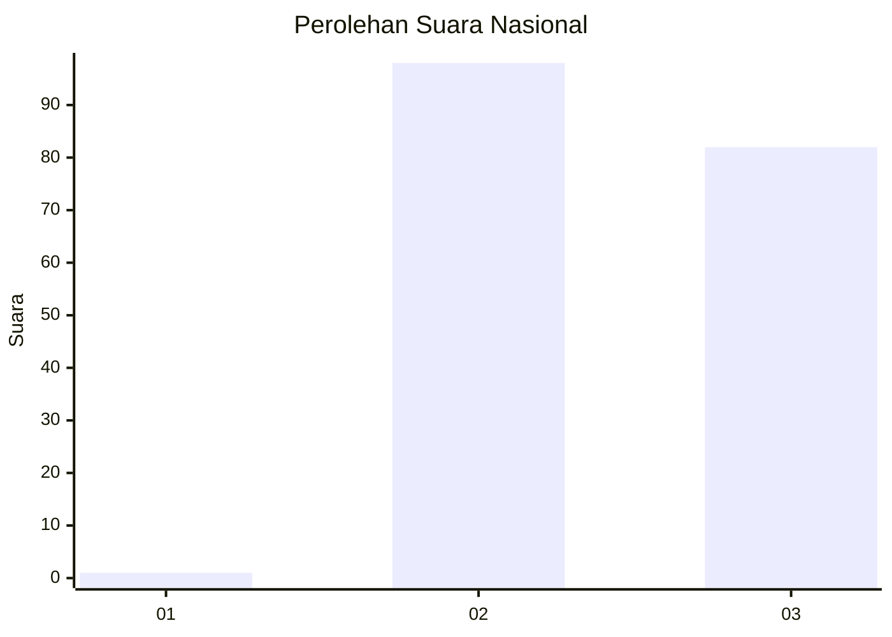
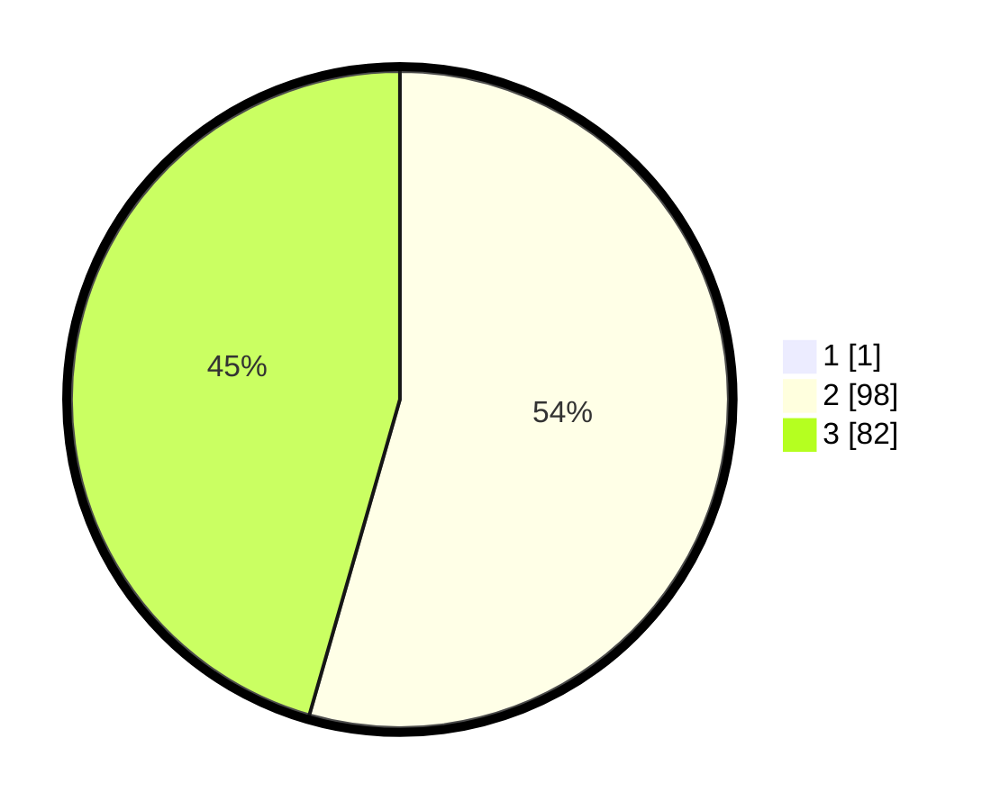

# Hasil

## Grafik

## Tabel

| No. | Nama Paslon    | Suara | Suara (raw) | Persentase |
|:--- |:-------------- | -----:| -----------:| ----------:|
| 1   | ANIES MUHAIMIN | 1     | [1][p-1]    | 0,55       |
| 2   | PRABOWO GIBRAN | 98    | [98][p-2]   | 54,14      |
| 3   | GANJAR MAHFUD  | 82    | [82][p-3]   | 45,30      |

[p-1]: https://github.com/gigit-pemilu/pemilu-2024/blob/main/pilpres/hitung-suara/sub/51-bali/sub/08-buleleng/sub/02-seririt/sub/2017-lokapaksa/sub/021-tps/sub/paslon-1.txt
[p-2]: https://github.com/gigit-pemilu/pemilu-2024/blob/main/pilpres/hitung-suara/sub/51-bali/sub/08-buleleng/sub/02-seririt/sub/2017-lokapaksa/sub/021-tps/sub/paslon-2.txt
[p-3]: https://github.com/gigit-pemilu/pemilu-2024/blob/main/pilpres/hitung-suara/sub/51-bali/sub/08-buleleng/sub/02-seririt/sub/2017-lokapaksa/sub/021-tps/sub/paslon-3.txt

## Foto C Plano

https://sirekap-obj-formc.kpu.go.id/a6b5/pemilu/ppwp/51/08/02/20/17/5108022017021-20240215-022937--4285deb5-6c55-4adf-9c60-bb4321af5f9b.jpg

https://sirekap-obj-formc.kpu.go.id/a6b5/pemilu/ppwp/51/08/02/20/17/5108022017021-20240215-023842--248aecdd-4db0-4a03-9a2b-79969485906b.jpg

https://sirekap-obj-formc.kpu.go.id/a6b5/pemilu/ppwp/51/08/02/20/17/5108022017021-20240215-024330--3ccc0f99-cdcb-4cb9-bfa7-7ccc9184e356.jpg

## Metadata

| Key        | Value               |
| ---------- | ------------------- |
| Time Stamp | 2024-02-24 22:31:28 |

