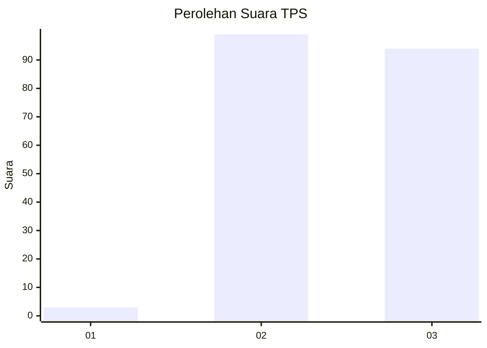
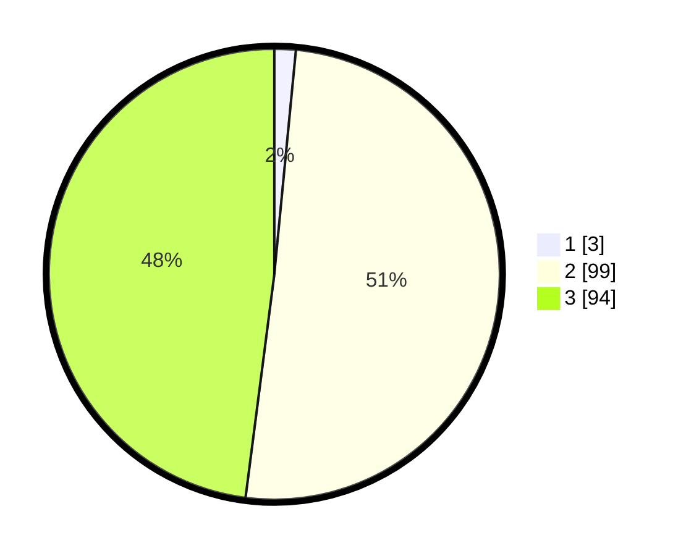

# Hasil

## Grafik

## Tabel

| No. | Nama Paslon    | Suara | Suara (raw) | Persentase |
|:--- |:-------------- | -----:| -----------:| ----------:|
| 1   | ANIES MUHAIMIN | 3     | [3][p-1]    | 1,53       |
| 2   | PRABOWO GIBRAN | 99    | [99][p-2]   | 50,51      |
| 3   | GANJAR MAHFUD  | 94    | [94][p-3]   | 47,96      |

[p-1]: https://github.com/gigit-pemilu/pemilu-2024-51-bali/blob/main/pilpres/hitung-suara/sub/51-bali/sub/08-buleleng/sub/02-seririt/sub/2017-lokapaksa/sub/022-tps/sub/paslon-1.txt
[p-2]: https://github.com/gigit-pemilu/pemilu-2024-51-bali/blob/main/pilpres/hitung-suara/sub/51-bali/sub/08-buleleng/sub/02-seririt/sub/2017-lokapaksa/sub/022-tps/sub/paslon-2.txt
[p-3]: https://github.com/gigit-pemilu/pemilu-2024-51-bali/blob/main/pilpres/hitung-suara/sub/51-bali/sub/08-buleleng/sub/02-seririt/sub/2017-lokapaksa/sub/022-tps/sub/paslon-3.txt

## Foto C Plano

https://sirekap-obj-formc.kpu.go.id/a67b/pemilu/ppwp/51/08/02/20/17/5108022017022-20240215-013754--e18d179d-7975-425e-ae09-ae7bdceb623b.jpg

https://sirekap-obj-formc.kpu.go.id/a67b/pemilu/ppwp/51/08/02/20/17/5108022017022-20240215-013954--488f3509-0b80-4e92-8751-32c218d9179d.jpg

https://sirekap-obj-formc.kpu.go.id/a67b/pemilu/ppwp/51/08/02/20/17/5108022017022-20240215-014442--f9a087ef-af16-4725-a039-0d2463425807.jpg

## Metadata

| Key        | Value               |
| ---------- | ------------------- |
| Time Stamp | 2024-02-24 22:31:28 |

