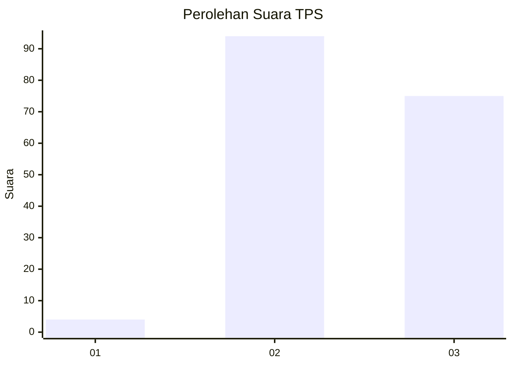
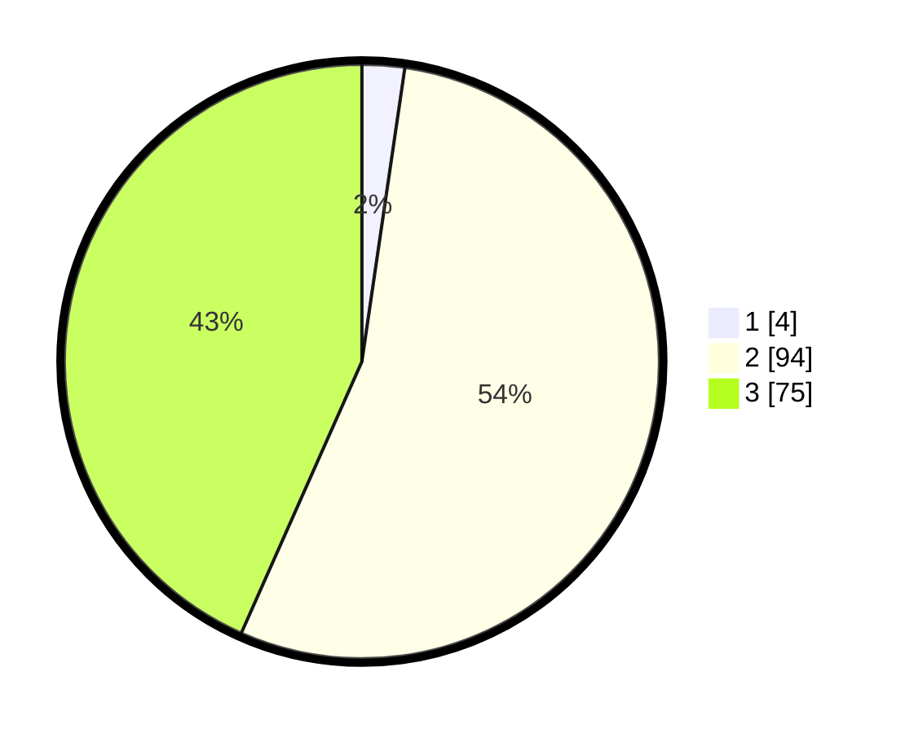

# Hasil

## Grafik

## Tabel

| No. | Nama Paslon    | Suara | Suara (raw) | Persentase |
|:--- |:-------------- | -----:| -----------:| ----------:|
| 1   | ANIES MUHAIMIN | 4     | [4][p-1]    | 2,31       |
| 2   | PRABOWO GIBRAN | 94    | [94][p-2]   | 54,34      |
| 3   | GANJAR MAHFUD  | 75    | [75][p-3]   | 43,35      |

[p-1]: https://github.com/gigit-pemilu/pemilu-2024-51-bali/blob/main/pilpres/hitung-suara/sub/51-bali/sub/08-buleleng/sub/02-seririt/sub/2017-lokapaksa/sub/024-tps/sub/paslon-1.txt
[p-2]: https://github.com/gigit-pemilu/pemilu-2024-51-bali/blob/main/pilpres/hitung-suara/sub/51-bali/sub/08-buleleng/sub/02-seririt/sub/2017-lokapaksa/sub/024-tps/sub/paslon-2.txt
[p-3]: https://github.com/gigit-pemilu/pemilu-2024-51-bali/blob/main/pilpres/hitung-suara/sub/51-bali/sub/08-buleleng/sub/02-seririt/sub/2017-lokapaksa/sub/024-tps/sub/paslon-3.txt

## Foto C Plano

https://sirekap-obj-formc.kpu.go.id/bbcf/pemilu/ppwp/51/08/02/20/17/5108022017024-20240215-015607--f21c1ccf-1169-49e6-ac83-5af31a3aae2b.jpg

https://sirekap-obj-formc.kpu.go.id/bbcf/pemilu/ppwp/51/08/02/20/17/5108022017024-20240215-015753--4195a8c3-424c-43c5-941d-25f9932c80f0.jpg

https://sirekap-obj-formc.kpu.go.id/bbcf/pemilu/ppwp/51/08/02/20/17/5108022017024-20240215-015936--3db19e9c-46b2-42d8-ada5-9b1466a82116.jpg

## Metadata

| Key        | Value               |
| ---------- | ------------------- |
| Time Stamp | 2024-02-25 16:00:00 |

