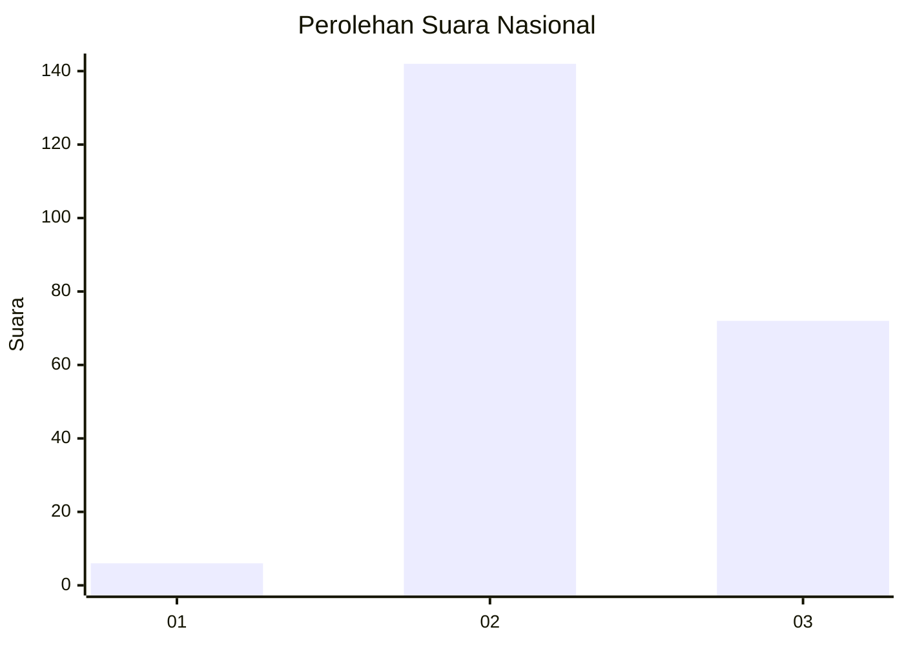
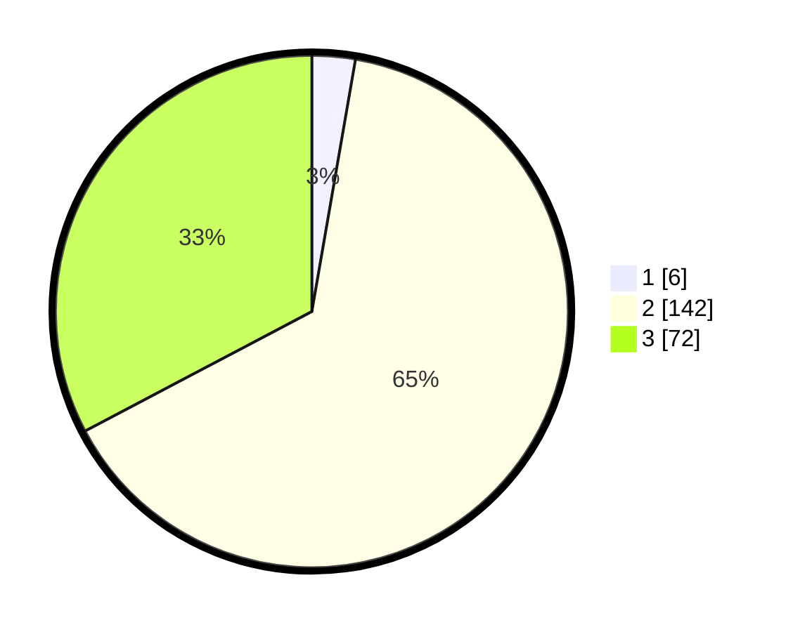

# Hasil

## Grafik

## Tabel

| No. | Nama Paslon    | Suara | Suara (raw) | Persentase |
|:--- |:-------------- | -----:| -----------:| ----------:|
| 1   | ANIES MUHAIMIN | 6     | [6][p-1]    | 2,73       |
| 2   | PRABOWO GIBRAN | 142   | [142][p-2]  | 64,55      |
| 3   | GANJAR MAHFUD  | 72    | [72][p-3]   | 32,73      |

[p-1]: https://github.com/gigit-pemilu/pemilu-2024/blob/main/pilpres/hitung-suara/sub/51-bali/sub/08-buleleng/sub/02-seririt/sub/2017-lokapaksa/sub/033-tps/sub/paslon-1.txt
[p-2]: https://github.com/gigit-pemilu/pemilu-2024/blob/main/pilpres/hitung-suara/sub/51-bali/sub/08-buleleng/sub/02-seririt/sub/2017-lokapaksa/sub/033-tps/sub/paslon-2.txt
[p-3]: https://github.com/gigit-pemilu/pemilu-2024/blob/main/pilpres/hitung-suara/sub/51-bali/sub/08-buleleng/sub/02-seririt/sub/2017-lokapaksa/sub/033-tps/sub/paslon-3.txt

## Foto C Plano

https://sirekap-obj-formc.kpu.go.id/cfe9/pemilu/ppwp/51/08/02/20/17/5108022017033-20240215-122301--19f65117-e51a-417e-90e5-c21c664cd762.jpg

https://sirekap-obj-formc.kpu.go.id/cfe9/pemilu/ppwp/51/08/02/20/17/5108022017033-20240215-122111--c1ee73cb-985e-4758-8771-94cf99cc1ff1.jpg

https://sirekap-obj-formc.kpu.go.id/cfe9/pemilu/ppwp/51/08/02/20/17/5108022017033-20240215-121912--f0e4a485-14a6-40de-bcd2-40bd373d3e98.jpg

## Metadata

| Key        | Value               |
| ---------- | ------------------- |
| Time Stamp | 2024-02-24 22:31:28 |

