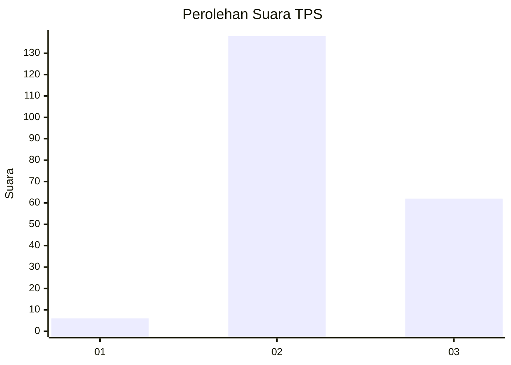

# Hasil

## Grafik

## Tabel

| No. | Nama Paslon    | Suara | Suara (raw) | Persentase |
|:--- |:-------------- | -----:| -----------:| ----------:|
| 1   | ANIES MUHAIMIN | 6     | [6][p-1]    | 2,91       |
| 2   | PRABOWO GIBRAN | 138   | [138][p-2]  | 66,99      |
| 3   | GANJAR MAHFUD  | 62    | [62][p-3]   | 30,10      |

[p-1]: https://github.com/gigit-pemilu/pemilu-2024-51-bali/blob/main/pilpres/hitung-suara/sub/51-bali/sub/08-buleleng/sub/02-seririt/sub/2017-lokapaksa/sub/034-tps/sub/paslon-1.txt
[p-2]: https://github.com/gigit-pemilu/pemilu-2024-51-bali/blob/main/pilpres/hitung-suara/sub/51-bali/sub/08-buleleng/sub/02-seririt/sub/2017-lokapaksa/sub/034-tps/sub/paslon-2.txt
[p-3]: https://github.com/gigit-pemilu/pemilu-2024-51-bali/blob/main/pilpres/hitung-suara/sub/51-bali/sub/08-buleleng/sub/02-seririt/sub/2017-lokapaksa/sub/034-tps/sub/paslon-3.txt

## Foto C Plano

https://sirekap-obj-formc.kpu.go.id/5e2e/pemilu/ppwp/51/08/02/20/17/5108022017034-20240215-114619--039fcfc6-a642-4da2-aa19-04211a7b9a42.jpg

https://sirekap-obj-formc.kpu.go.id/5e2e/pemilu/ppwp/51/08/02/20/17/5108022017034-20240215-091453--8c3786bc-6323-4f5b-a899-3953381f1904.jpg

https://sirekap-obj-formc.kpu.go.id/5e2e/pemilu/ppwp/51/08/02/20/17/5108022017034-20240215-091509--d2382215-0171-462f-a536-2b834ef43548.jpg

## Metadata

| Key        | Value               |
| ---------- | ------------------- |
| Time Stamp | 2024-02-25 13:00:00 |

