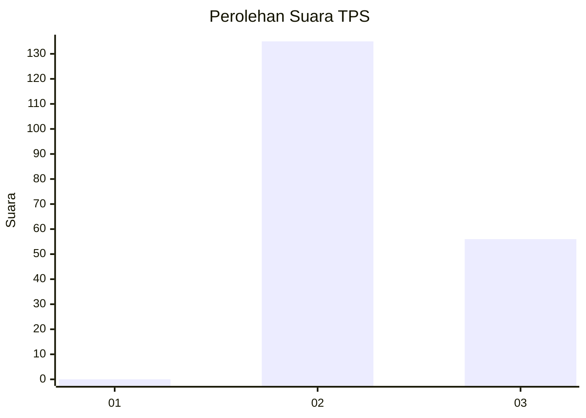
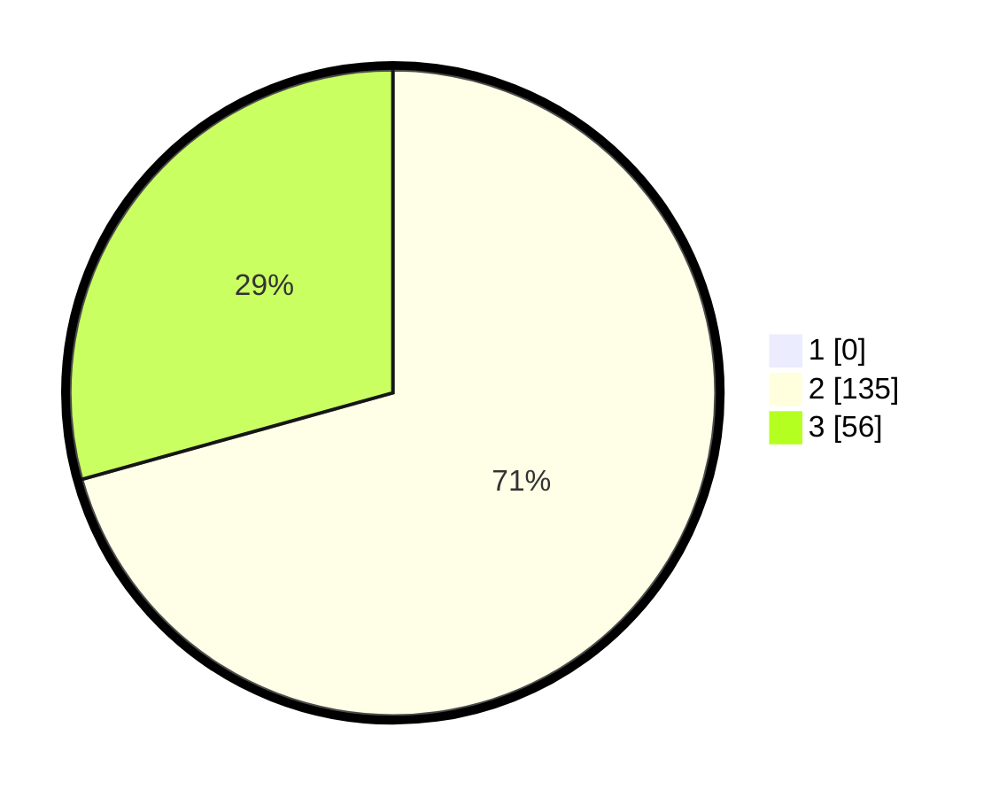

# Hasil

## Grafik

## Tabel

| No. | Nama Paslon    | Suara | Suara (raw) | Persentase |
|:--- |:-------------- | -----:| -----------:| ----------:|
| 1   | ANIES MUHAIMIN | 0     | [0][p-1]    | 0,00       |
| 2   | PRABOWO GIBRAN | 135   | [135][p-2]  | 70,68      |
| 3   | GANJAR MAHFUD  | 56    | [56][p-3]   | 29,32      |

[p-1]: https://github.com/gigit-pemilu/pemilu-2024-51-bali/blob/main/pilpres/hitung-suara/sub/51-bali/sub/08-buleleng/sub/02-seririt/sub/2018-pangkungparuk/sub/002-tps/sub/paslon-1.txt
[p-2]: https://github.com/gigit-pemilu/pemilu-2024-51-bali/blob/main/pilpres/hitung-suara/sub/51-bali/sub/08-buleleng/sub/02-seririt/sub/2018-pangkungparuk/sub/002-tps/sub/paslon-2.txt
[p-3]: https://github.com/gigit-pemilu/pemilu-2024-51-bali/blob/main/pilpres/hitung-suara/sub/51-bali/sub/08-buleleng/sub/02-seririt/sub/2018-pangkungparuk/sub/002-tps/sub/paslon-3.txt

## Foto C Plano

https://sirekap-obj-formc.kpu.go.id/914c/pemilu/ppwp/51/08/02/20/18/5108022018002-20240214-141820--10d23f5a-8c5b-46ec-8e84-197077bfe98a.jpg

https://sirekap-obj-formc.kpu.go.id/914c/pemilu/ppwp/51/08/02/20/18/5108022018002-20240214-141404--e5cf884a-32d7-41fb-a50b-fabdf83f6f7d.jpg

https://sirekap-obj-formc.kpu.go.id/914c/pemilu/ppwp/51/08/02/20/18/5108022018002-20240214-141555--00840bbf-c65e-4a3b-a06c-6ffbf105e3f6.jpg

## Metadata

| Key        | Value               |
| ---------- | ------------------- |
| Time Stamp | 2024-02-24 22:31:28 |

