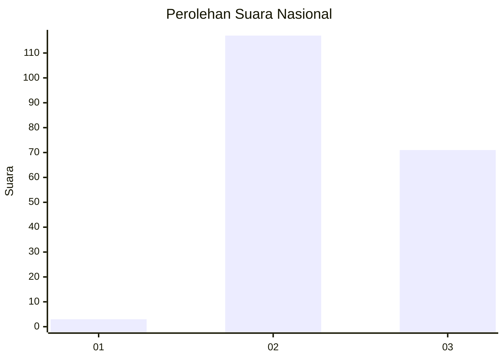
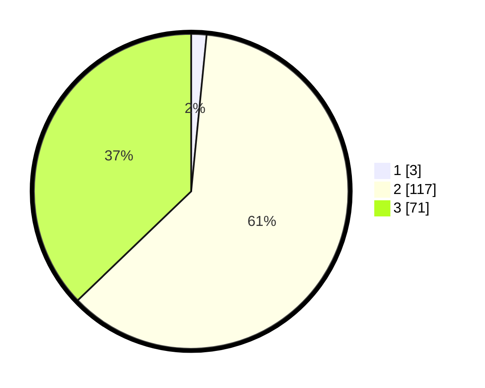

# Hasil

## Grafik

## Tabel

| No. | Nama Paslon    | Suara | Suara (raw) | Persentase |
|:--- |:-------------- | -----:| -----------:| ----------:|
| 1   | ANIES MUHAIMIN | 3     | [3][p-1]    | 1,57       |
| 2   | PRABOWO GIBRAN | 117   | [117][p-2]  | 61,26      |
| 3   | GANJAR MAHFUD  | 71    | [71][p-3]   | 37,17      |

[p-1]: https://github.com/gigit-pemilu/pemilu-2024/blob/main/pilpres/hitung-suara/sub/51-bali/sub/08-buleleng/sub/02-seririt/sub/2018-pangkungparuk/sub/003-tps/sub/paslon-1.txt
[p-2]: https://github.com/gigit-pemilu/pemilu-2024/blob/main/pilpres/hitung-suara/sub/51-bali/sub/08-buleleng/sub/02-seririt/sub/2018-pangkungparuk/sub/003-tps/sub/paslon-2.txt
[p-3]: https://github.com/gigit-pemilu/pemilu-2024/blob/main/pilpres/hitung-suara/sub/51-bali/sub/08-buleleng/sub/02-seririt/sub/2018-pangkungparuk/sub/003-tps/sub/paslon-3.txt

## Foto C Plano

https://sirekap-obj-formc.kpu.go.id/b72c/pemilu/ppwp/51/08/02/20/18/5108022018003-20240215-193240--72a69262-d60f-4e39-bae1-092f692fa99f.jpg

https://sirekap-obj-formc.kpu.go.id/b72c/pemilu/ppwp/51/08/02/20/18/5108022018003-20240215-193243--cf75ae02-7a00-4783-8d39-f9ea2a4f4c27.jpg

https://sirekap-obj-formc.kpu.go.id/b72c/pemilu/ppwp/51/08/02/20/18/5108022018003-20240215-000837--41f46582-bc9b-451e-9c7a-0301fad7d3e2.jpg

## Metadata

| Key        | Value               |
| ---------- | ------------------- |
| Time Stamp | 2024-02-24 22:31:28 |

