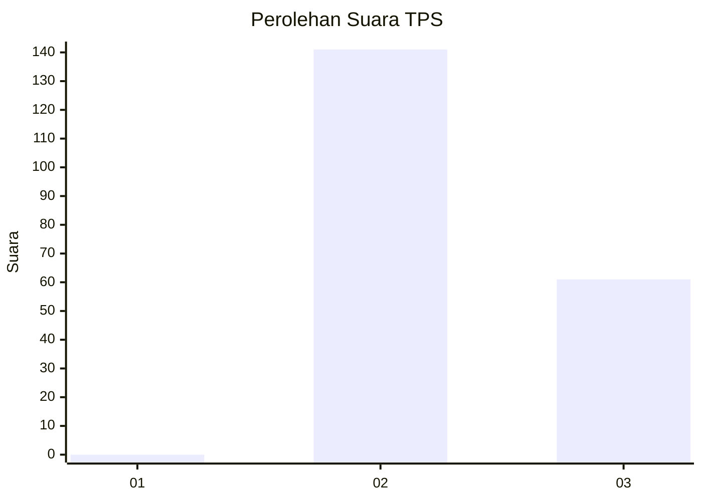
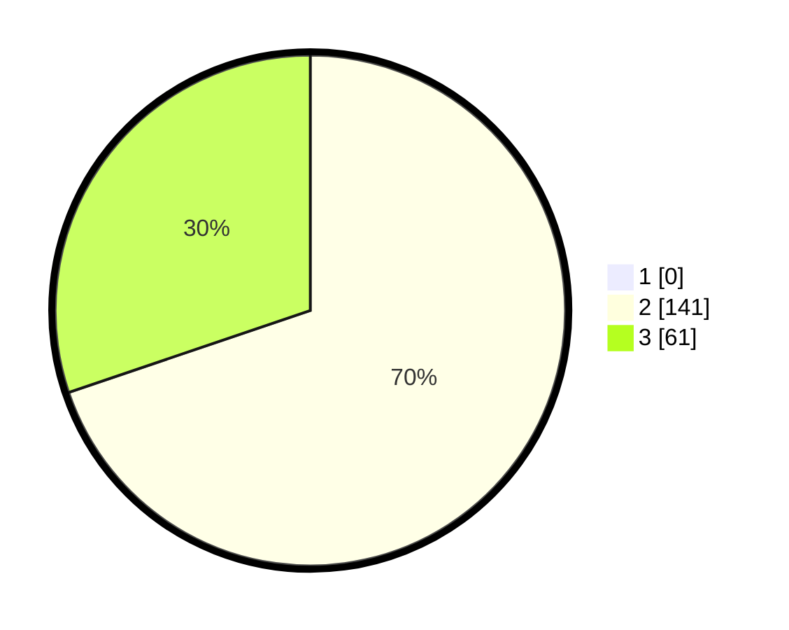

# Hasil

## Grafik

## Tabel

| No. | Nama Paslon    | Suara | Suara (raw) | Persentase |
|:--- |:-------------- | -----:| -----------:| ----------:|
| 1   | ANIES MUHAIMIN | 0     | [0][p-1]    | 0,00       |
| 2   | PRABOWO GIBRAN | 141   | [141][p-2]  | 69,80      |
| 3   | GANJAR MAHFUD  | 61    | [61][p-3]   | 30,20      |

[p-1]: https://github.com/gigit-pemilu/pemilu-2024-51-bali/blob/main/pilpres/hitung-suara/sub/51-bali/sub/08-buleleng/sub/02-seririt/sub/2018-pangkungparuk/sub/004-tps/sub/paslon-1.txt
[p-2]: https://github.com/gigit-pemilu/pemilu-2024-51-bali/blob/main/pilpres/hitung-suara/sub/51-bali/sub/08-buleleng/sub/02-seririt/sub/2018-pangkungparuk/sub/004-tps/sub/paslon-2.txt
[p-3]: https://github.com/gigit-pemilu/pemilu-2024-51-bali/blob/main/pilpres/hitung-suara/sub/51-bali/sub/08-buleleng/sub/02-seririt/sub/2018-pangkungparuk/sub/004-tps/sub/paslon-3.txt

## Foto C Plano

https://sirekap-obj-formc.kpu.go.id/ea7d/pemilu/ppwp/51/08/02/20/18/5108022018004-20240214-220441--ba0c0d26-ef4a-45ed-ba7a-18409df7b3b1.jpg

https://sirekap-obj-formc.kpu.go.id/ea7d/pemilu/ppwp/51/08/02/20/18/5108022018004-20240214-214212--7e4d9bdb-325f-461b-88a8-24e75074486c.jpg

https://sirekap-obj-formc.kpu.go.id/ea7d/pemilu/ppwp/51/08/02/20/18/5108022018004-20240214-214446--c00b6a08-9d40-44fd-9db8-4f4198d3d277.jpg

## Metadata

| Key        | Value               |
| ---------- | ------------------- |
| Time Stamp | 2024-02-25 12:00:00 |

