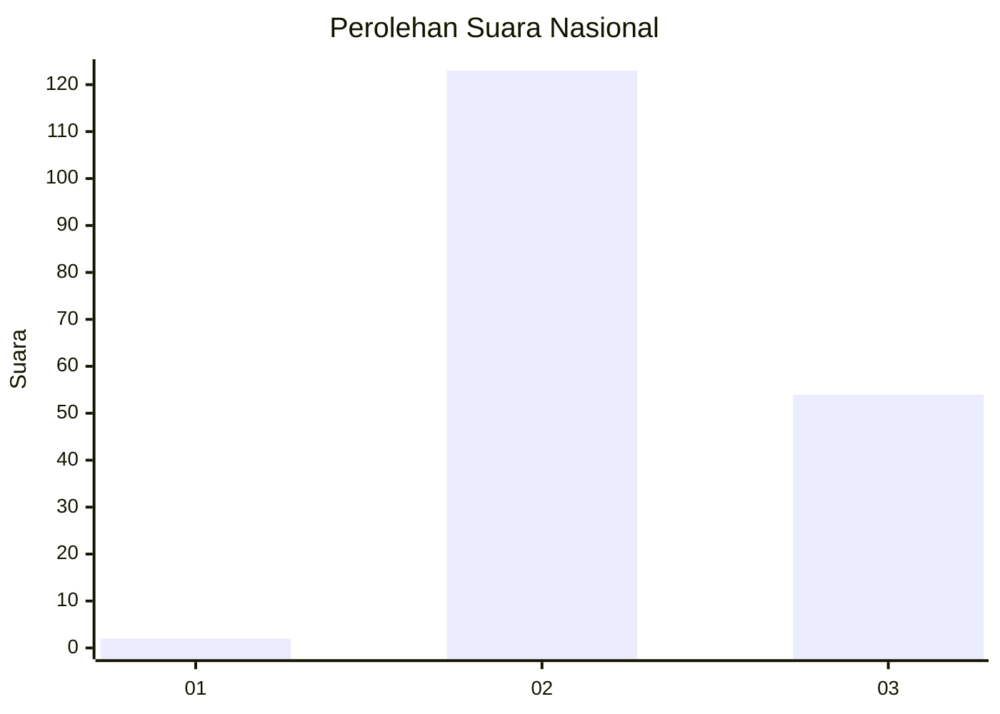

# Hasil

## Grafik

## Tabel

| No. | Nama Paslon    | Suara | Suara (raw) | Persentase |
|:--- |:-------------- | -----:| -----------:| ----------:|
| 1   | ANIES MUHAIMIN | 2     | [2][p-1]    | 1,12       |
| 2   | PRABOWO GIBRAN | 123   | [123][p-2]  | 68,72      |
| 3   | GANJAR MAHFUD  | 54    | [54][p-3]   | 30,17      |

[p-1]: https://github.com/gigit-pemilu/pemilu-2024/blob/main/pilpres/hitung-suara/sub/51-bali/sub/08-buleleng/sub/02-seririt/sub/2018-pangkungparuk/sub/005-tps/sub/paslon-1.txt
[p-2]: https://github.com/gigit-pemilu/pemilu-2024/blob/main/pilpres/hitung-suara/sub/51-bali/sub/08-buleleng/sub/02-seririt/sub/2018-pangkungparuk/sub/005-tps/sub/paslon-2.txt
[p-3]: https://github.com/gigit-pemilu/pemilu-2024/blob/main/pilpres/hitung-suara/sub/51-bali/sub/08-buleleng/sub/02-seririt/sub/2018-pangkungparuk/sub/005-tps/sub/paslon-3.txt

## Foto C Plano

https://sirekap-obj-formc.kpu.go.id/da49/pemilu/ppwp/51/08/02/20/18/5108022018005-20240215-000354--adfe29c9-093a-4194-bef8-ef8328b4d196.jpg

https://sirekap-obj-formc.kpu.go.id/da49/pemilu/ppwp/51/08/02/20/18/5108022018005-20240215-000522--c01a401a-a9c9-4f2d-9431-7e29f1d8971f.jpg

https://sirekap-obj-formc.kpu.go.id/da49/pemilu/ppwp/51/08/02/20/18/5108022018005-20240215-001606--f474c629-0652-4dd4-8c62-d208f9ad8359.jpg

## Metadata

| Key        | Value               |
| ---------- | ------------------- |
| Time Stamp | 2024-02-25 14:00:00 |

