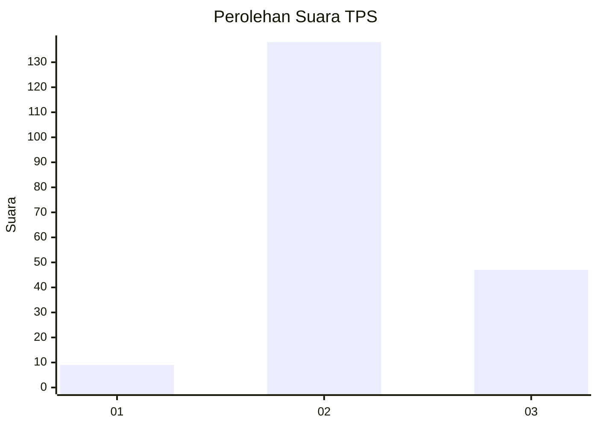
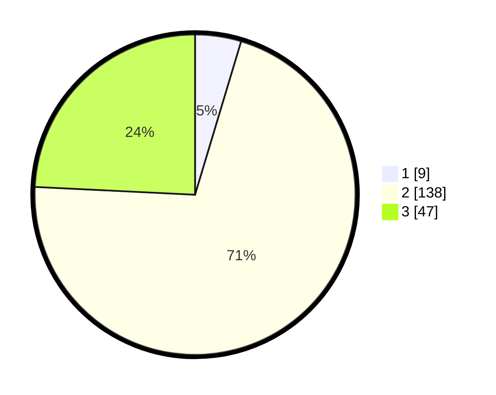

# Hasil

## Grafik

## Tabel

| No. | Nama Paslon    | Suara | Suara (raw) | Persentase |
|:--- |:-------------- | -----:| -----------:| ----------:|
| 1   | ANIES MUHAIMIN | 9     | [9][p-1]    | 4,64       |
| 2   | PRABOWO GIBRAN | 138   | [138][p-2]  | 71,13      |
| 3   | GANJAR MAHFUD  | 47    | [47][p-3]   | 24,23      |

[p-1]: https://github.com/gigit-pemilu/pemilu-2024-51-bali/blob/main/pilpres/hitung-suara/sub/51-bali/sub/08-buleleng/sub/02-seririt/sub/2018-pangkungparuk/sub/010-tps/sub/paslon-1.txt
[p-2]: https://github.com/gigit-pemilu/pemilu-2024-51-bali/blob/main/pilpres/hitung-suara/sub/51-bali/sub/08-buleleng/sub/02-seririt/sub/2018-pangkungparuk/sub/010-tps/sub/paslon-2.txt
[p-3]: https://github.com/gigit-pemilu/pemilu-2024-51-bali/blob/main/pilpres/hitung-suara/sub/51-bali/sub/08-buleleng/sub/02-seririt/sub/2018-pangkungparuk/sub/010-tps/sub/paslon-3.txt

## Foto C Plano

https://sirekap-obj-formc.kpu.go.id/79e8/pemilu/ppwp/51/08/02/20/18/5108022018010-20240214-141048--ab728901-1759-4019-87f3-0807a6cc4950.jpg

https://sirekap-obj-formc.kpu.go.id/79e8/pemilu/ppwp/51/08/02/20/18/5108022018010-20240214-141452--42afb5ba-1eee-4a5c-b3be-9af5938f7704.jpg

https://sirekap-obj-formc.kpu.go.id/79e8/pemilu/ppwp/51/08/02/20/18/5108022018010-20240214-141548--c22b5d5a-8cbd-4c54-bd92-de6a26ce160b.jpg

## Metadata

| Key        | Value               |
| ---------- | ------------------- |
| Time Stamp | 2024-02-14 21:46:01 |

