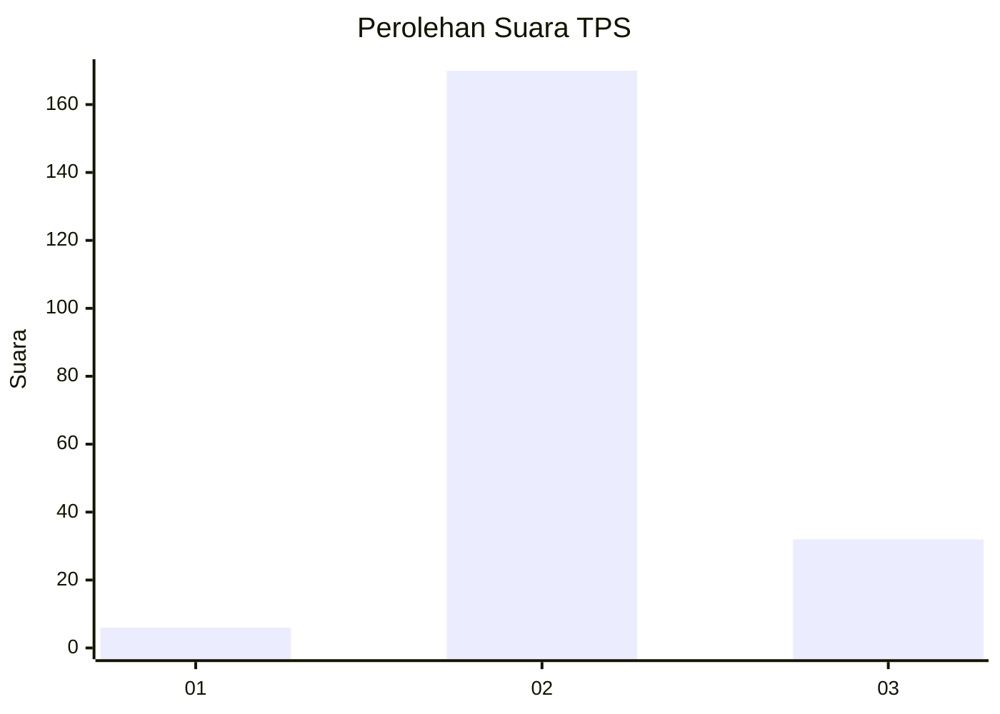

# Hasil

## Grafik

## Tabel

| No. | Nama Paslon    | Suara | Suara (raw) | Persentase |
|:--- |:-------------- | -----:| -----------:| ----------:|
| 1   | ANIES MUHAIMIN | 6     | [6][p-1]    | 2,88       |
| 2   | PRABOWO GIBRAN | 170   | [170][p-2]  | 81,73      |
| 3   | GANJAR MAHFUD  | 32    | [32][p-3]   | 15,38      |

[p-1]: https://github.com/gigit-pemilu/pemilu-2024-51-bali/blob/main/pilpres/hitung-suara/sub/51-bali/sub/08-buleleng/sub/02-seririt/sub/2018-pangkungparuk/sub/011-tps/sub/paslon-1.txt
[p-2]: https://github.com/gigit-pemilu/pemilu-2024-51-bali/blob/main/pilpres/hitung-suara/sub/51-bali/sub/08-buleleng/sub/02-seririt/sub/2018-pangkungparuk/sub/011-tps/sub/paslon-2.txt
[p-3]: https://github.com/gigit-pemilu/pemilu-2024-51-bali/blob/main/pilpres/hitung-suara/sub/51-bali/sub/08-buleleng/sub/02-seririt/sub/2018-pangkungparuk/sub/011-tps/sub/paslon-3.txt

## Foto C Plano

https://sirekap-obj-formc.kpu.go.id/5819/pemilu/ppwp/51/08/02/20/18/5108022018011-20240215-003048--89076919-dd76-437b-a93e-fc4078c9a40f.jpg

https://sirekap-obj-formc.kpu.go.id/5819/pemilu/ppwp/51/08/02/20/18/5108022018011-20240215-003210--40cd8aee-25f5-45b1-ad24-7404173fa5f1.jpg

https://sirekap-obj-formc.kpu.go.id/5819/pemilu/ppwp/51/08/02/20/18/5108022018011-20240215-003331--a56f70e9-e33f-4815-b558-995e8a01f72f.jpg

## Metadata

| Key        | Value               |
| ---------- | ------------------- |
| Time Stamp | 2024-03-01 10:00:00 |

