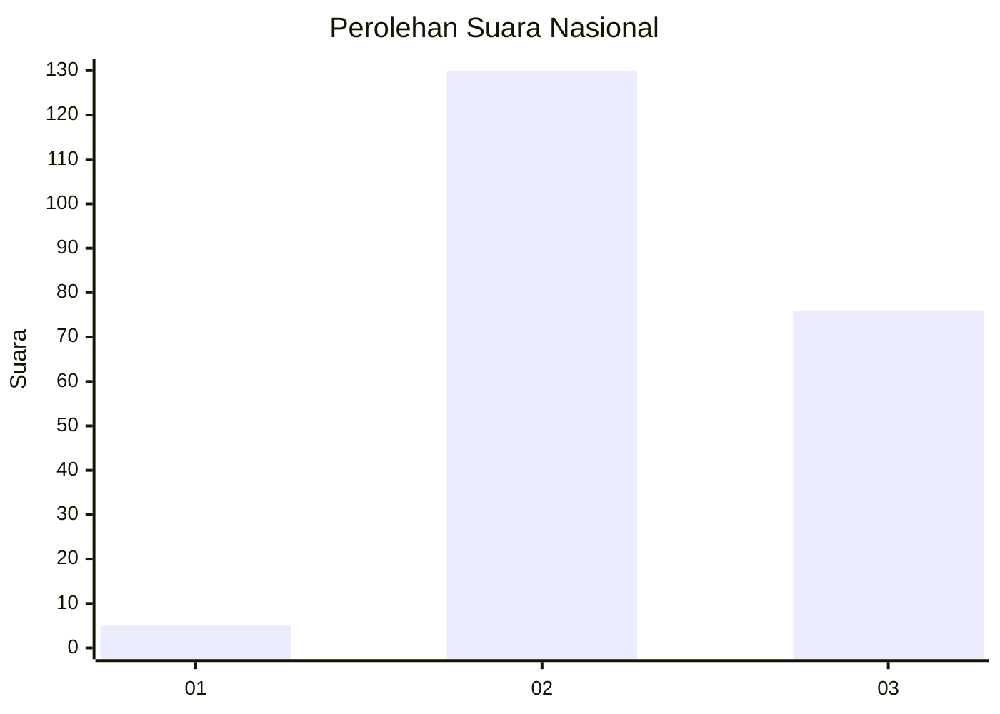
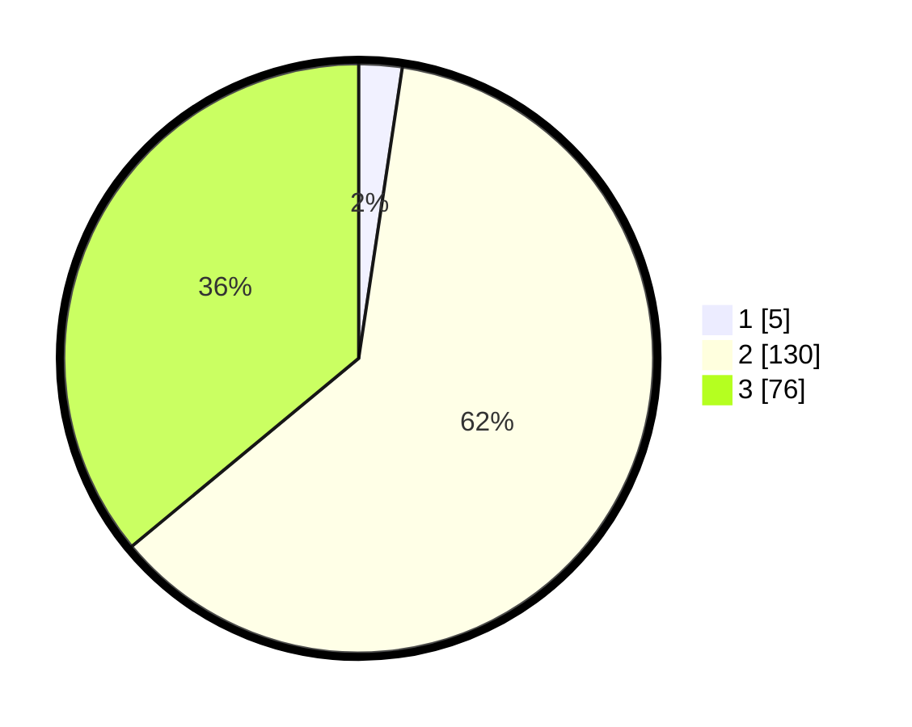

# Hasil

## Grafik

## Tabel

| No. | Nama Paslon    | Suara | Suara (raw) | Persentase |
|:--- |:-------------- | -----:| -----------:| ----------:|
| 1   | ANIES MUHAIMIN | 5     | [5][p-1]    | 2,37       |
| 2   | PRABOWO GIBRAN | 130   | [130][p-2]  | 61,61      |
| 3   | GANJAR MAHFUD  | 76    | [76][p-3]   | 36,02      |

[p-1]: https://github.com/gigit-pemilu/pemilu-2024/blob/main/pilpres/hitung-suara/sub/51-bali/sub/08-buleleng/sub/02-seririt/sub/2018-pangkungparuk/sub/013-tps/sub/paslon-1.txt
[p-2]: https://github.com/gigit-pemilu/pemilu-2024/blob/main/pilpres/hitung-suara/sub/51-bali/sub/08-buleleng/sub/02-seririt/sub/2018-pangkungparuk/sub/013-tps/sub/paslon-2.txt
[p-3]: https://github.com/gigit-pemilu/pemilu-2024/blob/main/pilpres/hitung-suara/sub/51-bali/sub/08-buleleng/sub/02-seririt/sub/2018-pangkungparuk/sub/013-tps/sub/paslon-3.txt

## Foto C Plano

https://sirekap-obj-formc.kpu.go.id/e43b/pemilu/ppwp/51/08/02/20/18/5108022018013-20240215-014628--e9e4acc3-af9c-4348-b871-b9f0769ba4e2.jpg

https://sirekap-obj-formc.kpu.go.id/e43b/pemilu/ppwp/51/08/02/20/18/5108022018013-20240215-014849--0fe72059-f6ee-4fe4-9966-14a01749363f.jpg

https://sirekap-obj-formc.kpu.go.id/e43b/pemilu/ppwp/51/08/02/20/18/5108022018013-20240215-015106--d8b7bb9c-5020-4661-b049-6508a44f73b4.jpg

## Metadata

| Key        | Value               |
| ---------- | ------------------- |
| Time Stamp | 2024-02-25 17:00:00 |

