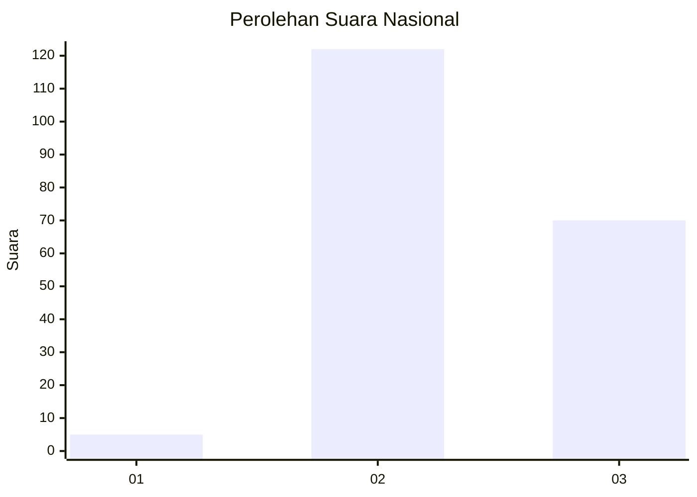
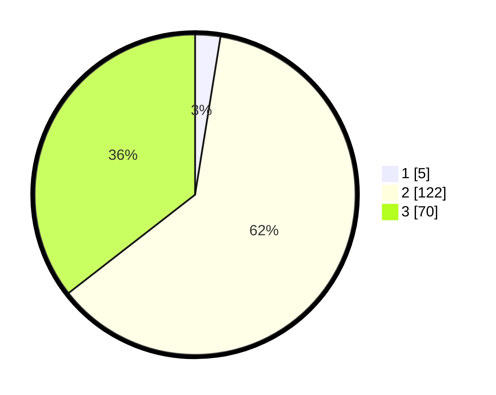

# Hasil

## Grafik

## Tabel

| No. | Nama Paslon    | Suara | Suara (raw) | Persentase |
|:--- |:-------------- | -----:| -----------:| ----------:|
| 1   | ANIES MUHAIMIN | 5     | [5][p-1]    | 2,54       |
| 2   | PRABOWO GIBRAN | 122   | [122][p-2]  | 61,93      |
| 3   | GANJAR MAHFUD  | 70    | [70][p-3]   | 35,53      |

[p-1]: https://github.com/gigit-pemilu/pemilu-2024/blob/main/pilpres/hitung-suara/sub/51-bali/sub/08-buleleng/sub/02-seririt/sub/2018-pangkungparuk/sub/014-tps/sub/paslon-1.txt
[p-2]: https://github.com/gigit-pemilu/pemilu-2024/blob/main/pilpres/hitung-suara/sub/51-bali/sub/08-buleleng/sub/02-seririt/sub/2018-pangkungparuk/sub/014-tps/sub/paslon-2.txt
[p-3]: https://github.com/gigit-pemilu/pemilu-2024/blob/main/pilpres/hitung-suara/sub/51-bali/sub/08-buleleng/sub/02-seririt/sub/2018-pangkungparuk/sub/014-tps/sub/paslon-3.txt

## Foto C Plano

https://sirekap-obj-formc.kpu.go.id/6864/pemilu/ppwp/51/08/02/20/18/5108022018014-20240215-031001--8555a41b-dc4e-40f9-b2fb-06fb4c1232e4.jpg

https://sirekap-obj-formc.kpu.go.id/6864/pemilu/ppwp/51/08/02/20/18/5108022018014-20240215-030858--89a8517e-296e-450b-9e05-3160d7ee1bec.jpg

https://sirekap-obj-formc.kpu.go.id/6864/pemilu/ppwp/51/08/02/20/18/5108022018014-20240215-030925--12dfc91b-1e24-40cb-ad91-ea03f6d0bbaa.jpg

## Metadata

| Key        | Value               |
| ---------- | ------------------- |
| Time Stamp | 2024-02-24 22:31:28 |

