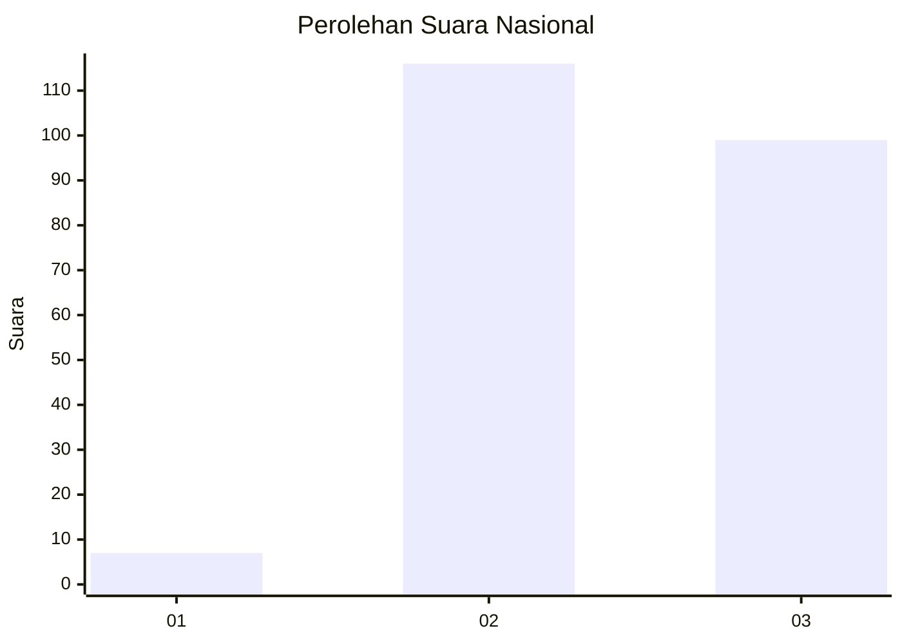
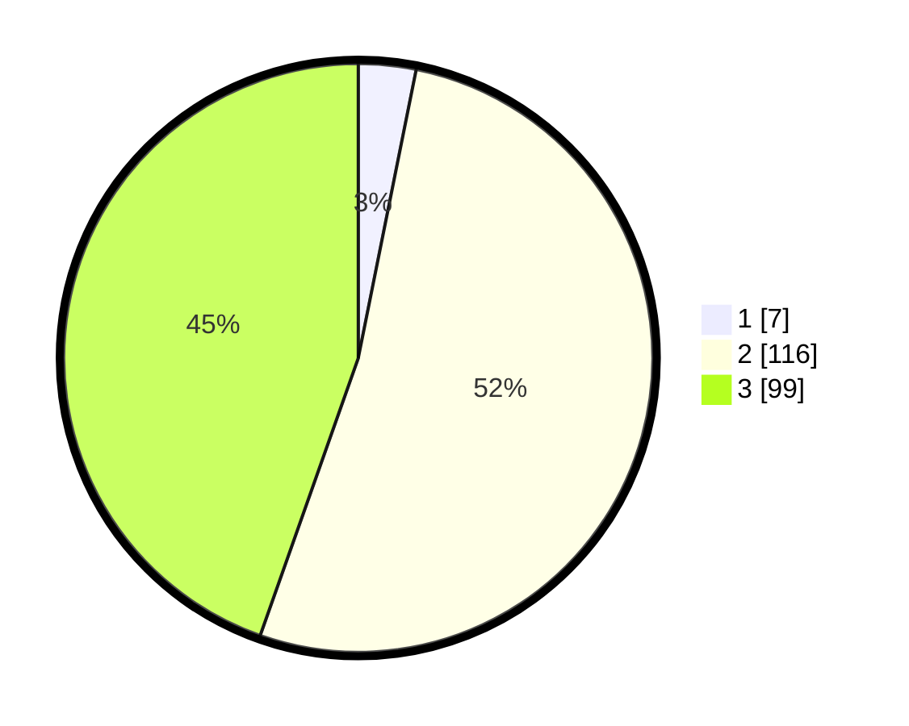

# Hasil

## Grafik

## Tabel

| No. | Nama Paslon    | Suara | Suara (raw) | Persentase |
|:--- |:-------------- | -----:| -----------:| ----------:|
| 1   | ANIES MUHAIMIN | 7     | [7][p-1]    | 3,15       |
| 2   | PRABOWO GIBRAN | 116   | [116][p-2]  | 52,25      |
| 3   | GANJAR MAHFUD  | 99    | [99][p-3]   | 44,59      |

[p-1]: https://github.com/gigit-pemilu/pemilu-2024/blob/main/pilpres/hitung-suara/sub/51-bali/sub/08-buleleng/sub/02-seririt/sub/2018-pangkungparuk/sub/017-tps/sub/paslon-1.txt
[p-2]: https://github.com/gigit-pemilu/pemilu-2024/blob/main/pilpres/hitung-suara/sub/51-bali/sub/08-buleleng/sub/02-seririt/sub/2018-pangkungparuk/sub/017-tps/sub/paslon-2.txt
[p-3]: https://github.com/gigit-pemilu/pemilu-2024/blob/main/pilpres/hitung-suara/sub/51-bali/sub/08-buleleng/sub/02-seririt/sub/2018-pangkungparuk/sub/017-tps/sub/paslon-3.txt

## Foto C Plano

https://sirekap-obj-formc.kpu.go.id/8a94/pemilu/ppwp/51/08/02/20/18/5108022018017-20240214-203811--0dde1da1-05ee-49d1-bbf5-a27cf24c7938.jpg

https://sirekap-obj-formc.kpu.go.id/8a94/pemilu/ppwp/51/08/02/20/18/5108022018017-20240214-203925--82e7e910-2c68-4653-b324-b70834afb2c6.jpg

https://sirekap-obj-formc.kpu.go.id/8a94/pemilu/ppwp/51/08/02/20/18/5108022018017-20240214-204024--0488c444-7f69-4961-9360-ba5364330ecc.jpg

## Metadata

| Key        | Value               |
| ---------- | ------------------- |
| Time Stamp | 2024-02-24 22:31:28 |

