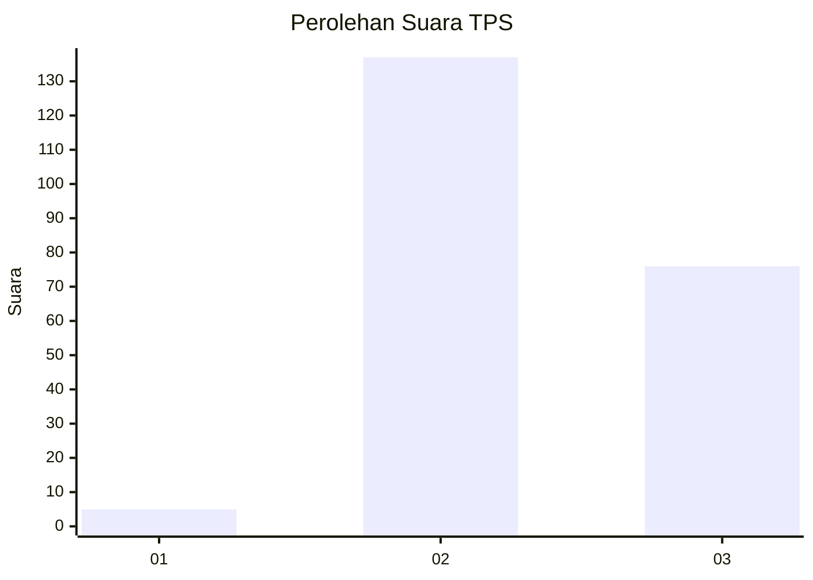
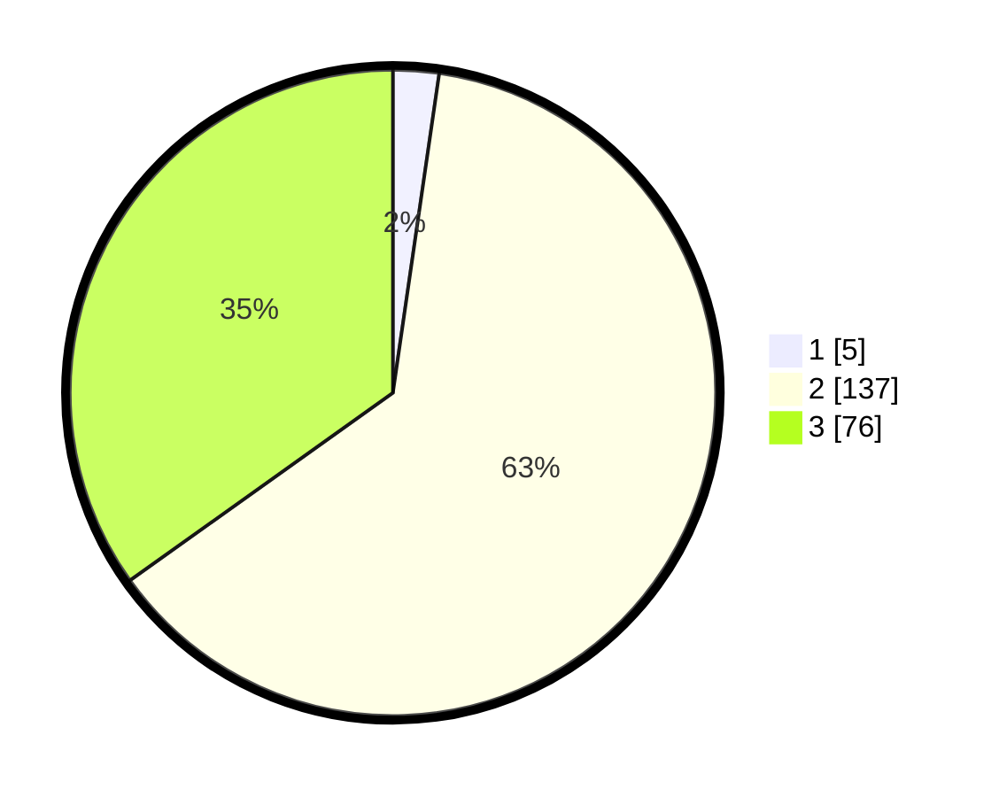

# Hasil

## Grafik

## Tabel

| No. | Nama Paslon    | Suara | Suara (raw) | Persentase |
|:--- |:-------------- | -----:| -----------:| ----------:|
| 1   | ANIES MUHAIMIN | 5     | [5][p-1]    | 2,29       |
| 2   | PRABOWO GIBRAN | 137   | [137][p-2]  | 62,84      |
| 3   | GANJAR MAHFUD  | 76    | [76][p-3]   | 34,86      |

[p-1]: https://github.com/gigit-pemilu/pemilu-2024-51-bali/blob/main/pilpres/hitung-suara/sub/51-bali/sub/08-buleleng/sub/02-seririt/sub/2018-pangkungparuk/sub/018-tps/sub/paslon-1.txt
[p-2]: https://github.com/gigit-pemilu/pemilu-2024-51-bali/blob/main/pilpres/hitung-suara/sub/51-bali/sub/08-buleleng/sub/02-seririt/sub/2018-pangkungparuk/sub/018-tps/sub/paslon-2.txt
[p-3]: https://github.com/gigit-pemilu/pemilu-2024-51-bali/blob/main/pilpres/hitung-suara/sub/51-bali/sub/08-buleleng/sub/02-seririt/sub/2018-pangkungparuk/sub/018-tps/sub/paslon-3.txt

## Foto C Plano

https://sirekap-obj-formc.kpu.go.id/6bef/pemilu/ppwp/51/08/02/20/18/5108022018018-20240215-014740--363e35a4-fb76-45a9-b06e-4e7d493edea1.jpg

https://sirekap-obj-formc.kpu.go.id/6bef/pemilu/ppwp/51/08/02/20/18/5108022018018-20240215-014958--7fea358b-c2a6-4d8e-a810-0185f59e527e.jpg

https://sirekap-obj-formc.kpu.go.id/6bef/pemilu/ppwp/51/08/02/20/18/5108022018018-20240215-015202--58802a38-9210-4d9b-9887-3bee06f28a1b.jpg

## Metadata

| Key        | Value               |
| ---------- | ------------------- |
| Time Stamp | 2024-02-24 22:31:28 |

