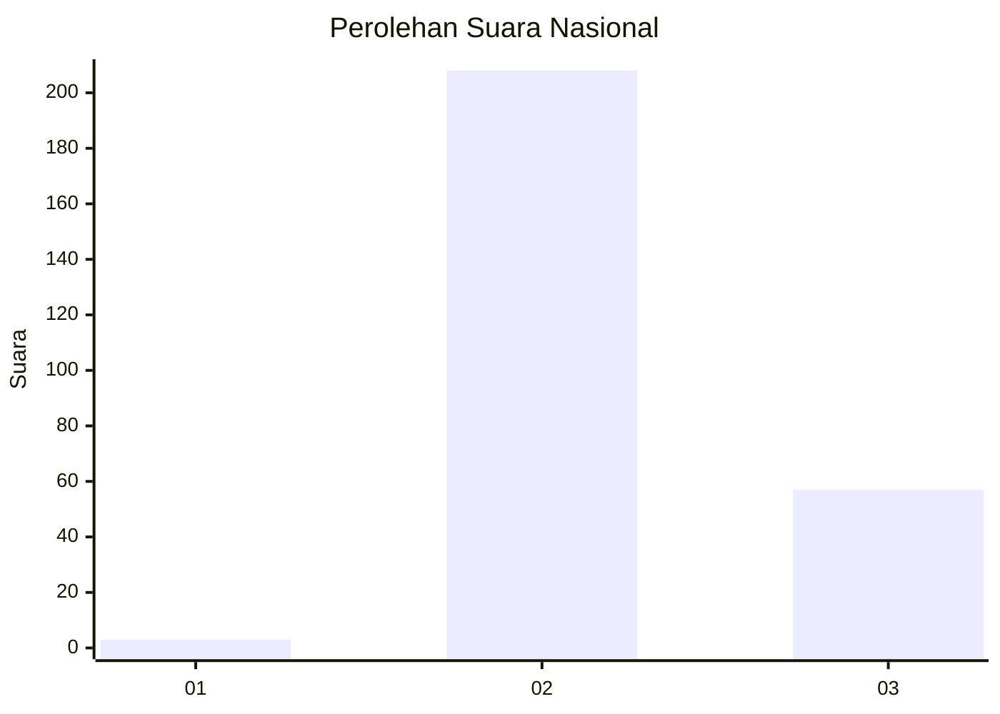

# Hasil

## Grafik

## Tabel

| No. | Nama Paslon    | Suara | Suara (raw) | Persentase |
|:--- |:-------------- | -----:| -----------:| ----------:|
| 1   | ANIES MUHAIMIN | 3     | [3][p-1]    | 1,12       |
| 2   | PRABOWO GIBRAN | 208   | [208][p-2]  | 77,61      |
| 3   | GANJAR MAHFUD  | 57    | [57][p-3]   | 21,27      |

[p-1]: https://github.com/gigit-pemilu/pemilu-2024/blob/main/pilpres/hitung-suara/sub/51-bali/sub/08-buleleng/sub/02-seririt/sub/2018-pangkungparuk/sub/020-tps/sub/paslon-1.txt
[p-2]: https://github.com/gigit-pemilu/pemilu-2024/blob/main/pilpres/hitung-suara/sub/51-bali/sub/08-buleleng/sub/02-seririt/sub/2018-pangkungparuk/sub/020-tps/sub/paslon-2.txt
[p-3]: https://github.com/gigit-pemilu/pemilu-2024/blob/main/pilpres/hitung-suara/sub/51-bali/sub/08-buleleng/sub/02-seririt/sub/2018-pangkungparuk/sub/020-tps/sub/paslon-3.txt

## Foto C Plano

https://sirekap-obj-formc.kpu.go.id/e2d4/pemilu/ppwp/51/08/02/20/18/5108022018020-20240215-005956--a11ae4c2-f43a-4abc-945b-f84ebeb769c6.jpg

https://sirekap-obj-formc.kpu.go.id/e2d4/pemilu/ppwp/51/08/02/20/18/5108022018020-20240215-010146--9553d2b8-9447-4a58-bed2-713ebdac6e92.jpg

https://sirekap-obj-formc.kpu.go.id/e2d4/pemilu/ppwp/51/08/02/20/18/5108022018020-20240215-010240--2bb3e544-859a-421c-accc-4e1246ff9046.jpg

## Metadata

| Key        | Value               |
| ---------- | ------------------- |
| Time Stamp | 2024-02-24 22:31:28 |

