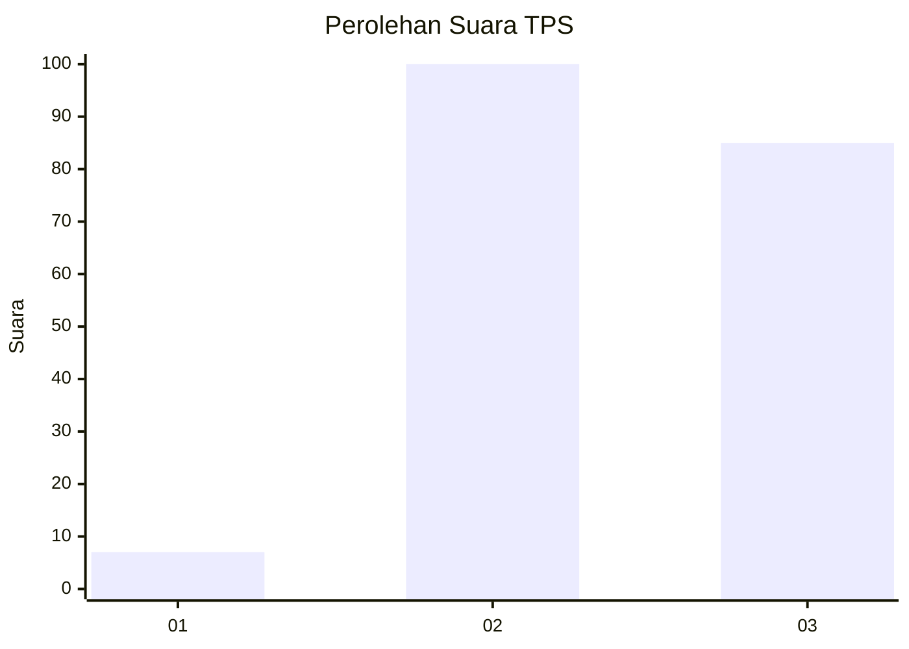
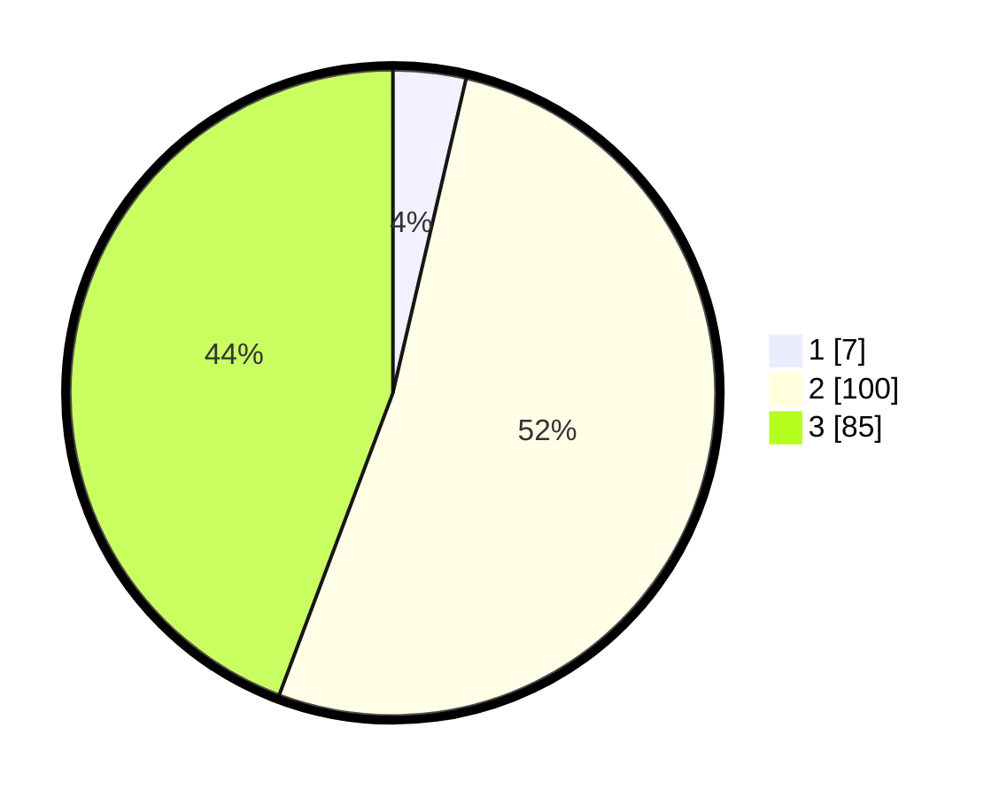

# Hasil

## Grafik

## Tabel

| No. | Nama Paslon    | Suara | Suara (raw) | Persentase |
|:--- |:-------------- | -----:| -----------:| ----------:|
| 1   | ANIES MUHAIMIN | 7     | [7][p-1]    | 3,65       |
| 2   | PRABOWO GIBRAN | 100   | [100][p-2]  | 52,08      |
| 3   | GANJAR MAHFUD  | 85    | [85][p-3]   | 44,27      |

[p-1]: https://github.com/gigit-pemilu/pemilu-2024-51-bali/blob/main/pilpres/hitung-suara/sub/51-bali/sub/08-buleleng/sub/02-seririt/sub/2019-banjarasem/sub/001-tps/sub/paslon-1.txt
[p-2]: https://github.com/gigit-pemilu/pemilu-2024-51-bali/blob/main/pilpres/hitung-suara/sub/51-bali/sub/08-buleleng/sub/02-seririt/sub/2019-banjarasem/sub/001-tps/sub/paslon-2.txt
[p-3]: https://github.com/gigit-pemilu/pemilu-2024-51-bali/blob/main/pilpres/hitung-suara/sub/51-bali/sub/08-buleleng/sub/02-seririt/sub/2019-banjarasem/sub/001-tps/sub/paslon-3.txt

## Foto C Plano

https://sirekap-obj-formc.kpu.go.id/91f2/pemilu/ppwp/51/08/02/20/19/5108022019001-20240214-211940--e46f8b9d-e306-4a6c-8edb-e1ed510ced98.jpg

https://sirekap-obj-formc.kpu.go.id/91f2/pemilu/ppwp/51/08/02/20/19/5108022019001-20240214-212514--367c2e0c-19db-4681-be11-6c44bef95a4b.jpg

https://sirekap-obj-formc.kpu.go.id/91f2/pemilu/ppwp/51/08/02/20/19/5108022019001-20240214-212718--ea9373ae-2e61-4934-b3d6-1473d039fd19.jpg

## Metadata

| Key        | Value               |
| ---------- | ------------------- |
| Time Stamp | 2024-02-24 22:31:28 |

