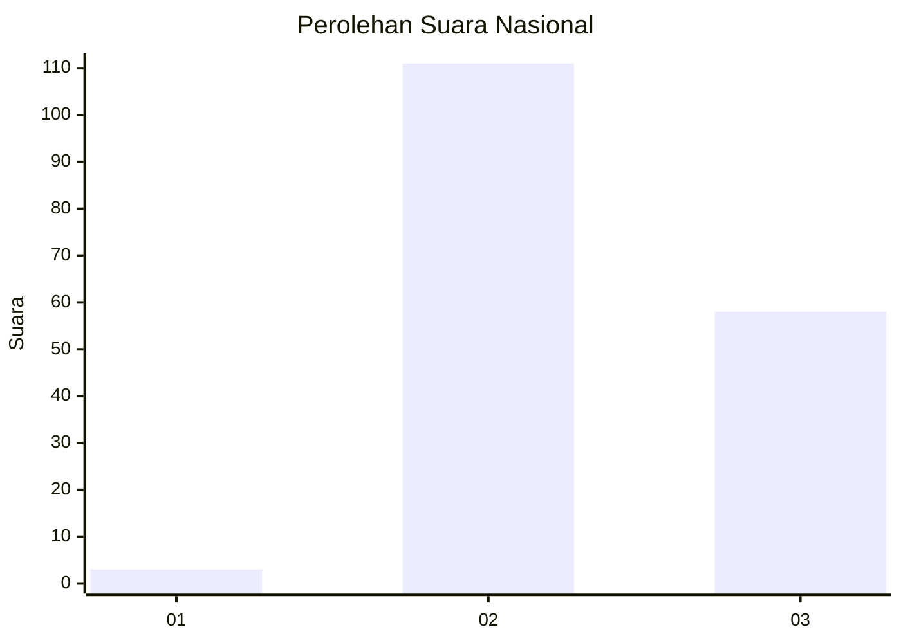
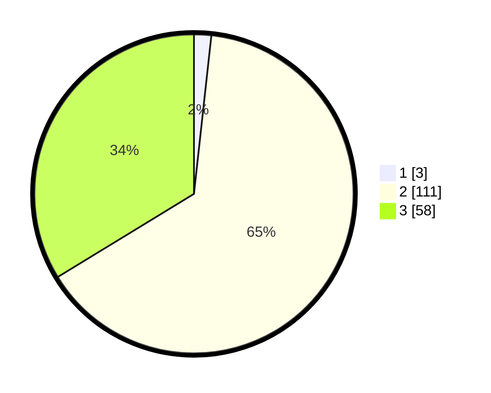

# Hasil

## Grafik

## Tabel

| No. | Nama Paslon    | Suara | Suara (raw) | Persentase |
|:--- |:-------------- | -----:| -----------:| ----------:|
| 1   | ANIES MUHAIMIN | 3     | [3][p-1]    | 1,74       |
| 2   | PRABOWO GIBRAN | 111   | [111][p-2]  | 64,53      |
| 3   | GANJAR MAHFUD  | 58    | [58][p-3]   | 33,72      |

[p-1]: https://github.com/gigit-pemilu/pemilu-2024/blob/main/pilpres/hitung-suara/sub/51-bali/sub/08-buleleng/sub/02-seririt/sub/2019-banjarasem/sub/005-tps/sub/paslon-1.txt
[p-2]: https://github.com/gigit-pemilu/pemilu-2024/blob/main/pilpres/hitung-suara/sub/51-bali/sub/08-buleleng/sub/02-seririt/sub/2019-banjarasem/sub/005-tps/sub/paslon-2.txt
[p-3]: https://github.com/gigit-pemilu/pemilu-2024/blob/main/pilpres/hitung-suara/sub/51-bali/sub/08-buleleng/sub/02-seririt/sub/2019-banjarasem/sub/005-tps/sub/paslon-3.txt

## Foto C Plano

https://sirekap-obj-formc.kpu.go.id/43e1/pemilu/ppwp/51/08/02/20/19/5108022019005-20240214-232407--029ba7b9-d29e-4619-8b0f-331b10d7cc4c.jpg

https://sirekap-obj-formc.kpu.go.id/43e1/pemilu/ppwp/51/08/02/20/19/5108022019005-20240214-233134--7a226036-57b9-4280-989c-ba792191370d.jpg

https://sirekap-obj-formc.kpu.go.id/43e1/pemilu/ppwp/51/08/02/20/19/5108022019005-20240214-232746--8fb65db9-fa5a-47bf-9b17-46b2231045b1.jpg

## Metadata

| Key        | Value               |
| ---------- | ------------------- |
| Time Stamp | 2024-02-24 22:31:28 |

