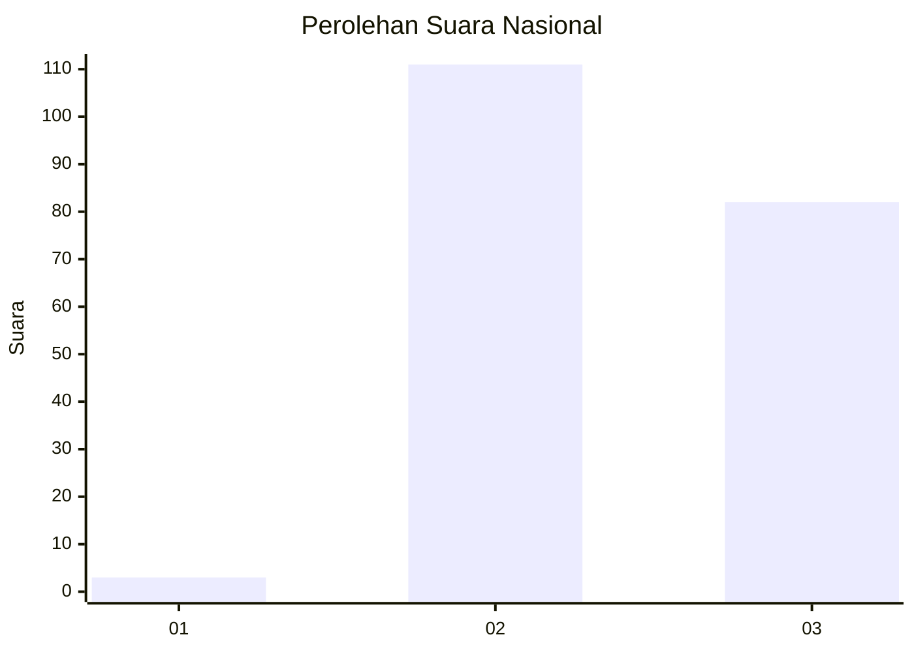
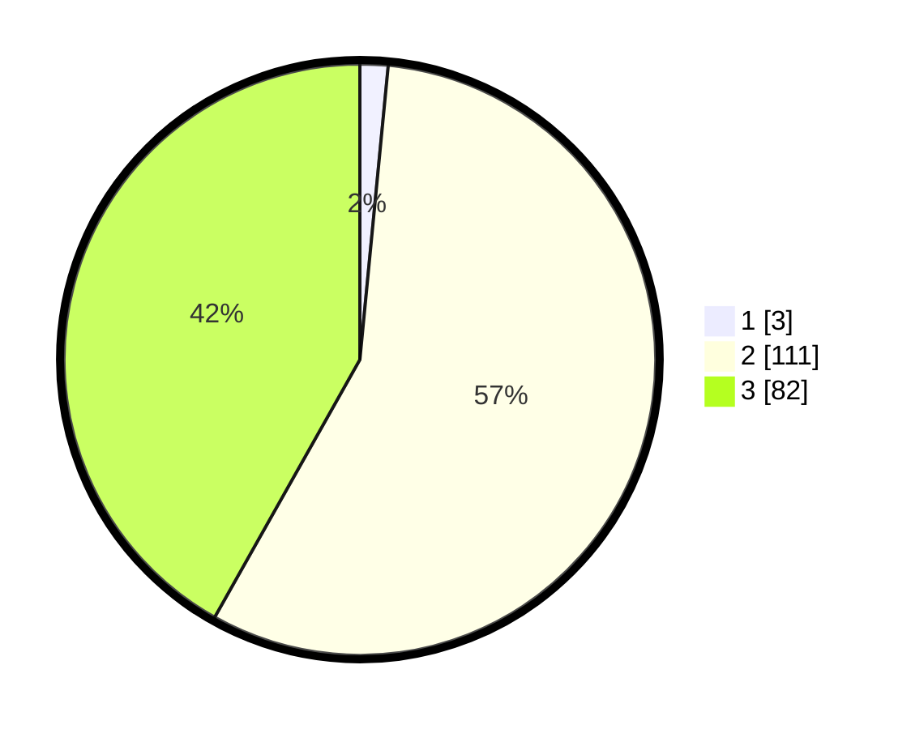

# Hasil

## Grafik

## Tabel

| No. | Nama Paslon    | Suara | Suara (raw) | Persentase |
|:--- |:-------------- | -----:| -----------:| ----------:|
| 1   | ANIES MUHAIMIN | 3     | [3][p-1]    | 1,53       |
| 2   | PRABOWO GIBRAN | 111   | [111][p-2]  | 56,63      |
| 3   | GANJAR MAHFUD  | 82    | [82][p-3]   | 41,84      |

[p-1]: https://github.com/gigit-pemilu/pemilu-2024/blob/main/pilpres/hitung-suara/sub/51-bali/sub/08-buleleng/sub/02-seririt/sub/2019-banjarasem/sub/006-tps/sub/paslon-1.txt
[p-2]: https://github.com/gigit-pemilu/pemilu-2024/blob/main/pilpres/hitung-suara/sub/51-bali/sub/08-buleleng/sub/02-seririt/sub/2019-banjarasem/sub/006-tps/sub/paslon-2.txt
[p-3]: https://github.com/gigit-pemilu/pemilu-2024/blob/main/pilpres/hitung-suara/sub/51-bali/sub/08-buleleng/sub/02-seririt/sub/2019-banjarasem/sub/006-tps/sub/paslon-3.txt

## Foto C Plano

https://sirekap-obj-formc.kpu.go.id/1dd3/pemilu/ppwp/51/08/02/20/19/5108022019006-20240215-033640--aad8ff4f-da4e-461f-99ff-374c538bedbd.jpg

https://sirekap-obj-formc.kpu.go.id/1dd3/pemilu/ppwp/51/08/02/20/19/5108022019006-20240215-033525--d3d4d7b3-0613-4189-91a7-bb99eedcedfa.jpg

https://sirekap-obj-formc.kpu.go.id/1dd3/pemilu/ppwp/51/08/02/20/19/5108022019006-20240215-033713--34e0e085-bc6a-49b1-b77f-26926990ef6d.jpg

## Metadata

| Key        | Value               |
| ---------- | ------------------- |
| Time Stamp | 2024-02-24 22:31:28 |

