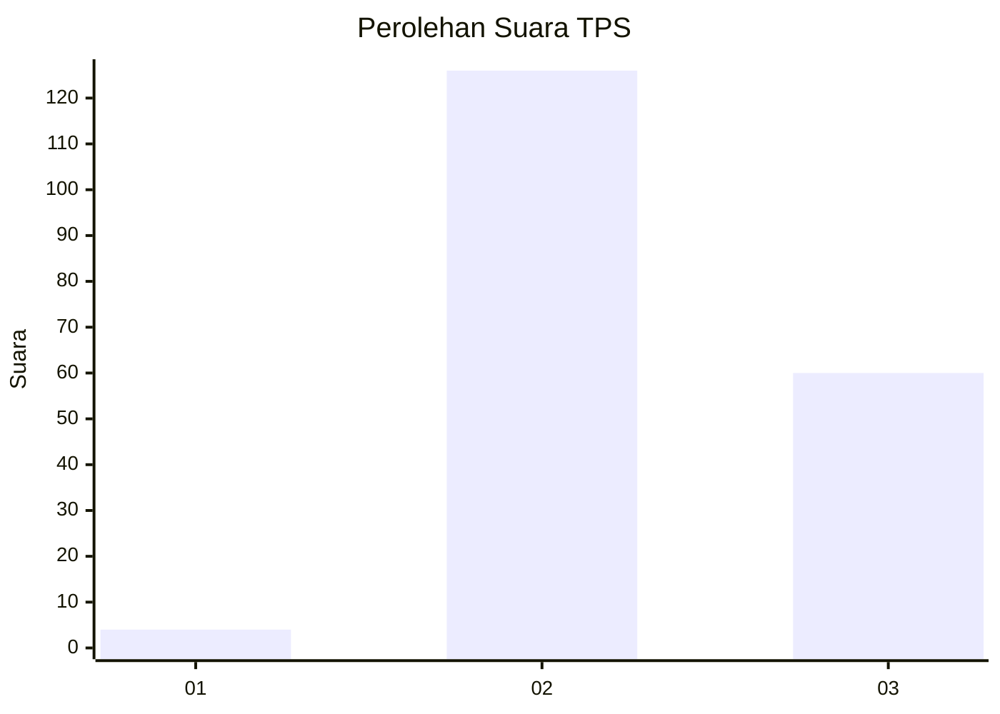
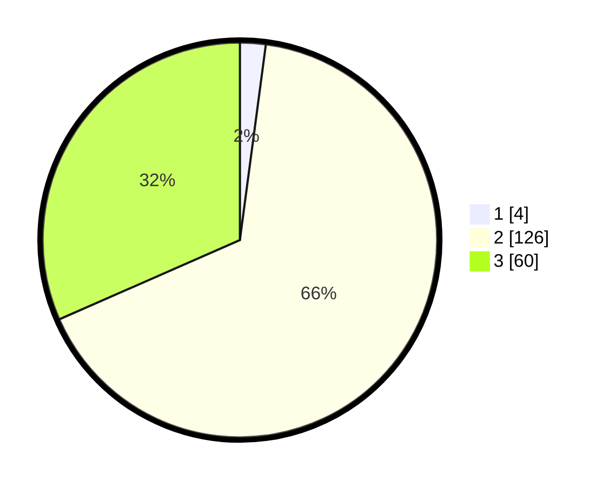

# Hasil

## Grafik

## Tabel

| No. | Nama Paslon    | Suara | Suara (raw) | Persentase |
|:--- |:-------------- | -----:| -----------:| ----------:|
| 1   | ANIES MUHAIMIN | 4     | [4][p-1]    | 2,11       |
| 2   | PRABOWO GIBRAN | 126   | [126][p-2]  | 66,32      |
| 3   | GANJAR MAHFUD  | 60    | [60][p-3]   | 31,58      |

[p-1]: https://github.com/gigit-pemilu/pemilu-2024-51-bali/blob/main/pilpres/hitung-suara/sub/51-bali/sub/08-buleleng/sub/02-seririt/sub/2019-banjarasem/sub/010-tps/sub/paslon-1.txt
[p-2]: https://github.com/gigit-pemilu/pemilu-2024-51-bali/blob/main/pilpres/hitung-suara/sub/51-bali/sub/08-buleleng/sub/02-seririt/sub/2019-banjarasem/sub/010-tps/sub/paslon-2.txt
[p-3]: https://github.com/gigit-pemilu/pemilu-2024-51-bali/blob/main/pilpres/hitung-suara/sub/51-bali/sub/08-buleleng/sub/02-seririt/sub/2019-banjarasem/sub/010-tps/sub/paslon-3.txt

## Foto C Plano

https://sirekap-obj-formc.kpu.go.id/1957/pemilu/ppwp/51/08/02/20/19/5108022019010-20240214-141759--fbffa401-17e2-4427-b14f-4cd152007496.jpg

https://sirekap-obj-formc.kpu.go.id/1957/pemilu/ppwp/51/08/02/20/19/5108022019010-20240214-141857--0e003cf9-ec28-4785-b224-cacb91b77c33.jpg

https://sirekap-obj-formc.kpu.go.id/1957/pemilu/ppwp/51/08/02/20/19/5108022019010-20240214-141933--3f2750c8-c973-4dd4-9fa5-af5ae904020f.jpg

## Metadata

| Key        | Value               |
| ---------- | ------------------- |
| Time Stamp | 2024-02-26 11:00:00 |

