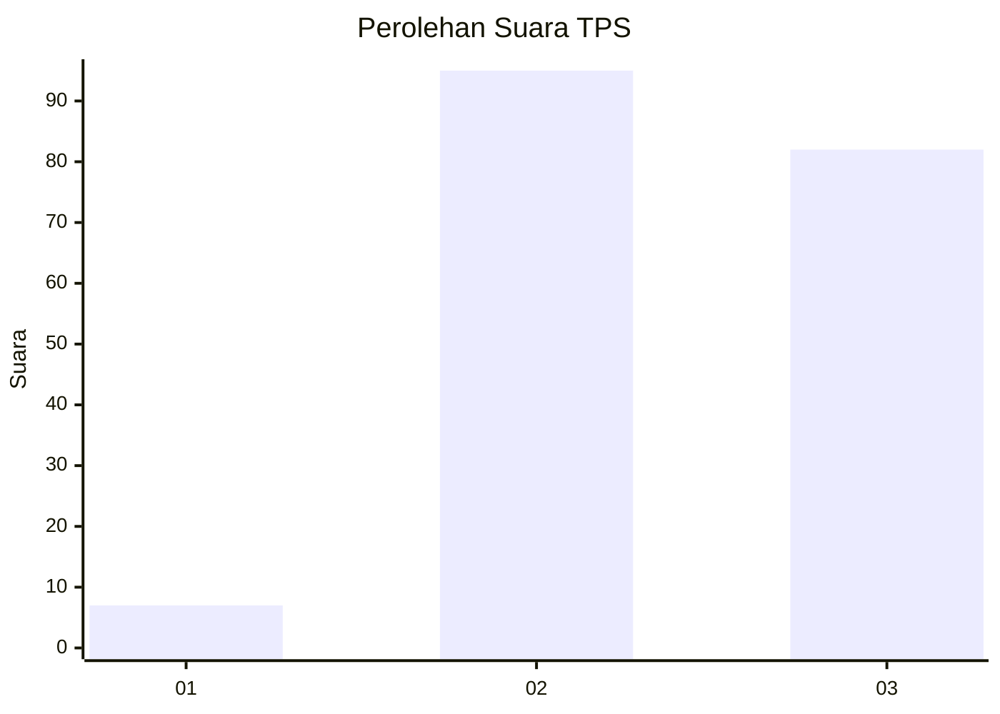
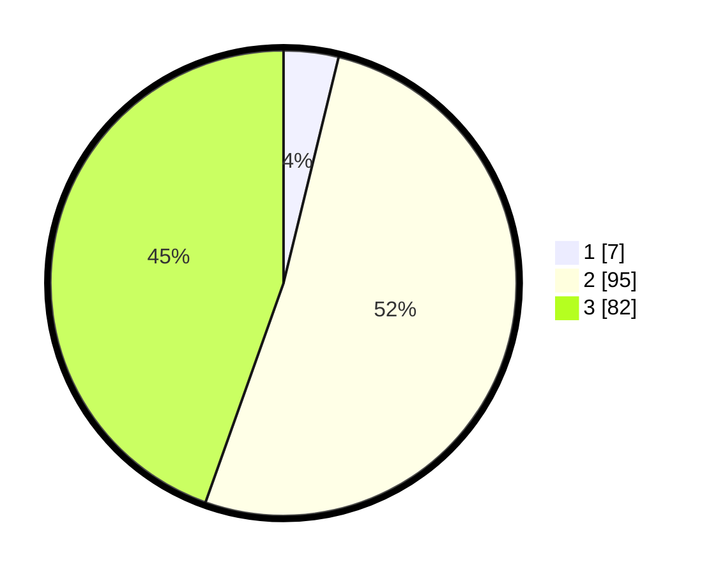

# Hasil

## Grafik

## Tabel

| No. | Nama Paslon    | Suara | Suara (raw) | Persentase |
|:--- |:-------------- | -----:| -----------:| ----------:|
| 1   | ANIES MUHAIMIN | 7     | [7][p-1]    | 3,80       |
| 2   | PRABOWO GIBRAN | 95    | [95][p-2]   | 51,63      |
| 3   | GANJAR MAHFUD  | 82    | [82][p-3]   | 44,57      |

[p-1]: https://github.com/gigit-pemilu/pemilu-2024-51-bali/blob/main/pilpres/hitung-suara/sub/51-bali/sub/08-buleleng/sub/02-seririt/sub/2019-banjarasem/sub/016-tps/sub/paslon-1.txt
[p-2]: https://github.com/gigit-pemilu/pemilu-2024-51-bali/blob/main/pilpres/hitung-suara/sub/51-bali/sub/08-buleleng/sub/02-seririt/sub/2019-banjarasem/sub/016-tps/sub/paslon-2.txt
[p-3]: https://github.com/gigit-pemilu/pemilu-2024-51-bali/blob/main/pilpres/hitung-suara/sub/51-bali/sub/08-buleleng/sub/02-seririt/sub/2019-banjarasem/sub/016-tps/sub/paslon-3.txt

## Foto C Plano

https://sirekap-obj-formc.kpu.go.id/3f35/pemilu/ppwp/51/08/02/20/19/5108022019016-20240214-140939--e29cc47b-2b60-4b03-8108-cb893f4ff861.jpg

https://sirekap-obj-formc.kpu.go.id/3f35/pemilu/ppwp/51/08/02/20/19/5108022019016-20240215-000859--5c82eef9-4e5b-4930-9ceb-7b8c05b0c8b8.jpg

https://sirekap-obj-formc.kpu.go.id/3f35/pemilu/ppwp/51/08/02/20/19/5108022019016-20240214-141747--21edde97-6f63-4a7b-bcf5-1521b264f900.jpg

## Metadata

| Key        | Value               |
| ---------- | ------------------- |
| Time Stamp | 2024-02-25 18:00:00 |

