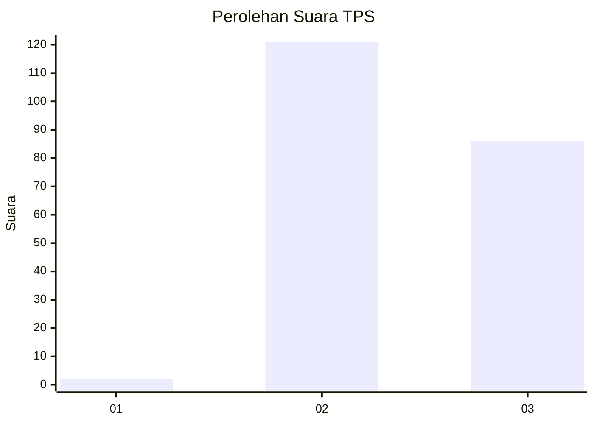
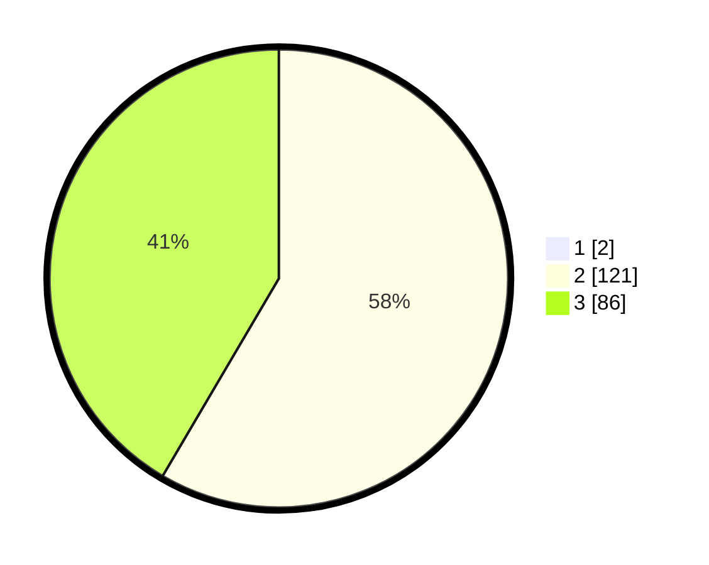

# Hasil

## Grafik

## Tabel

| No. | Nama Paslon    | Suara | Suara (raw) | Persentase |
|:--- |:-------------- | -----:| -----------:| ----------:|
| 1   | ANIES MUHAIMIN | 2     | [2][p-1]    | 0,96       |
| 2   | PRABOWO GIBRAN | 121   | [121][p-2]  | 57,89      |
| 3   | GANJAR MAHFUD  | 86    | [86][p-3]   | 41,15      |

[p-1]: https://github.com/gigit-pemilu/pemilu-2024-51-bali/blob/main/pilpres/hitung-suara/sub/51-bali/sub/08-buleleng/sub/02-seririt/sub/2020-kalisada/sub/002-tps/sub/paslon-1.txt
[p-2]: https://github.com/gigit-pemilu/pemilu-2024-51-bali/blob/main/pilpres/hitung-suara/sub/51-bali/sub/08-buleleng/sub/02-seririt/sub/2020-kalisada/sub/002-tps/sub/paslon-2.txt
[p-3]: https://github.com/gigit-pemilu/pemilu-2024-51-bali/blob/main/pilpres/hitung-suara/sub/51-bali/sub/08-buleleng/sub/02-seririt/sub/2020-kalisada/sub/002-tps/sub/paslon-3.txt

## Foto C Plano

https://sirekap-obj-formc.kpu.go.id/297f/pemilu/ppwp/51/08/02/20/20/5108022020002-20240214-214616--9f3f5544-ba29-4ffa-ab0c-449965f8a1c7.jpg

https://sirekap-obj-formc.kpu.go.id/297f/pemilu/ppwp/51/08/02/20/20/5108022020002-20240214-214926--6a64a00f-3f17-4293-b192-b5c52e932927.jpg

https://sirekap-obj-formc.kpu.go.id/297f/pemilu/ppwp/51/08/02/20/20/5108022020002-20240214-215304--33f824cd-63ca-4898-bc34-36b12f7f69a6.jpg

## Metadata

| Key        | Value               |
| ---------- | ------------------- |
| Time Stamp | 2024-02-24 22:31:28 |

