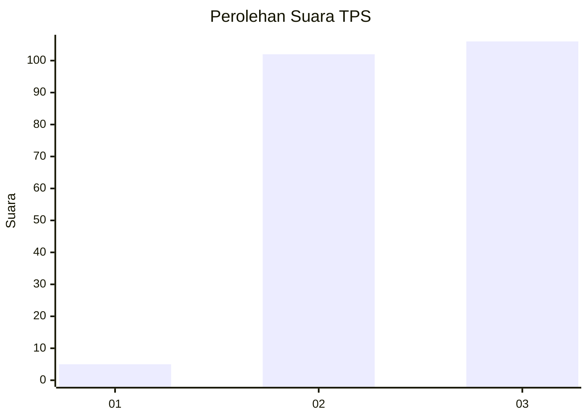
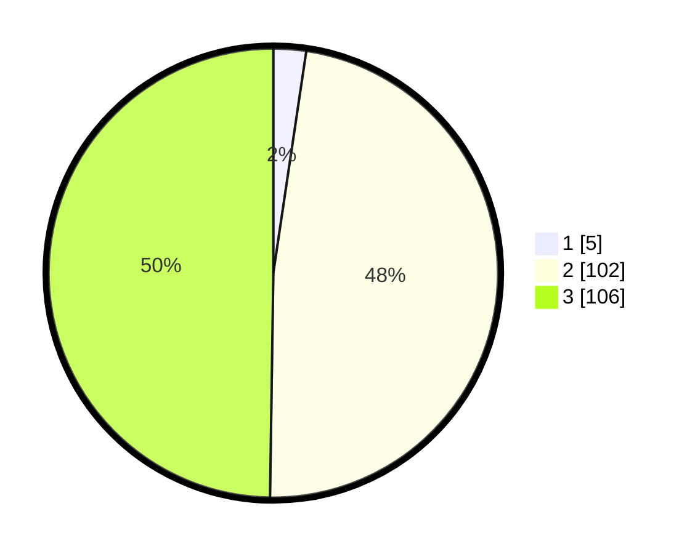

# Hasil

## Grafik

## Tabel

| No. | Nama Paslon    | Suara | Suara (raw) | Persentase |
|:--- |:-------------- | -----:| -----------:| ----------:|
| 1   | ANIES MUHAIMIN | 5     | [5][p-1]    | 2,35       |
| 2   | PRABOWO GIBRAN | 102   | [102][p-2]  | 47,89      |
| 3   | GANJAR MAHFUD  | 106   | [106][p-3]  | 49,77      |

[p-1]: https://github.com/gigit-pemilu/pemilu-2024-51-bali/blob/main/pilpres/hitung-suara/sub/51-bali/sub/08-buleleng/sub/02-seririt/sub/2020-kalisada/sub/004-tps/sub/paslon-1.txt
[p-2]: https://github.com/gigit-pemilu/pemilu-2024-51-bali/blob/main/pilpres/hitung-suara/sub/51-bali/sub/08-buleleng/sub/02-seririt/sub/2020-kalisada/sub/004-tps/sub/paslon-2.txt
[p-3]: https://github.com/gigit-pemilu/pemilu-2024-51-bali/blob/main/pilpres/hitung-suara/sub/51-bali/sub/08-buleleng/sub/02-seririt/sub/2020-kalisada/sub/004-tps/sub/paslon-3.txt

## Foto C Plano

https://sirekap-obj-formc.kpu.go.id/2662/pemilu/ppwp/51/08/02/20/20/5108022020004-20240214-140959--9796a2d0-5a81-441d-9fae-d226596d0324.jpg

https://sirekap-obj-formc.kpu.go.id/2662/pemilu/ppwp/51/08/02/20/20/5108022020004-20240214-140950--f9a232b9-e80b-40c3-aa20-efc9f9767f18.jpg

https://sirekap-obj-formc.kpu.go.id/2662/pemilu/ppwp/51/08/02/20/20/5108022020004-20240215-001717--283ce680-6ffe-4c4e-9f91-379140fcf61d.jpg

## Metadata

| Key        | Value               |
| ---------- | ------------------- |
| Time Stamp | 2024-02-15 03:06:03 |

