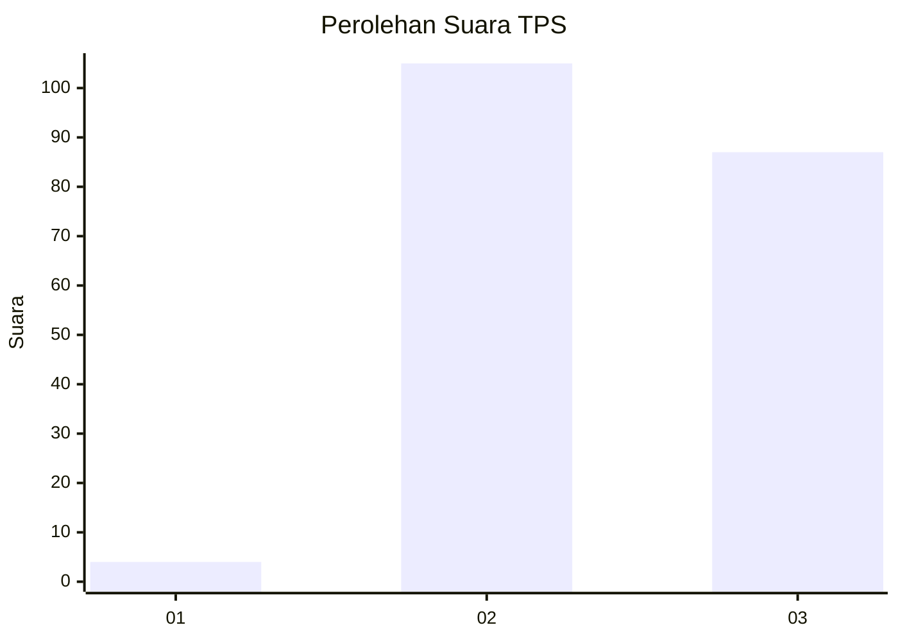
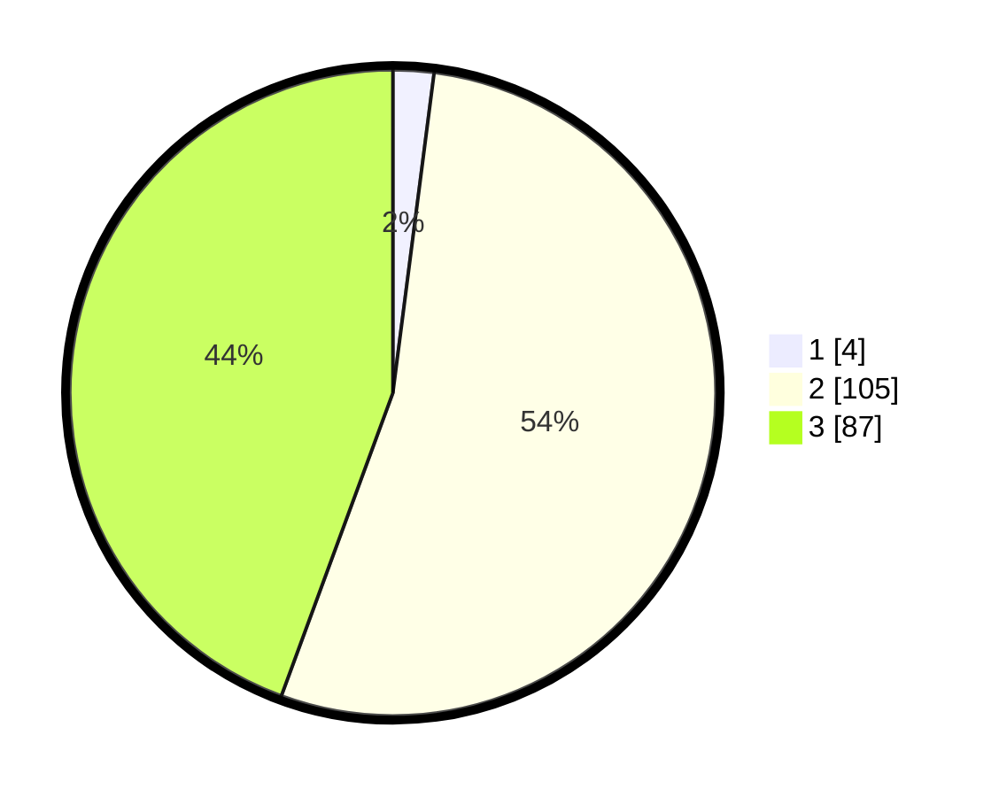

# Hasil

## Grafik

## Tabel

| No. | Nama Paslon    | Suara | Suara (raw) | Persentase |
|:--- |:-------------- | -----:| -----------:| ----------:|
| 1   | ANIES MUHAIMIN | 4     | [4][p-1]    | 2,04       |
| 2   | PRABOWO GIBRAN | 105   | [105][p-2]  | 53,57      |
| 3   | GANJAR MAHFUD  | 87    | [87][p-3]   | 44,39      |

[p-1]: https://github.com/gigit-pemilu/pemilu-2024-51-bali/blob/main/pilpres/hitung-suara/sub/51-bali/sub/08-buleleng/sub/02-seririt/sub/2020-kalisada/sub/005-tps/sub/paslon-1.txt
[p-2]: https://github.com/gigit-pemilu/pemilu-2024-51-bali/blob/main/pilpres/hitung-suara/sub/51-bali/sub/08-buleleng/sub/02-seririt/sub/2020-kalisada/sub/005-tps/sub/paslon-2.txt
[p-3]: https://github.com/gigit-pemilu/pemilu-2024-51-bali/blob/main/pilpres/hitung-suara/sub/51-bali/sub/08-buleleng/sub/02-seririt/sub/2020-kalisada/sub/005-tps/sub/paslon-3.txt

## Foto C Plano

https://sirekap-obj-formc.kpu.go.id/168c/pemilu/ppwp/51/08/02/20/20/5108022020005-20240214-212705--69cfb73e-8448-4232-9fbc-2eaa4984013d.jpg

https://sirekap-obj-formc.kpu.go.id/168c/pemilu/ppwp/51/08/02/20/20/5108022020005-20240214-224608--3a3866fc-42c7-49a7-a5a7-0d50ab66bdae.jpg

https://sirekap-obj-formc.kpu.go.id/168c/pemilu/ppwp/51/08/02/20/20/5108022020005-20240214-213051--7fa8c7ec-14f6-472c-9720-73224b702d16.jpg

## Metadata

| Key        | Value               |
| ---------- | ------------------- |
| Time Stamp | 2024-02-24 22:31:28 |

