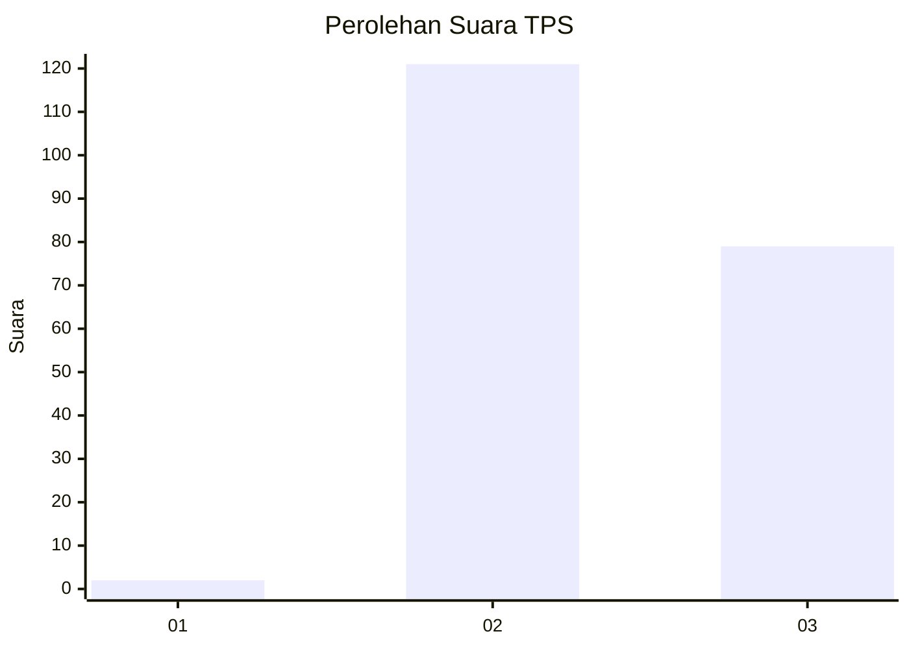
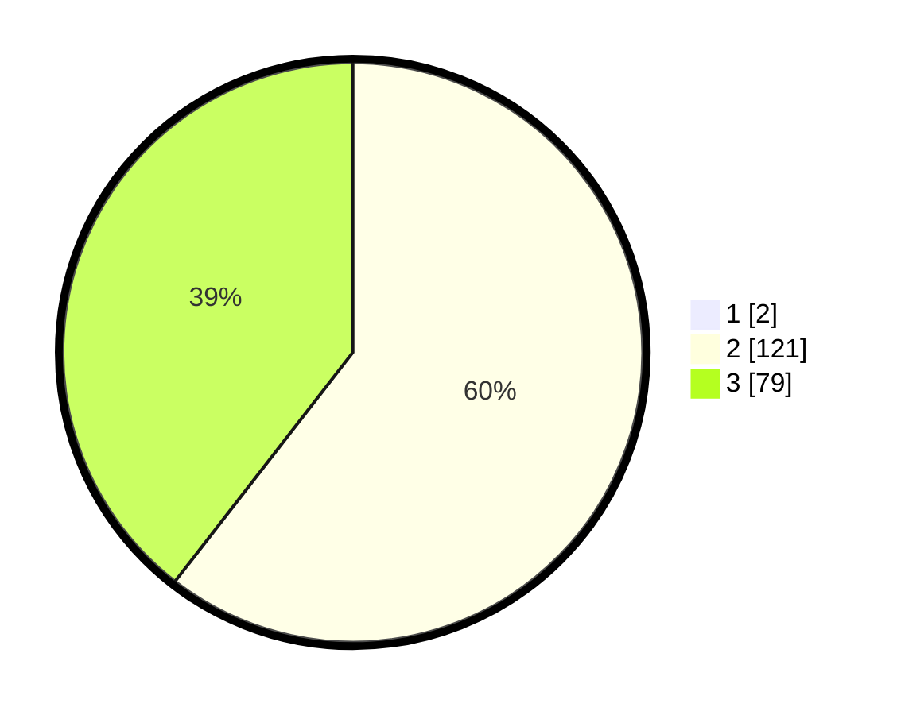

# Hasil

## Grafik

## Tabel

| No. | Nama Paslon    | Suara | Suara (raw) | Persentase |
|:--- |:-------------- | -----:| -----------:| ----------:|
| 1   | ANIES MUHAIMIN | 2     | [2][p-1]    | 0,99       |
| 2   | PRABOWO GIBRAN | 121   | [121][p-2]  | 59,90      |
| 3   | GANJAR MAHFUD  | 79    | [79][p-3]   | 39,11      |

[p-1]: https://github.com/gigit-pemilu/pemilu-2024-51-bali/blob/main/pilpres/hitung-suara/sub/51-bali/sub/08-buleleng/sub/02-seririt/sub/2020-kalisada/sub/006-tps/sub/paslon-1.txt
[p-2]: https://github.com/gigit-pemilu/pemilu-2024-51-bali/blob/main/pilpres/hitung-suara/sub/51-bali/sub/08-buleleng/sub/02-seririt/sub/2020-kalisada/sub/006-tps/sub/paslon-2.txt
[p-3]: https://github.com/gigit-pemilu/pemilu-2024-51-bali/blob/main/pilpres/hitung-suara/sub/51-bali/sub/08-buleleng/sub/02-seririt/sub/2020-kalisada/sub/006-tps/sub/paslon-3.txt

## Foto C Plano

https://sirekap-obj-formc.kpu.go.id/718b/pemilu/ppwp/51/08/02/20/20/5108022020006-20240214-234632--f686ee7b-d578-412c-8572-ac2b642cf63f.jpg

https://sirekap-obj-formc.kpu.go.id/718b/pemilu/ppwp/51/08/02/20/20/5108022020006-20240214-234735--ea1dad01-a0bd-4a14-a342-7aa1c871648e.jpg

https://sirekap-obj-formc.kpu.go.id/718b/pemilu/ppwp/51/08/02/20/20/5108022020006-20240214-234824--3040f7c8-636d-41eb-9865-560a07733c9e.jpg

## Metadata

| Key        | Value               |
| ---------- | ------------------- |
| Time Stamp | 2024-02-24 22:31:28 |

