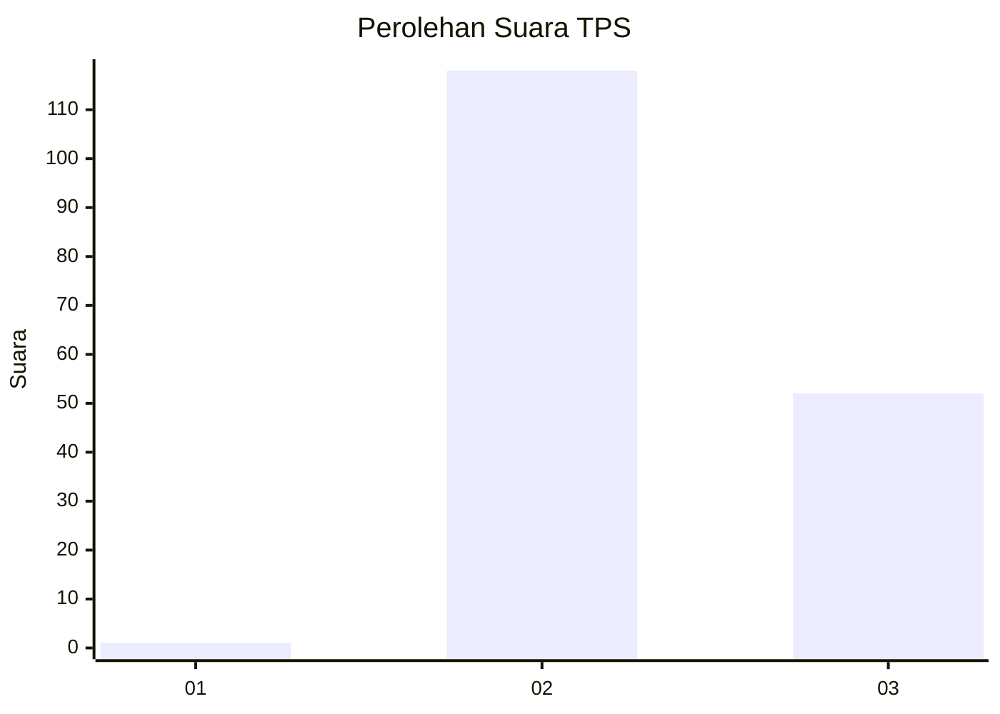
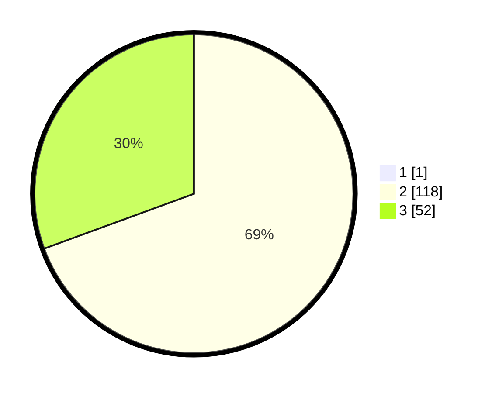

# Hasil

## Grafik

## Tabel

| No. | Nama Paslon    | Suara | Suara (raw) | Persentase |
|:--- |:-------------- | -----:| -----------:| ----------:|
| 1   | ANIES MUHAIMIN | 1     | [1][p-1]    | 0,58       |
| 2   | PRABOWO GIBRAN | 118   | [118][p-2]  | 69,01      |
| 3   | GANJAR MAHFUD  | 52    | [52][p-3]   | 30,41      |

[p-1]: https://github.com/gigit-pemilu/pemilu-2024-51-bali/blob/main/pilpres/hitung-suara/sub/51-bali/sub/08-buleleng/sub/02-seririt/sub/2020-kalisada/sub/008-tps/sub/paslon-1.txt
[p-2]: https://github.com/gigit-pemilu/pemilu-2024-51-bali/blob/main/pilpres/hitung-suara/sub/51-bali/sub/08-buleleng/sub/02-seririt/sub/2020-kalisada/sub/008-tps/sub/paslon-2.txt
[p-3]: https://github.com/gigit-pemilu/pemilu-2024-51-bali/blob/main/pilpres/hitung-suara/sub/51-bali/sub/08-buleleng/sub/02-seririt/sub/2020-kalisada/sub/008-tps/sub/paslon-3.txt

## Foto C Plano

https://sirekap-obj-formc.kpu.go.id/0e75/pemilu/ppwp/51/08/02/20/20/5108022020008-20240215-000334--7d03f40a-7027-4446-9f9b-9ea543b24068.jpg

https://sirekap-obj-formc.kpu.go.id/0e75/pemilu/ppwp/51/08/02/20/20/5108022020008-20240215-000542--80acd05d-26a1-4bf2-a63f-a1514901954d.jpg

https://sirekap-obj-formc.kpu.go.id/0e75/pemilu/ppwp/51/08/02/20/20/5108022020008-20240215-000946--4be20700-e0de-43d9-be1b-d7779787f1ec.jpg

## Metadata

| Key        | Value               |
| ---------- | ------------------- |
| Time Stamp | 2024-02-24 22:31:28 |

